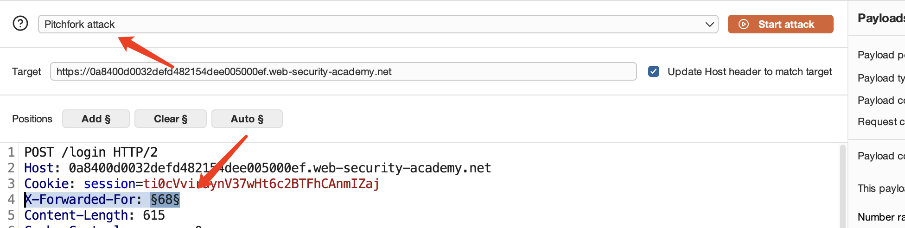
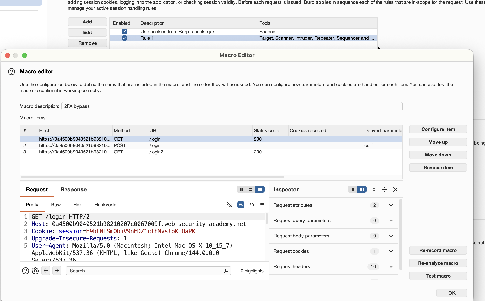
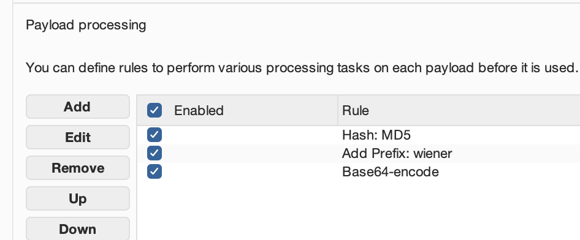

# 1 Vulnerabilities in authentication mechanisms

## 1.1 password-based login

1. add X-Forwarded-For and brute force

   

2. IP block, resources poul. add our own account

   

3. Account locking; logic flow

   ```python
   if (password == correct) {
       // login success
       return success_page;  
   }
   if (block) {
       return "You have made too many incorrect login attempts";
   }
   return "Invalid username or password";
   ```

4. user rate limiting: bypass this defense if you can work out how to guess multiple passwords with a single request


## 1.2 multi-factor authentication

(1)burp marco



(2)Turbo


## 1.3 other authentication mechanisms

(1)Keeping users logged in

brute-force the cookie by simply hashing their wordlists.



(2)resetting users passwords

最简单:密码重置流程中有个 token 用来验证身份，但服务器**根本没检查这个 token 的值**。所以可以把 token 删掉，然后把用户名改成 carlos，直接重置他的密码。


# 2 OAuth 2.0 authentication vulnerabilities


