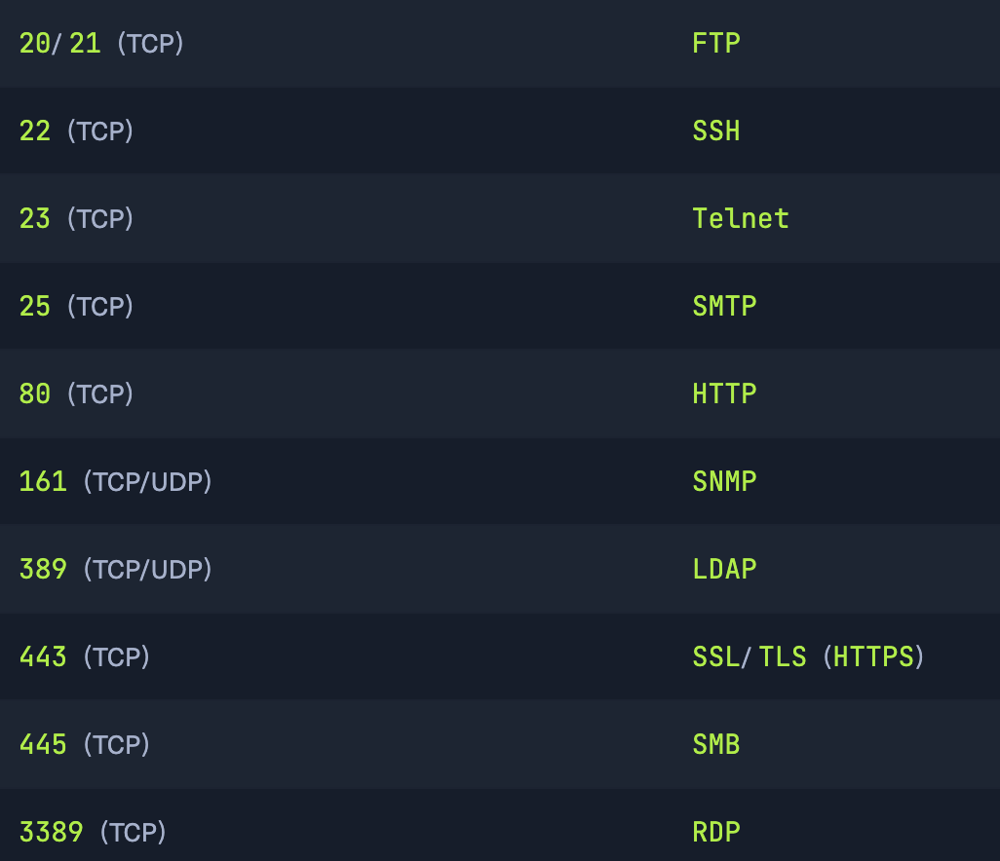
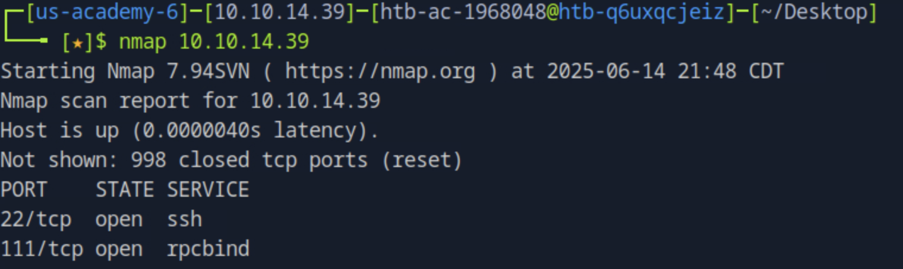
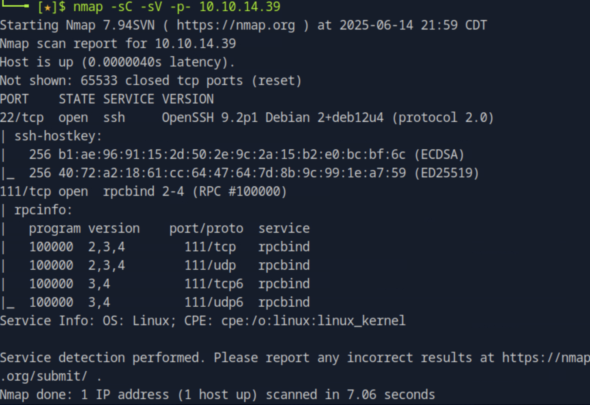
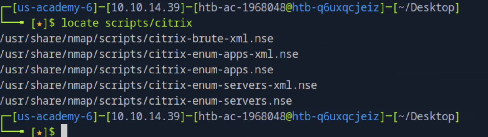
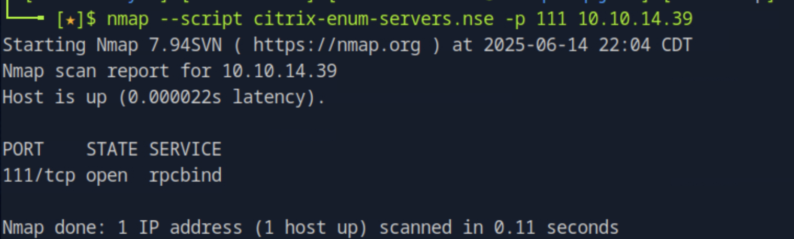
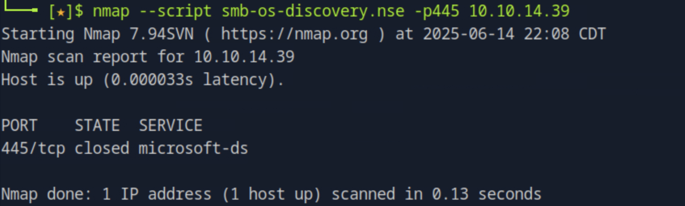
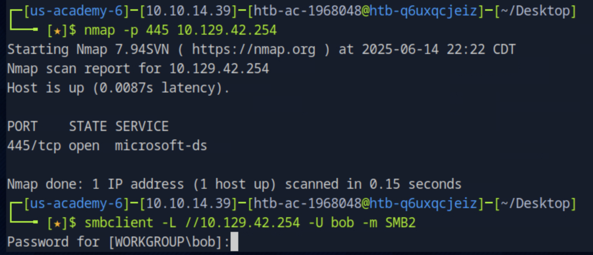
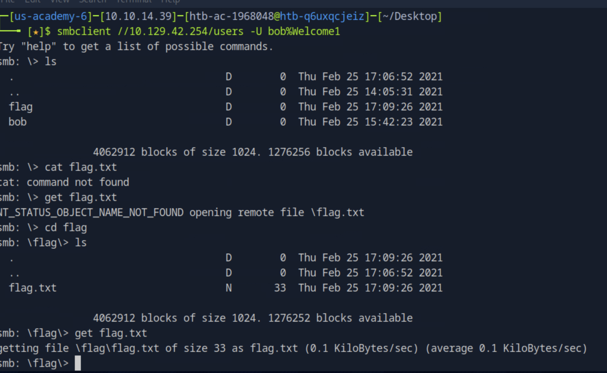
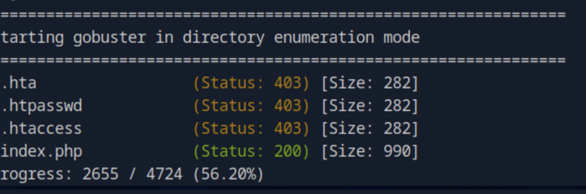

# Pentesting Basics

## Tcp / udp port: 



## scanning

### nmap

Nmap 默认只会扫描 1,000 个最常用的端口。扫描输出显示端口 21、22、80、139 和 445 可用。 

Nmap + ip address 



- `-sC`参数指定`Nmap`使用脚本来尝试获取更详细的信息
- `-sV`参数指示`Nmap`执行版本扫描
- `-p-`告诉 Nmap 我们要扫描所有 65,535 个 TCP 端口



locate scripts/citrix加载脚本



nmap --script <script name> -p<port> <host>



特定端口

```shell-session
nmap -sC -sV -p21 10.10.14.39
```


### nc

```shell-session
nc -nv <ip> <port>
```

### ftp

ftp -p 10.10.14.39

l s cd cat

### 中小企业

SMB（服务器消息块）是 Windows 计算机上流行的协议，它为垂直和横向移动提供了许多向量。敏感数据（包括凭据）可能位于网络文件共享中，并且某些 SMB 版本可能容易受到诸如[“永恒之蓝”](https://www.avast.com/c-eternalblue)之类的 RCE 漏洞攻击。仔细枚举这个巨大的潜在攻击面至关重要。`Nmap`有许多用于枚举 SMB 的脚本，例如[smb-os-discovery.nse](https://nmap.org/nsedoc/scripts/smb-os-discovery.html)，它将与 SMB 服务交互以提取报告的操作系统版本。



### SMB

SMB 允许用户和管理员共享文件夹，并允许其他用户远程访问这些文件夹。这些共享中通常包含敏感信息（例如密码）的文件。smbclient 是一款可以枚举 SMB 共享并与之交互的工具[。](https://www.samba.org/samba/docs/current/man-html/smbclient.1.html)该`-L`标志指定我们要检索远程主机上可用共享的列表，同时`-N`隐藏密码提示。





下面是windows的格式

 服务扫描

```shell-session
capybaralalale@htb[/htb]$ smbclient -N -L \\\\10.129.42.253

	Sharename       Type      Comment
	---------       ----      -------
	print$          Disk      Printer Drivers
	users           Disk      
	IPC$            IPC       IPC Service (gs-svcscan server (Samba, Ubuntu))
SMB1 disabled -- no workgroup available
```

这将显示非默认共享`users`。让我们尝试以访客用户身份连接。

 服务扫描

```shell-session
capybaralalale@htb[/htb]$ smbclient \\\\10.129.42.253\\users

Enter WORKGROUP\users's password: 
Try "help" to get a list of possible commands.

smb: \> ls
NT_STATUS_ACCESS_DENIED listing \*

smb: \> exit
```

该`ls`命令导致出现“访问被拒绝”消息，表明不允许访客访问。让我们使用用户 bob 的凭据重试一次（`bob:Welcome1`）。

 服务扫描

```shell-session
capybaralalale@htb[/htb]$ smbclient -U bob \\\\10.129.42.253\\users

Enter WORKGROUP\bob's password: 
Try "help" to get a list of possible commands.

smb: \> ls
  .                                   D        0  Thu Feb 25 16:42:23 2021
  ..                                  D        0  Thu Feb 25 15:05:31 2021
  bob                                 D        0  Thu Feb 25 16:42:23 2021

		4062912 blocks of size 1024. 1332480 blocks available
		
smb: \> cd bob

smb: \bob\> ls
  .                                   D        0  Thu Feb 25 16:42:23 2021
  ..                                  D        0  Thu Feb 25 16:42:23 2021
  passwords.txt                       N      156  Thu Feb 25 16:42:23 2021

		4062912 blocks of size 1024. 1332480 blocks available
		
smb: \bob\> get passwords.txt 
getting file \bob\passwords.txt of size 156 as passwords.txt (0.3 KiloBytes/sec) (average 0.3 KiloBytes/sec)
```

我们成功地`users`使用凭据获得了对共享的访问权限，并获得了对有趣文件的访问权限`passwords.txt`，可以使用`get`命令下载该文件。

------

### SNMP

SNMP 社区字符串提供有关路由器或设备的信息和统计信息，帮助我们访问它。制造商默认的社区字符串`public`通常`private`保持不变。在 SNMP 版本 1 和 2c 中，访问控制使用明文社区字符串，如果我们知道名称，就可以访问它。加密和身份验证功能是在 SNMP 版本 3 中才添加的。从 SNMP 中可以获得很多信息。检查进程参数可能会泄露在命令行上传递的凭据，鉴于企业环境中密码重用的普遍性，这些凭据可能被其他外部可访问的服务重用。路由信息、绑定到其他接口的服务以及已安装软件的版本也可能被泄露。

 服务扫描

```shell-session
capybaralalale@htb[/htb]$ snmpwalk -v 2c -c public 10.129.42.253 1.3.6.1.2.1.1.5.0

iso.3.6.1.2.1.1.5.0 = STRING: "gs-svcscan"
```

 服务扫描

```shell-session
capybaralalale@htb[/htb]$ snmpwalk -v 2c -c private  10.129.42.253 

Timeout: No Response from 10.129.42.253
```

[可以使用onesixtyone](https://github.com/trailofbits/onesixtyone)等工具，通过常用社区字符串的字典文件（例如`dict.txt`该工具的 GitHub 存储库中包含的文件）来强制获取社区字符串名称。

 服务扫描

```shell-session
capybaralalale@htb[/htb]$ onesixtyone -c dict.txt 10.129.42.254

Scanning 1 hosts, 51 communities
10.129.42.254 [public] Linux gs-svcscan 5.4.0-66-generic #74-Ubuntu SMP Wed Jan 27 22:
```

## Web Enumeration

### Gobuster

使用[ffuf](https://github.com/ffuf/ffuf)或[GoBuster](https://github.com/OJ/gobuster)等工具来执行目录枚举

```shell-session
gobuster dir -u http://10.10.10.121/ -w /usr/share/seclists/Discovery/Web-Content/common.txt
```



