# 2\_Network\_Enumeration\_with\_Nmap

## 1 Host Enumeration

### 1.1 主机发现

***

例如，当我们需要对公司整个网络进行内部渗透测试时，我们首先应该了解哪些系统处于在线状态，并可供我们使用。为了在网络上主动发现此类系统，我们可以使用各种`Nmap`主机发现选项。市面上有很多选项`Nmap`可以用来判断目标主机是否处于活动状态。最有效的主机发现方法是使用**ICMP 回显请求**，我们将对此进行探讨。

始终建议保存每次扫描结果。这可以用于以后的比较、记录和报告。毕竟，不同的工具可能会产生不同的结果。因此，区分不同工具产生的结果会很有帮助。

#### 查找主机名

<div data-full-width="false">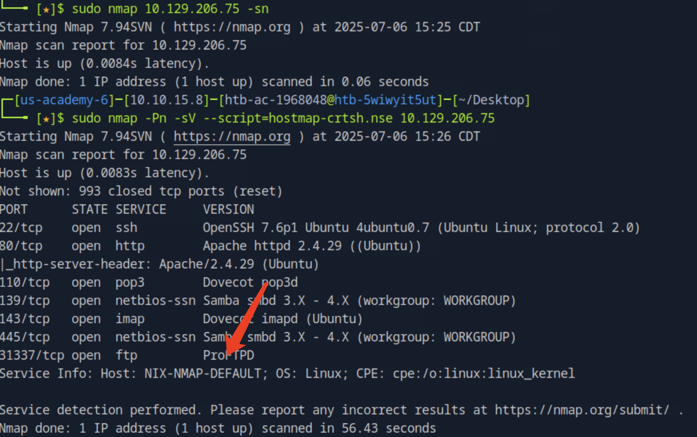</div>

#### 1.1.1 扫描网络范围

```shell
capybaralalale@htb[/htb]$ sudo nmap 10.129.2.0/24 -sn -oA tnet | grep for | cut -d" " -f5

10.129.2.4
10.129.2.10
10.129.2.11
10.129.2.18
10.129.2.19
10.129.2.20
10.129.2.28
```

| **扫描选项**        | **描述**                |
| --------------- | --------------------- |
| `10.129.2.0/24` | 目标网络范围。               |
| `-sn`           | 禁用端口扫描。               |
| `-oA tnet`      | 以名称“tnet”开头的所有格式存储结果。 |

此扫描方法仅在主机防火墙允许的情况下有效。否则，我们可以使用其他扫描技术来查明主机是否处于活动状态。

***

#### 1.1.2扫描IP列表

在内部渗透测试期间，我们通常会获得包含需要测试的主机的 IP 列表。`Nmap`还为我们提供了使用列表并从该列表中读取主机的选项，而不必手动定义或输入它们。

这样的列表可能看起来像这样：

```shell
capybaralalale@htb[/htb]$ cat hosts.lst

10.129.2.4
10.129.2.10
10.129.2.11
10.129.2.18
10.129.2.19
10.129.2.20
10.129.2.28
```

如果我们对预定义列表使用相同的扫描技术，命令将如下所示：

```shell
capybaralalale@htb[/htb]$ sudo nmap -sn -oA tnet -iL hosts.lst | grep for | cut -d" " -f5

10.129.2.18
10.129.2.19
10.129.2.20
```

| **扫描选项**   | **描述**                        |
| ---------- | ----------------------------- |
| `-sn`      | 禁用端口扫描。                       |
| `-oA tnet` | 以名称“tnet”开头的所有格式存储结果。         |
| `-iL`      | 对提供的“hosts.lst”列表中的目标执行定义的扫描。 |

在此示例中，我们看到 7 个主机中只有 3 个处于活动状态。请记住，这可能意味着其他主机由于其防火墙配置而忽略了默认的**ICMP 回显请求**`Nmap`。由于未收到响应，它会将这些主机标记为非活动状态。

***

#### 1.1.4 扫描多个IP

有时我们只需要扫描网络的一小部分。我们上次使用的方法是指定多个 IP 地址。

```shell
capybaralalale@htb[/htb]$ sudo nmap -sn -oA tnet 10.129.2.18 10.129.2.19 10.129.2.20| grep for | cut -d" " -f5

10.129.2.18
10.129.2.19
10.129.2.20
```

如果这些 IP 地址彼此相邻，我们也可以在相应的八位字节中定义范围。

```shell
capybaralalale@htb[/htb]$ sudo nmap -sn -oA tnet 10.129.2.18-20| grep for | cut -d" " -f5

10.129.2.18
10.129.2.19
10.129.2.20
```

***

#### 1.1.5 扫描单个IP

在扫描单个主机的开放端口及其服务之前，我们首先需要确定它是否处于活动状态。为此，我们可以使用与之前相同的方法。

```shell
capybaralalale@htb[/htb]$ sudo nmap 10.129.2.18 -sn -oA host 

Starting Nmap 7.80 ( https://nmap.org ) at 2020-06-14 23:59 CEST
Nmap scan report for 10.129.2.18
Host is up (0.087s latency).
MAC Address: DE:AD:00:00:BE:EF
Nmap done: 1 IP address (1 host up) scanned in 0.11 seconds
```

| **扫描选项**      | **描述**                |
| ------------- | --------------------- |
| `10.129.2.18` | 对目标执行定义的扫描。           |
| `-sn`         | 禁用端口扫描。               |
| `-oA host`    | 以名称“host”开头的所有格式存储结果。 |

如果我们禁用了端口扫描（`-sn`），Nmap 会自动使用 ICMP Echo 请求（`-PE`）进行 ping 扫描。一旦发送了这样的请求，我们通常会期望收到 ICMP 回复，以判断被 ping 的主机是否在线。更有意思的是，我们之前的扫描并没有这样做，因为在 Nmap 发送 ICMP Echo 请求之前，它会先发送一个 ARP ping，从而收到一个 ARP 回复。我们可以通过加上 `--packet-trace` 选项来确认这一点。为了确保发送的是 ICMP Echo 请求，我们还需要显式指定 `-PE` 选项。

```shell
capybaralalale@htb[/htb]$ sudo nmap 10.129.2.18 -sn -oA host -PE --packet-trace 

Starting Nmap 7.80 ( https://nmap.org ) at 2020-06-15 00:08 CEST
SENT (0.0074s) ARP who-has 10.129.2.18 tell 10.10.14.2
RCVD (0.0309s) ARP reply 10.129.2.18 is-at DE:AD:00:00:BE:EF
Nmap scan report for 10.129.2.18
Host is up (0.023s latency).
MAC Address: DE:AD:00:00:BE:EF
Nmap done: 1 IP address (1 host up) scanned in 0.05 seconds
```

| **扫描选项**         | **描述**                         |
| ---------------- | ------------------------------ |
| `10.129.2.18`    | 对目标执行定义的扫描。                    |
| `-sn`            | 禁用端口扫描。                        |
| `-oA host`       | 以名称“host”开头的所有格式存储结果。          |
| `-PE`            | 使用“ICMP Echo 请求”对目标执行 ping 扫描。 |
| `--packet-trace` | 显示所有发送和接收的数据包                  |

***

确定 Nmap 将我们的目标标记为“活动”的原因的另一种方法是使用“ `--reason`”选项。

```shell
capybaralalale@htb[/htb]$ sudo nmap 10.129.2.18 -sn -oA host -PE --reason 

Starting Nmap 7.80 ( https://nmap.org ) at 2020-06-15 00:10 CEST
SENT (0.0074s) ARP who-has 10.129.2.18 tell 10.10.14.2
RCVD (0.0309s) ARP reply 10.129.2.18 is-at DE:AD:00:00:BE:EF
Nmap scan report for 10.129.2.18
Host is up, received arp-response (0.028s latency).
MAC Address: DE:AD:00:00:BE:EF
Nmap done: 1 IP address (1 host up) scanned in 0.03 seconds
```

| **扫描选项**      | **描述**                         |
| ------------- | ------------------------------ |
| `10.129.2.18` | 对目标执行定义的扫描。                    |
| `-sn`         | 禁用端口扫描。                        |
| `-oA host`    | 以名称“host”开头的所有格式存储结果。          |
| `-PE`         | 使用“ICMP Echo 请求”对目标执行 ping 扫描。 |
| `--reason`    | 显示特定结果的原因。                     |

***

我们在这里看到，Nmap 确实可以仅通过 ARP 请求和 ARP 回复来判断主机是否在线。为了不使用 ARP 请求，并使用我们想要的 ICMP Echo 请求来扫描目标，我们可以通过设置 `--disable-arp-ping` 选项来禁用 ARP ping。然后，我们可以重新扫描目标，并查看发送和接收的包。

```shell
capybaralalale@htb[/htb]$ sudo nmap 10.129.2.18 -sn -oA host -PE --packet-trace --disable-arp-ping 

Starting Nmap 7.80 ( https://nmap.org ) at 2020-06-15 00:12 CEST
SENT (0.0107s) ICMP [10.10.14.2 > 10.129.2.18 Echo request (type=8/code=0) id=13607 seq=0] IP [ttl=255 id=23541 iplen=28 ]
RCVD (0.0152s) ICMP [10.129.2.18 > 10.10.14.2 Echo reply (type=0/code=0) id=13607 seq=0] IP [ttl=128 id=40622 iplen=28 ]
Nmap scan report for 10.129.2.18
Host is up (0.086s latency).
MAC Address: DE:AD:00:00:BE:EF
Nmap done: 1 IP address (1 host up) scanned in 0.11 seconds
```

| TTL 值（默认） | 常见操作系统           |
| --------- | ---------------- |
| **64**    | Linux、Unix、macOS |
| **128**   | **Windows** 系统   |
| **255**   | 网络设备（如思科）、BSD 系列 |

可以看出这是windows系统

### 1.2 Host and Port Scanning

#### 1.2.1 发现开放的 TCP 端口

扫描前10个

默认情况下，Nmap 会使用 SYN 扫描（`-sS`）扫描前 1000 个 TCP 端口。只有在以 root 身份运行时，这种 SYN 扫描才会作为默认选项，因为创建原始 TCP 数据包需要相应的套接字权限。否则，默认会使用 TCP 扫描（`-sT`）。 这意味着，如果我们没有明确指定端口和扫描方法，这些参数会被自动设定。

可以通过以下几种方式手动指定端口：

* 一个个指定端口，例如 `-p 22,25,80,139,445`
* 指定端口范围，例如 `-p 22-445`
* 使用 Nmap 数据库中最常见的端口数量，如 `--top-ports=10`
* 扫描所有端口，使用 `-p-`
* 进行快速端口扫描，使用 `-F`，它会扫描最常见的前 100 个端口。

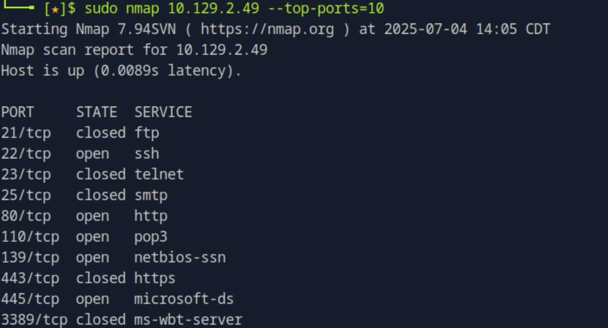

我们看到我们只扫描了目标的前10个TCP端口，而NMAP相应地显示了他们的状态。如果我们跟踪数据包NMAP发送，我们将在TCP端口21上看到我们的目标发送给我们的REST标志。为了清楚地了解SYN扫描，我们禁用ICMP回波请求（-PN），DNS分辨率（-n）和ARP ping扫描（ - 可见的arp-ping）。

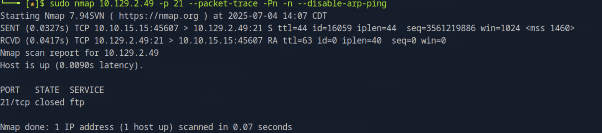

我们可以从 `SENT` 行看到，我们的主机（10.10.14.2）向目标主机（10.129.2.28）发送了一个带有 SYN 标志（`S`）的 TCP 数据包。在接下来的 `RCVD` 行中，我们看到目标主机回应了一个包含 RST 和 ACK 标志（`RA`）的 TCP 数据包。

`RST`（重置）和 `ACK`（确认）标志的作用是：

* `ACK` 用于确认接收到了之前发送的 TCP 数据包，
* `RST` 表示拒绝或终止该连接请求。

这通常说明目标主机上相应的端口是**关闭的**，所以它拒绝了建立连接的尝试。

**1.2.1.1 连接扫描（Connect Scan）**

Nmap 的 TCP 连接扫描（`-sT`）使用 **完整的 TCP 三次握手** 来判断目标主机上特定端口是开放还是关闭。该扫描向目标端口发送一个 SYN 数据包，并等待响应：

* 如果收到 **SYN-ACK** 响应，说明端口是**开放的**；
* 如果收到 **RST** 响应，说明端口是**关闭的**。

***

**✅ 优点**

* **高准确性**：因为它完成了整个 TCP 三次握手流程，可以准确判断端口状态（开放、关闭或被过滤）。
* **服务友好**：它像一个正常客户端一样与服务进行交互，通常不会引起服务错误或不稳定，因此被认为是一种比较“温和”（polite）的扫描方式。
* **绕过某些防火墙**：如果目标主机的防火墙只屏蔽入站请求但允许出站响应，连接扫描可以绕过这种防护机制，准确识别端口状态。

***

**⚠️ 缺点**

* **不隐蔽**：因为它建立了完整连接，目标系统通常会有日志记录，很容易被 IDS/IPS 检测到，是所有扫描方式中最不隐蔽的之一。
* **速度较慢**：每发送一个包都要等待完整响应，尤其在目标主机繁忙或响应慢时，效率会受到影响。

***

**🔍 对比：SYN 扫描（`-sS`）**

* SYN 扫描也叫**半开放扫描**，它只发送 SYN 包，不完成三次握手，从而减少被记录的可能性。
* 更加隐蔽，但也有被高级防御系统检测到的风险。

***

**总结：**

| 扫描方式            | 隐蔽性 | 准确性 | 是否建立连接 | 是否易被检测 |
| --------------- | --- | --- | ------ | ------ |
| Connect (`-sT`) | 低   | 高   | 是      | 是      |
| SYN (`-sS`)     | 高   | 高   | 否      | 可能     |

连接扫描适合在**对隐蔽性要求不高**、但**需要高准确性**或**目标主机防火墙复杂**的场景中使用。

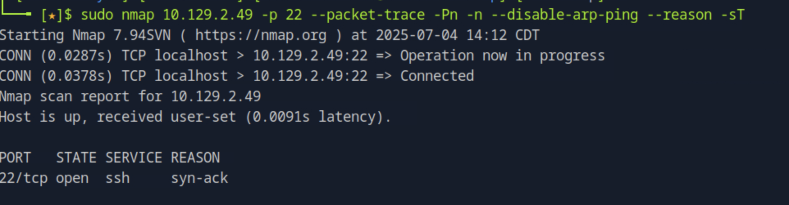

### 1.2.3 发现开放的 UDP 端口

有些系统管理员有时会忘记在过滤 TCP 端口的同时过滤 UDP 端口。而由于 **UDP 是一种无状态协议**，不像 TCP 那样需要三次握手，因此它在扫描中表现出一些独特的特性和挑战。

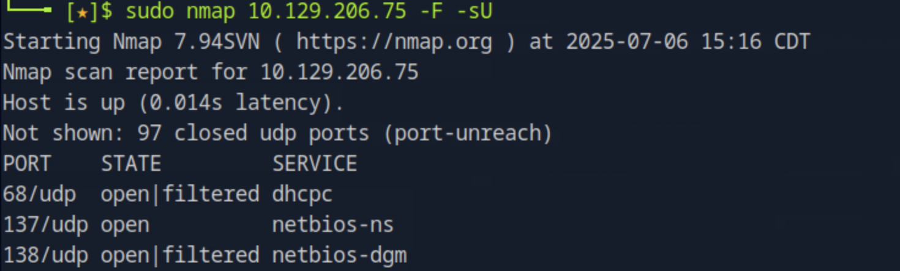

***

#### 🔍 UDP 扫描的特点（`-sU`）

* **无握手机制**：UDP 不像 TCP 那样有三次握手，因此我们**不会收到确认响应（ACK）**。这使得判断端口状态变得困难。
* **响应不确定**：Nmap 通常向目标 UDP 端口发送**空的 UDP 数据报**。但很多情况下，即使端口是开放的，我们也**收不到任何回应**，除非运行在该端口上的服务被配置为对空数据报作出响应。
* **超时较长**：由于可能没有任何反馈，Nmap 需要等待较长时间才能确定端口是否开放、关闭或被过滤，这使得**UDP 扫描比 TCP 扫描慢得多**。
* **仅在特定情况下响应**：如果端口关闭，目标主机会返回一个 **ICMP 端口不可达** 消息。如果是开放的，除非服务专门设计为回应 UDP 请求，否则**不会有任何返回**。

***

#### ⚠️ UDP 扫描弊端

* 很难判断端口是否开放，因为发送的是空包, **无响应可能意味着端口开放，也可能意味着包被过滤或丢失**。
* 对于很多目标主机或网络设备，**ICMP 消息可能被防火墙阻断**，进一步增加了判断难度。
* 扫描速度慢，不适合快速或大规模扫描任务。

***

#### 总结：

| 协议类型 | 是否握手     | 是否容易判断状态 | 扫描速度 | 响应可靠性 |
| ---- | -------- | -------- | ---- | ----- |
| TCP  | 有（3 次握手） | 高        | 快    | 高     |
| UDP  | 无        | 低        | 慢    | 低     |

***

因此，UDP 扫描虽然可以发现一些被忽视的开放端口，但由于其本身协议的特性，效率和准确性都不如 TCP 扫描，尤其在网络环境复杂、防火墙严格的情况下更为明显。在需要进行 UDP 扫描时，建议**只针对特定端口或服务**，并结合其他信息进行判断。

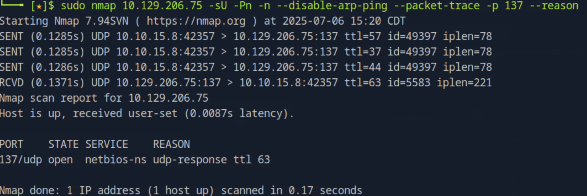

如果我们获得具有错误代码3（端口无法到达）的ICMP响应，我们知道该端口确实已关闭。

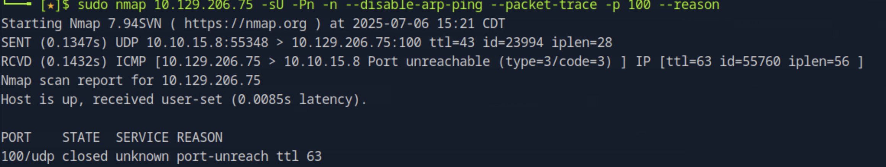

扫描端口的另一种方便方法是-SV选项，用于从开放端口获取其他可用信息。此方法可以识别有关我们目标的版本，服务名称和详细信息。

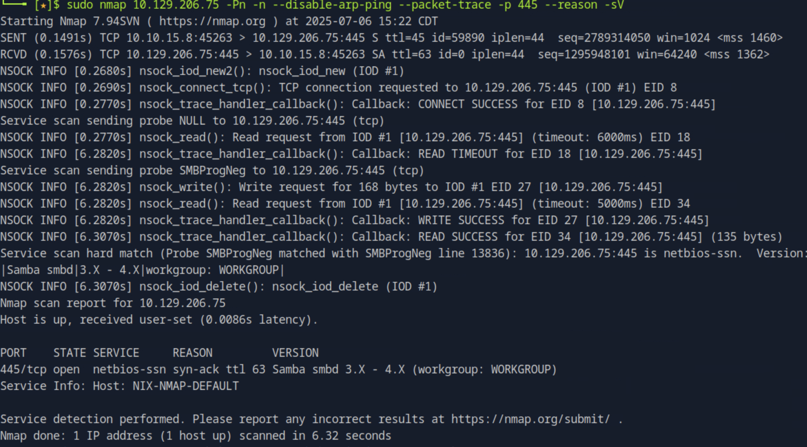

### 1.3 保存结果

-p- -oA target

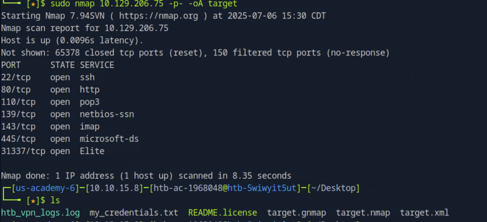

```shell
xsltproc target.xml -o target.html
```

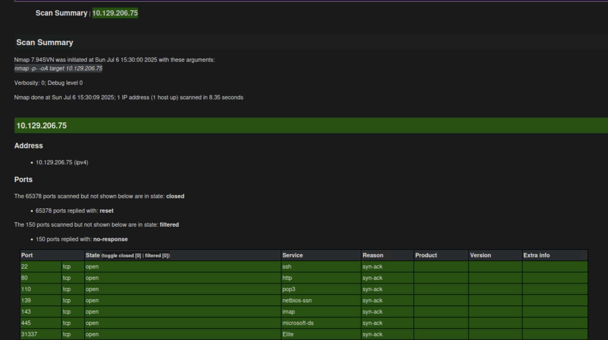

### 1.4 服务枚举

-p- -sV

我们可以使用的另一个选项（-stats- avery = 5s）是定义应如何显示状态的时间。在这里，我们可以指定秒或分钟（m）的秒数，然后我们要获得状态。

```shell
-p- -sV --stats-every=5s
```

我们还可以增加详细的水平（-v / -vv），当NMAP检测到它们时，它将直接向我们展示开放端口。

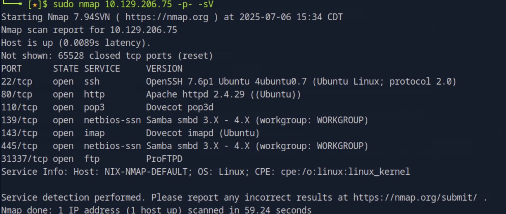

### 1.5 Nmap 脚本

#### 1.5.1 Nmap - 指定脚本

```shell
capybaralalale@htb[/htb]$ sudo nmap 10.129.2.28 -p 25 --script banner,smtp-commands

Starting Nmap 7.80 ( https://nmap.org ) at 2020-06-16 23:21 CEST
Nmap scan report for 10.129.2.28
Host is up (0.050s latency).

PORT   STATE SERVICE
25/tcp open  smtp
|_banner: 220 inlane ESMTP Postfix (Ubuntu)
|_smtp-commands: inlane, PIPELINING, SIZE 10240000, VRFY, ETRN, STARTTLS, ENHANCEDSTATUSCODES, 8BITMIME, DSN, SMTPUTF8,
MAC Address: DE:AD:00:00:BE:EF (Intel Corporate)
```

| **扫描选项**                        | **描述**        |
| ------------------------------- | ------------- |
| `10.129.2.28`                   | 扫描指定目标。       |
| `-p 25`                         | 仅扫描指定端口。      |
| `--script banner,smtp-commands` | 使用指定的 NSE 脚本。 |

使用“banner”脚本识别 Linux 的**Ubuntu**`smtp-commands`发行版。该脚本向我们展示了与目标 SMTP 服务器交互时可以使用的命令。在本例中，这些信息可以帮助我们找出目标服务器上的现有用户。`Nmap`此外，它还使我们能够使用激进选项 ( `-A`) 扫描目标。该脚本使用多种选项扫描目标，例如服务检测 ( `-sV`)、操作系统检测 ( `-O`)、跟踪路由 ( `--traceroute`) 以及默认的 NSE 脚本 ( `-sC`)。

#### 1.5.2Nmap - 积极扫描

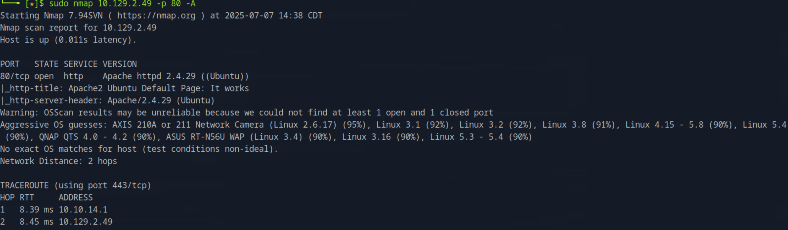

| **扫描选项**      | **描述**                         |
| ------------- | ------------------------------ |
| `10.129.2.28` | 扫描指定目标。                        |
| `-p 80`       | 仅扫描指定端口。                       |
| `-A`          | 执行服务检测、操作系统检测、跟踪路由并使用默认脚本扫描目标。 |

在使用的扫描选项（-a）的帮助下，我们发现系统上使用了哪种Web服务器（Apache 2.4.29），使用了哪种Web应用程序（WordPress 5.3.4），以及网页的标题（blog.inlanefreight.com）。此外，NMAP表明它可能是Linux（96％）操作系统。

#### 1.5.3 vulnerability Assessment

Now let us move on to HTTP port 80 and see what information and vulnerabilities we can find using the `vuln` category from `NSE`.

**1.5.3.1 Nmap - Vuln Category**

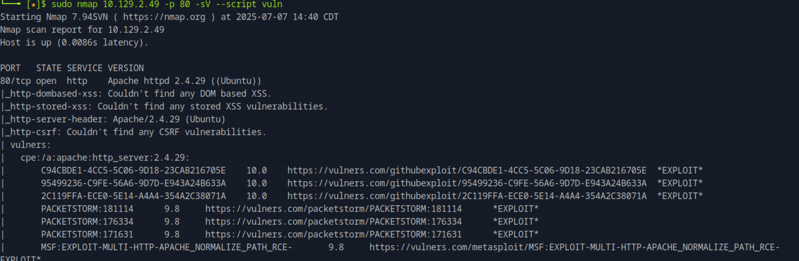

## 2 Bypass Security Measures

### 2.1 Firewall and IDS/IPS Evasion

Nmap 的 TCP ACK 扫描（-sA）比常规的 SYN 扫描（-sS）或连接扫描（-sT）更难被防火墙或入侵检测系统识别。因为 ACK 看起来像是正常会话的一部分，而不是主动发起连接，因此它能用来探测哪些端口被防火墙“过滤”掉了。(因为**SYN 包 = 主动发起连接请求的标志**)

#### 2.1.1 decoys

可以掩盖ip地址

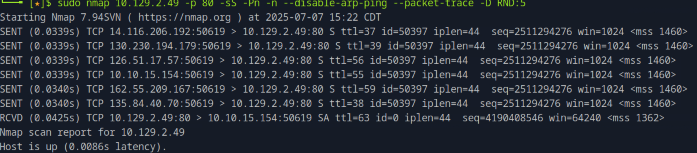

绕过目标系统的防火墙或入侵检测/防御系统（IDS/IPS）:

* 1 sudo nmap 10.129.2.28 -n -Pn -p445 -O
  *

      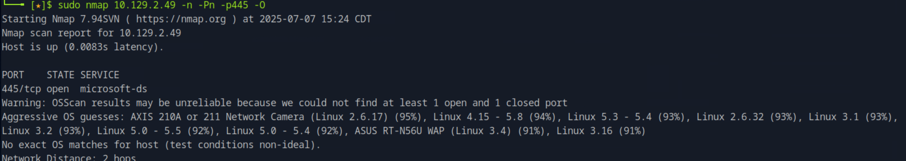
  * | 参数       | 含义                               |
    | -------- | -------------------------------- |
    | `-n`     | 禁用 DNS 解析，避免泄露信息或被目标域名拦截。        |
    | `-Pn`    | 不进行 Ping 探测，直接假定主机在线，绕过 ICMP 拦截。 |
    | `-p 445` | 只扫描 TCP 端口 445（Windows 文件共享端口）。  |
    | `-O`     | 启用操作系统检测。                        |
* 2 使用伪造源 IP sudo nmap 10.129.2.28 -n -Pn -p 445 -O -S 10.129.2.200 -e tun0

#### 2.1.2 DNS Proxying

**2.1.2.1 过滤端口的 SYN 扫描**

```shell
capybaralalale@htb[/htb]$ sudo nmap 10.129.2.28 -p50000 -sS -Pn -n --disable-arp-ping --packet-trace

Starting Nmap 7.80 ( https://nmap.org ) at 2020-06-21 22:50 CEST
SENT (0.0417s) TCP 10.10.14.2:33436 > 10.129.2.28:50000 S ttl=41 id=21939 iplen=44  seq=736533153 win=1024 <mss 1460>
SENT (1.0481s) TCP 10.10.14.2:33437 > 10.129.2.28:50000 S ttl=46 id=6446 iplen=44  seq=736598688 win=1024 <mss 1460>
Nmap scan report for 10.129.2.28
Host is up.

PORT      STATE    SERVICE
50000/tcp filtered ibm-db2

Nmap done: 1 IP address (1 host up) scanned in 2.06 seconds
```

**从 DNS 端口进行 SYN 扫描**

```shell
capybaralalale@htb[/htb]$ sudo nmap 10.129.2.28 -p50000 -sS -Pn -n --disable-arp-ping --packet-trace --source-port 53

SENT (0.0482s) TCP 10.10.14.2:53 > 10.129.2.28:50000 S ttl=58 id=27470 iplen=44  seq=4003923435 win=1024 <mss 1460>
RCVD (0.0608s) TCP 10.129.2.28:50000 > 10.10.14.2:53 SA ttl=64 id=0 iplen=44  seq=540635485 win=64240 <mss 1460>
Nmap scan report for 10.129.2.28
Host is up (0.013s latency).

PORT      STATE SERVICE
50000/tcp open  ibm-db2
MAC Address: DE:AD:00:00:BE:EF (Intel Corporate)

Nmap done: 1 IP address (1 host up) scanned in 0.08 seconds
```

| **扫描选项**             | **描述**          |
| -------------------- | --------------- |
| `10.129.2.28`        | 扫描指定目标。         |
| `-p 50000`           | 仅扫描指定端口。        |
| `-sS`                | 对指定端口执行 SYN 扫描。 |
| `-Pn`                | 禁用 ICMP 回显请求。   |
| `-n`                 | 禁用 DNS 解析。      |
| `--disable-arp-ping` | 禁用 ARP ping。    |
| `--packet-trace`     | 显示所有发送和接收的数据包。  |
| `--source-port 53`   | 从指定的源端口执行扫描。    |

***

既然我们已经发现防火墙接受了`TCP port 53`，那么很有可能 IDS/IPS 过滤器的配置也比其他过滤器弱得多。我们可以尝试使用 连接到此端口来测试这一点`Netcat`。

**连接到过滤端口**

```shell
capybaralalale@htb[/htb]$ ncat -nv --source-port 53 10.129.2.28 50000

Ncat: Version 7.80 ( https://nmap.org/ncat )
Ncat: Connected to 10.129.2.28:50000.
220 ProFTPd
```

#### 2.1.3 lab

**2.1.3.1 Firewall and IDS/IPS Evasion - Easy Lab**

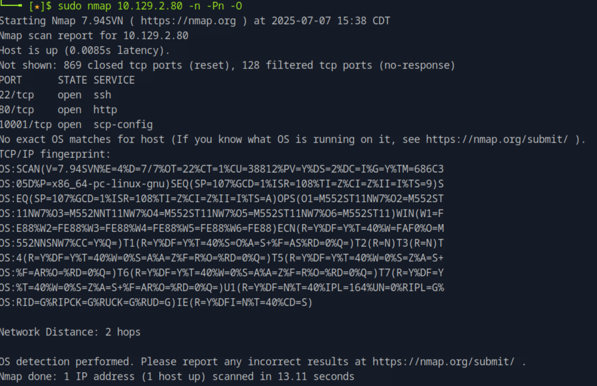 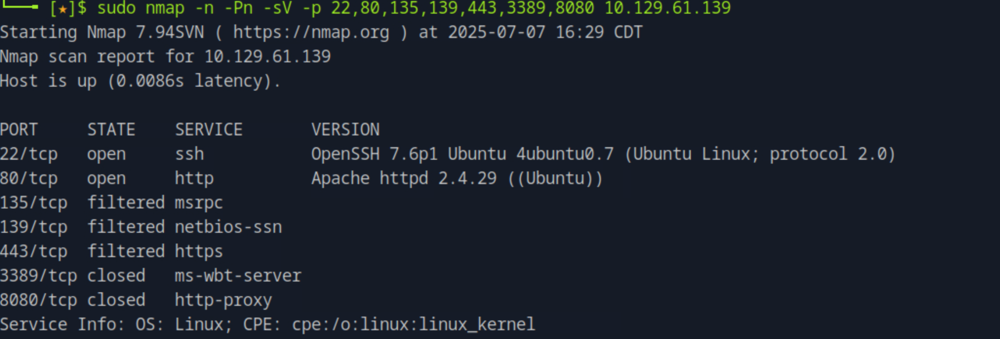

**2.1.3.2 Firewall and IDS/IPS Evasion - Medium Lab**

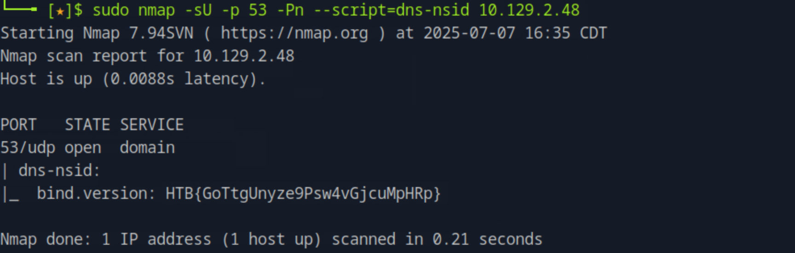

**2.1.3.3 Firewall and IDS/IPS Evasion - Hard Lab**

使用 `--reason -vv` 增加实时输出

```shell
bash

sudo nmap -n -Pn -sS -sV -p- --max-rate=30 -vv --reason 10.129.2.47
```

默认情况下，Nmap 会执行反向 DNS 解析（除非另有指定），以获取有关目标的更多重要信息。大多数情况下，这些 DNS 查询是允许通过的，因为目标 Web 服务器本身就是要被发现和访问的。这些 DNS 查询通常是通过 UDP 的 53 端口进行的。

TCP 的 53 端口以往仅用于 DNS 服务器之间的所谓“区域传输（Zone transfers）”或处理超过 512 字节的数据传输。然而，随着 IPv6 和 DNSSEC 的扩展，这种情况正在逐渐改变 —— 越来越多的 DNS 请求也通过 TCP 53 端口发送。

不过，Nmap 仍然允许我们自己指定使用的 DNS 服务器（通过 `--dns-server <ns>,<ns>` 参数）。如果我们处于一个隔离区（DMZ）中，这种方法可能对我们来说非常关键。公司内部的 DNS 服务器通常比互联网上的更受信任。例如，我们可以利用这些 DNS 服务器与内部网络的主机进行交互。

另一个例子是，我们可以将 TCP 53 端口作为扫描的源端口（使用 `--source-port` 参数）。如果管理员在防火墙上对该端口设置了信任，而没有正确配置 IDS/IPS 过滤规则，那么我们的 TCP 数据包可能就会被“信任”并顺利通过。

***

🧠 简单来说，这段话讲的是：

* **DNS 查询默认走 UDP 53，但也越来越多使用 TCP 53**
* Nmap 可以：
  * **指定 DNS 服务器**，比如使用内部 DNS
  * **伪装源端口为 TCP 53**，绕过对该端口信任的防火墙或 IDS/IPS

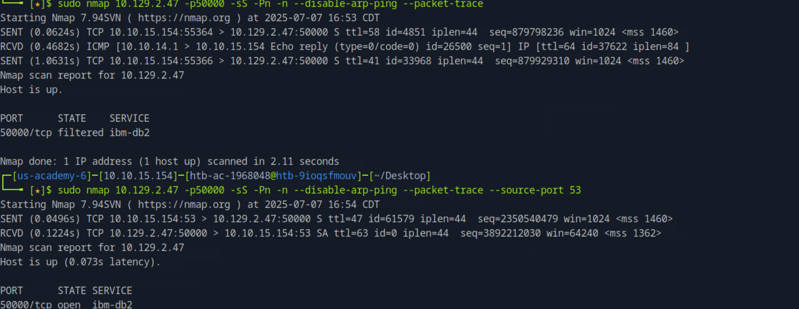


