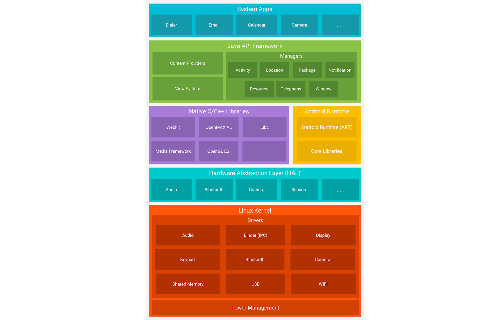
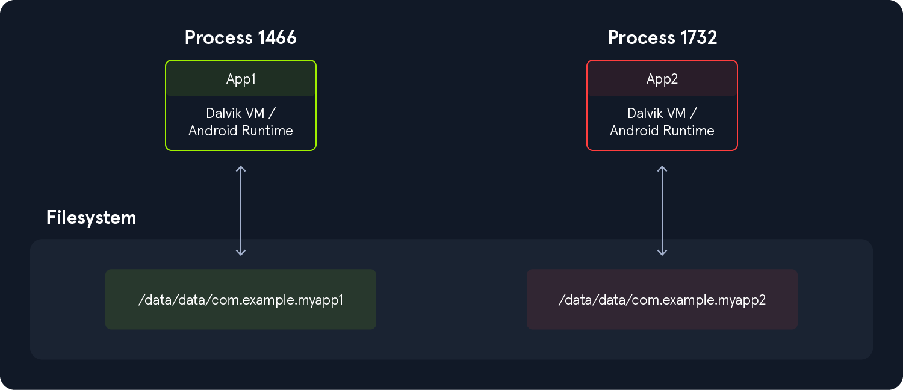
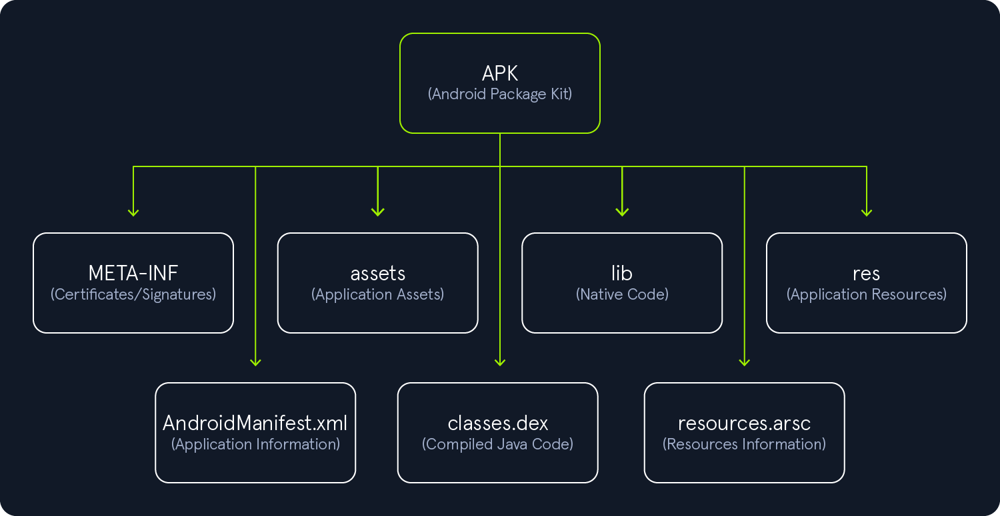
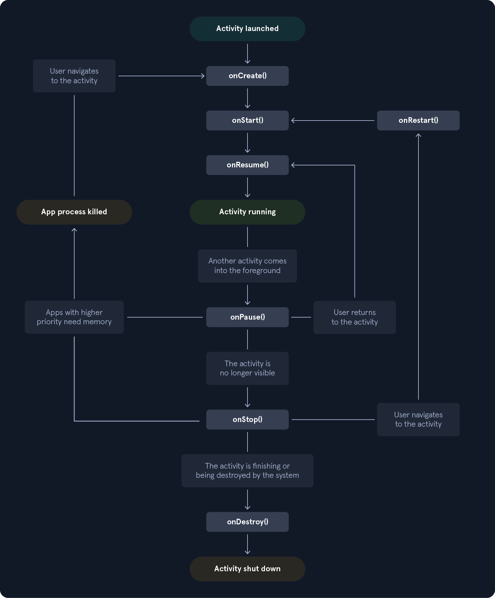
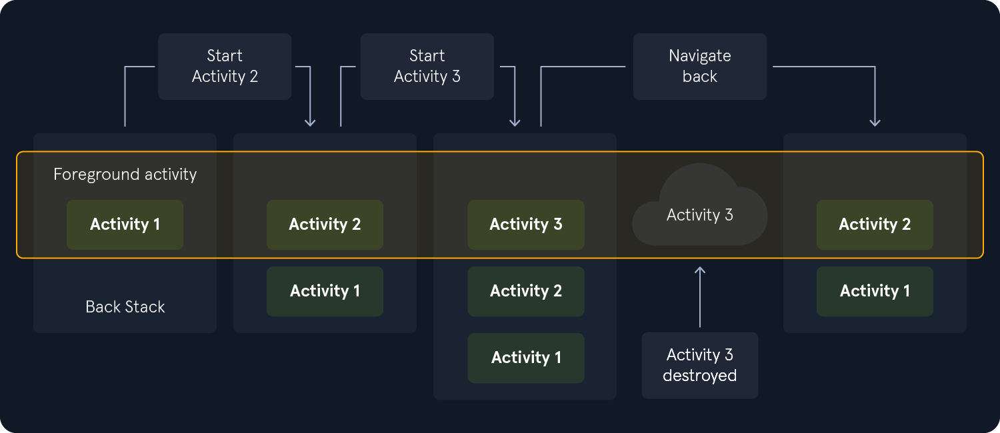
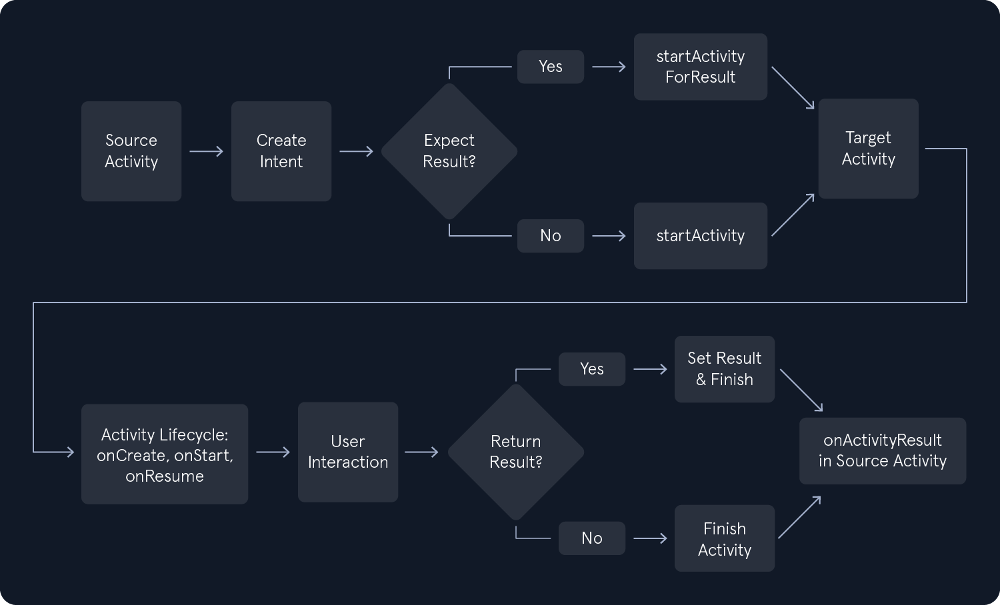
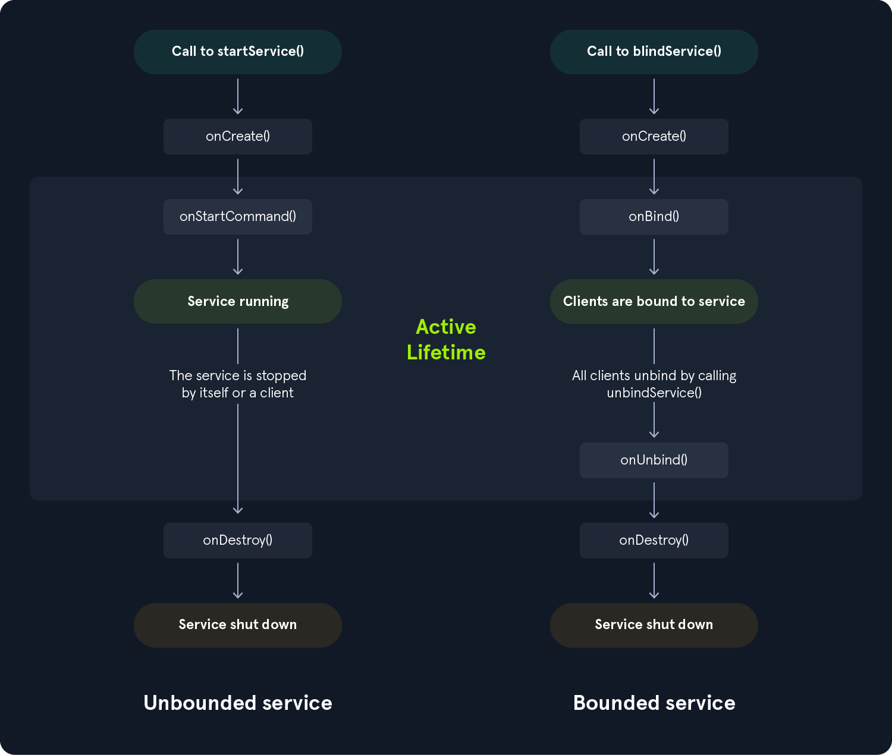
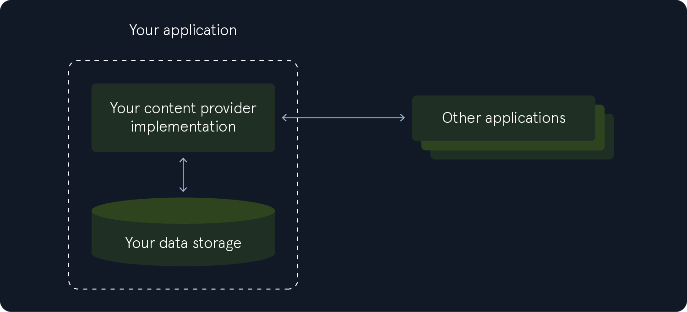
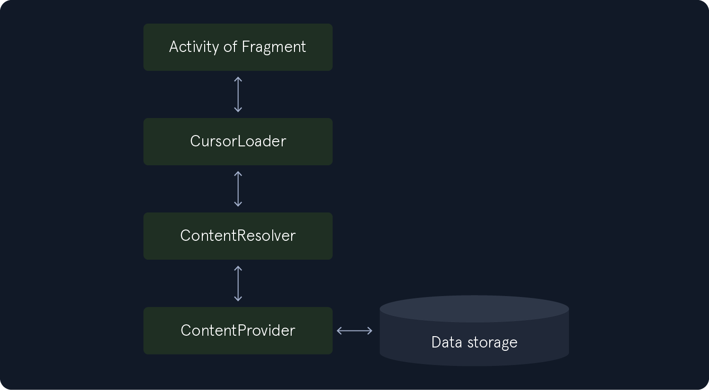
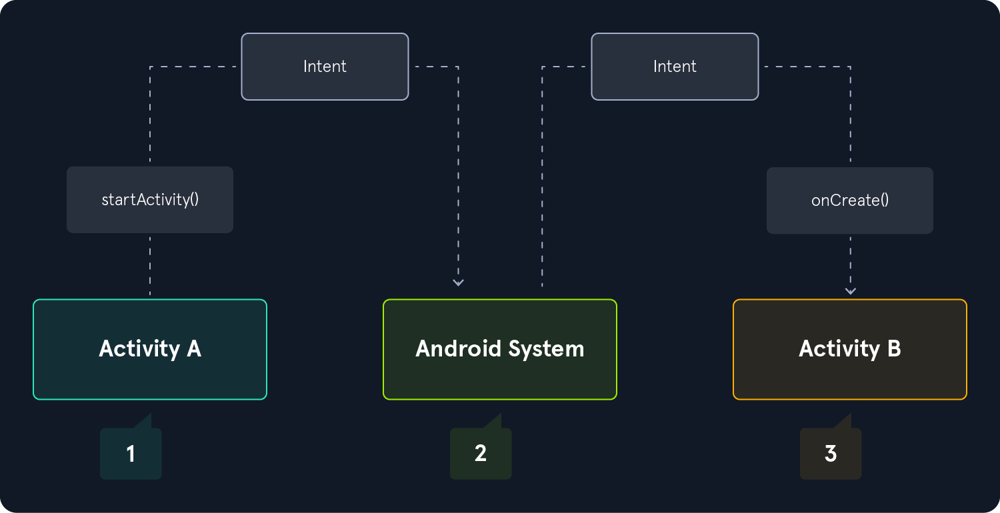

# Introduction

大多数 Android 设备使用的主要硬件架构是ARM

## Android 软件堆栈



Linux 内核是 Android 平台的基础，负责管理设备硬件，例如显示器、摄像头、蓝牙、Wi-Fi、音频、USB 等。Android 运行时也依赖这一层来执行线程和内存管理等功能。此外，Linux 内核允许 Android 利用多种安全功能（例如基于用户的权限模型和进程隔离）.

硬件抽象层 (HAL) 是一个软件层，它为 Android 操作系统提供与硬件组件（例如摄像头、蓝牙、传感器和输入设备）交互的标准化接口。作为硬件与更高级别软件层之间的桥梁，HAL 确保软件访问硬件功能的方式一致。

Android Runtime (ART) 是 Android 操作系统用于执行应用的托管运行时环境。ART 在 Android 5.0 Lollipop 中引入，用于替代 Dalvik 虚拟机，它为应用执行带来了显著的架构改进。ART 和 Dalvik 的主要区别在于它们的编译策略：ART 采用预先 (AOT) 编译，而 Dalvik 则采用即时 (JIT) 编译。使用 AOT 编译时，应用代码会在安装时编译为原生机器码，从而加快应用启动速度并提升运行时性能。

## Dalvik

Dalvik 虚拟机 (DVM) 由 Google 开发，并于 2008 年随 Android 的第一个版本一同推出。用 Java 或 Kotlin 编写的 Android 应用程序会被编译为 Java 字节码，然后转换为 Dalvik 字节码，并以 .dex（Dalvik 可执行文件）或 .odex（优化的 Dalvik 可执行文件）文件格式打包。与基于堆栈的 Java 虚拟机 (JVM) 不同，Dalvik VM 是基于寄存器的虚拟机。这种架构差异使其能够在 CPU 和内存资源有限的设备上更高效地执行，非常适合移动环境。

Dalvik 是 API 级别 21 (Lollipop) 之前 Android 版本的默认运行时环境。它最终被 Android 运行时 (ART) 取代。ART 在 Android 4.4 (KitKat) 中作为预览版推出，并在 Android 5.0 中成为默认运行时环境。ART 使用与 Dalvik 相同的 .dex 字节码格式来保持兼容性，但在执行模型上存在显著差异。

## Root

Android 将flash storage分为以下两个主要分区。

- `/system/`
- `/data/`

## 重要目录

Android 的文件结构与其他 Linux 发行版非常相似。以下列出的目录是进行 Android 应用评估时需要考虑的一些最重要的目录。

| **目录**                          | **描述**                                                     |
| --------------------------------- | ------------------------------------------------------------ |
| `/data/data`                      | 包含用户安装的所有应用程序                                   |
| `/data/user/0`                    | 包含只有应用可以访问的数据                                   |
| `/data/app`                       | 包含用户安装的应用程序的 APK                                 |
| `/system/app`                     | 包含设备预装的应用程序                                       |
| `/system/bin`                     | 包含二进制文件                                               |
| `/data/local/tmp`                 | 一个全球可写的目录                                           |
| `/data/system`                    | 包含系统配置文件                                             |
| `/etc/apns-conf.xml`              | 包含默认接入点名称 (APN) 配置。APN 用于帮助设备连接到我们当前运营商的网络 |
| `/data/misc/wifi`                 | 包含 WiFi 配置文件                                           |
| `/data/misc/user/0/cacerts-added` | 用户证书存储区。它包含用户添加的证书                         |
| `/etc/security/cacerts/`          | 系统证书存储。不允许非 root 用户访问                         |
| `/sdcard`                         | 包含指向目录 DCIM、下载、音乐、图片等的符号链接。            |

# Android security function

## uid

| **安全功能**                                                 |
| ------------------------------------------------------------ |
| Android 是一个多用户 Linux 系统，其中每个应用程序都被视为一个单独的用户。 |
| 默认情况下，系统会为每个应用分配一个唯一的 Linux 用户 ID (UID)。此 UID 供系统进行访问控制，但不会暴露给应用本身。 |
| 文件系统权限确保只有分配了特定 UID 的应用程序才能访问其自己的文件。 |
| 每个应用程序都在自己的进程中运行，每个进程都在 Android 运行时 (ART) 虚拟机的单独实例中运行，确保内存隔离。 |
| 系统根据需要启动应用程序的进程，并在不再需要或回收系统资源时终止它。 |
| Android 强制执行最小权限原则，这意味着应用仅获得执行其核心功能所需的权限。其他权限必须在应用的清单中明确声明，并由用户（或系统，取决于 API 级别）批准。 |



这会创建一个内核级的应用沙盒，在应用和系统之间强制执行严格的边界，防止跨应用边界的未经授权的数据访问或代码执行。除非获得明确授权，否则应用之间无法交互，也无法访问超出其权限的系统资源。由于沙盒由 Linux 内核强制执行，因此这些保护措施统一适用于在内核上运行的所有代码，包括原生二进制文件、操作系统服务、库和用户应用。要逃离此沙盒，通常需要入侵内核，方法是利用提权漏洞。

## 签名

```shell
capybaralalale@htb[/htb]$ echo -e "password\npassword\njohn doe\ntest\ntest\ntest\ntest\ntest\nyes" > params.txt
capybaralalale@htb[/htb]$ cat params.txt | keytool -genkey -keystore key.keystore -validity 1000 -keyalg RSA -alias john
capybaralalale@htb[/htb]$ zipalign -p -f -v 4 myapp.apk myapp_signed.apk
capybaralalale@htb[/htb]$ echo password | apksigner sign --ks key.keystore myapp_signed.apk
```

## 🔐 APK 签名步骤

1. **创建 `params.txt` 文件**，其中包含用于 `keytool` 生成密钥对所需的输入数据。
2. **将 `params.txt` 的内容通过管道传给 `keytool`**，以自动化生成密钥的过程，并将密钥存储在 `key.keystore` 文件中。
3. **使用 `zipalign` 工具对 `myapp.apk` 进行优化**，它允许 APK 中未压缩的文件被直接通过 `mmap` 访问，生成优化后的应用文件 `myapp_signed.apk`。
4. **使用 `apksigner` 工具对最终的 APK 进行签名**，签名所用的密钥存储在 `key.keystore` 中，密码通过管道（echo）传入命令中。

# APK Structure

## 总结构

```shell
capybaralalale@htb[/htb]$ unzip myapp.apk
capybaralalale@htb[/htb]$ ls -l

total 27584
-rw-r--r--    1 bertolis  bertolis     4220 Jan  1  1981 AndroidManifest.xml
drwxr-xr-x   49 bertolis  bertolis     1568 May 10 13:36 META-INF
drwxr-xr-x    3 bertolis  bertolis       96 May 10 13:36 assets
-rw-r--r--    1 bertolis  bertolis  8285624 Jan  1  1981 classes.dex
drwxr-xr-x    9 bertolis  bertolis      288 May 10 13:36 kotlin
drwxr-xr-x    6 bertolis  bertolis      192 May 10 13:36 lib
drwxr-xr-x  545 bertolis  bertolis    17440 May 10 13:36 res
-rw-r--r--    1 bertolis  bertolis   922940 Jan  1  1981 resources.arsc
```



### META-INF

此文件夹在应用程序签名时生成，其中包含验证信息。对 APK 文件进行的任何修改都会导致 APK 失效，需要重新签名。列出此目录的内容可查看以下文件。

```shell
capybaralalale@htb[/htb]$ ls -l META-INF/

total 664
-rw-r--r--  1 bertolis  bertolis   1103 Jan  1  1981 CERT.RSA
-rw-r--r--  1 bertolis  bertolis  77917 Jan  1  1981 CERT.SF
-rw-r--r--  1 bertolis  bertolis  77843 Jan  1  1981 MANIFEST.MF
<SNIP>
```

| **文件**      | **描述**                                                     |
| ------------- | ------------------------------------------------------------ |
| `CERT.RSA`    | 包含公钥和 CERT.SF 的签名。                                  |
| `CERT.SF`     | 包含 MANIFEST.MF 文件中相应行的名称/哈希列表。               |
| `MANIFEST.MF` | 包含 APK 所有文件的名称/哈希列表（通常为 Base64 中的 SHA256），用于在任何文件被修改时使 APK 无效。 |

### assets

图像、视频、文档、数据库和其他原始文件,或者代码和DLL

### lib

此文件夹包含针对不同设备架构的编译代码的原生库。使用原生开发工具包 (NDK) 的 Android 应用可能包含用 C 或 C++ 编写的组件。当应用包含原生库时，它们会`lib`作为带有扩展名的共享对象文件存储在此目录中`.so`。系统会为每个支持的架构生成单独的 SO 文件，这些文件通常按照此结构组织在子目录下。

```shell
capybaralalale@htb[/htb]$ ls -l lib/

total 0
drwxr-xr-x  3 bertolis  bertolis  96 May 10 13:36 arm64-v8a
drwxr-xr-x  3 bertolis  bertolis  96 May 10 13:36 armeabi-v7a
drwxr-xr-x  3 bertolis  bertolis  96 May 10 13:36 x86
drwxr-xr-x  3 bertolis  bertolis  96 May 10 13:36 x86_64
```

### res

预定义的应用程序资源，与 Assets 不同，这些资源在运行时无法被用户修改。这些资源包括定义颜色状态列表、UI 布局、字体、值、操作系统版本配置、屏幕方向、网络设置等的 XML 文件。

### AndroidManifest.xml

定义了系统用于管理应用程序的基本属性和组件，包括：

| **成分**     |
| ------------ |
| 包裹名字     |
| SDK 版本     |
| 构建版本     |
| 权限         |
| 网络安全配置 |
| 活动         |
| 提供商       |
| 服务         |

### classes.dex

包含所有已编译的 DEX（Dalvik 可执行文件）格式的 Java（或 Kotlin）类，这些类由搭载 Android 5.0 或更高版本的设备上的 Android 运行时 (ART) 执行，或由更低版本的 Dalvik 虚拟机执行。

### resources.arsc

预编译资源。它将代码中的资源标识符（例如`R.string.app_name`）映射到其实际值，例如字符串、颜色、布局和样式。它还包含 XML 资源的二进制表示形式。

在某些 APK 中，可能还会发现一个文件`kotlin/`夹，该文件夹存在于使用 Kotlin 编写的应用中，包含运行时和工具使用的 Kotlin 特定元数据

# Android Application Components and Interprocess Communication

## Activities

应用程序组件是定义 Android 应用程序不同部分（例如用户界面和核心功能）的构建块。这些组件在中声明`AndroidManifest.xml`，可以单独使用，也可以彼此配合使用。进程间通信`Interprocess Communication`(IPC) 是一种允许应用程序之间或同一应用程序内的不同进程之间进行通信的机制。

## 活动生命周期

Activity 的生命周期由六个主要阶段（称为回调）组成。下面的类定义了 Activity 的整个生命周期。

代码：java

```java
 public class Activity extends ApplicationContext {
     protected void onCreate(Bundle savedInstanceState);
     protected void onStart();
     protected void onRestart();
     protected void onResume();
     protected void onPause();
     protected void onStop();
     protected void onDestroy();
 }
```

每当 Activity 进入新状态时，系统都会调用相应的回调。请注意，一个应用可能只会使用部分回调。下图展示了 Activity 的生命周期。



## 启动活动

在 Android 中启动 Activity 是一个基本概念。Activity 代表一个带有用户界面的屏幕，负责管理用户与应用的交互。以下步骤描述了启动 Activity 时的具体操作。

#### 意图创建

要以编程方式启动 Activity，我们首先要创建一个 Intent 对象。Intent 是一种消息传递对象，用于向同一应用或其他应用中的另一个组件请求操作。目标 Activity 以及任何其他所需的附加数据都可以在 Intent 对象中指定。

```java
// In the source Activity (e.g., MainActivity.java)
Intent intent = new Intent(this, TargetActivity.class);
// Optionally, you can add extra data to the Intent
intent.putExtra("key", "test");
```

`key`我们可以看到，带有值的参数`test`也已使用属性传递`putExtra()`。

#### 请求活动启动

接下来，从源 Activity 调用`startActivity()`或`startActivityForResult()`，并将 Intent 对象作为参数传递。`startActivity()`用于启动 Activity 而不期望返回任何结果，而`startActivityForResult()`用于期望从启动的 Activity 中返回结果。

```java
// For launching an Activity without expecting any result back
startActivity(intent);

// For launching an Activity and expecting a result back
int requestCode = 1; // A unique integer request code to identify the result
startActivityForResult(intent, requestCode);
```

#### 活动堆栈管理

Android 操作系统会维护一个 Activity 堆栈，作为应用所属任务的一部分。当新的 Activity 启动时，它会被置于堆栈顶部，并成为活动 Activity。之前的 Activity 会暂停并保留在堆栈中。下图展示了每个点处 Activity 和当前返回堆栈之间的进度。



#### 活动生命周期转换

在此阶段，源 Activity 的`onPause()`方法会被调用，并变为非活动状态。与此同时，目标 Activity 会执行一系列生命周期方法，包括`onCreate()`、`onStart()`和`onResume()`，初始化其 UI，设置所需资源，并启动任何必要的后台任务。必要的生命周期方法应在目标 Activity 中实现。

#### 用户交互

新的 Activity 变为可见，用户可以进行交互。当用户决定返回时，当前 Activity 将从堆栈中弹出，并调用其`onPause()`、`onStop()`和生命周期方法。堆栈中的前一个 Activity 将再次变为活动状态，并恢复其、和生命周期方法。

#### 返回结果（可选）

如果启动的 Activity 是使用 启动的`startActivityForResult()`，它可以将结果返回给调用 Activity。具体方法是先调用`setResult()`启动的 Activity，然后调用`finish()`。调用 Activity 随后会在其方法中接收结果`onActivityResult()`，并据此处理数据。



除了通过点击图标或通过其他应用程序启动 Activity 之外，还可以使用 ADB（Android 调试桥）来完成。Android 调试桥是一个命令行工具，允许您与 Android 设备（模拟器或实体设备）进行通信。它主要用于调试、开发和测试。可以直接从 ADB访问`exported`属性设置为 的 Activity，但这有时会引发安全问题。

## 声明活动

为了正确使用 Activity，必须在应用的清单文件中声明它。在 Android 中，此文件名为`AndroidManifest.xml,`，正如我们在前面章节中提到的，它是一个配置文件，向 Android 系统提供有关应用程序的基本信息。这些信息包括应用组件、权限和其他元数据。创建新的 Activity 后，应使用 元素`<activity>`作为 元素的子元素进行声明`<application>`，如下例所示。`android:name`属性应包含完整的 Activity 类名。

```xml
<manifest xmlns:android="http://schemas.android.com/apk/res/android"
    package="com.example.myapp">

    <application
        android:allowBackup="true"
        android:icon="@mipmap/ic_launcher"
        android:label="@string/app_name"
        android:roundIcon="@mipmap/ic_launcher_round"
        android:supportsRtl="true"
        android:theme="@style/AppTheme">

        <!-- Declare your Activity here -->
        <activity android:name=".MainActivity">
            <intent-filter>
                <action android:name="android.intent.action.MAIN" />

                <category android:name="android.intent.category.LAUNCHER" />
            </intent-filter>
        </activity>

        <!-- Declare other Activities if needed -->
        <!-- <activity android:name=".AnotherActivity" /> -->

    </application>

</manifest>
```

在上面的代码片段中，`android.intent.action.MAIN`action 表示这`MainActivity`是应用的入口点。这意味着它是应用启动时启动的第一个 Activity。此 action 通常用于应用的主屏幕。虽然 Activity 名称`MainActivity`通常用作 Android 应用中的入口点，但该名称可以更改。在渗透测试期间，识别应用的入口点非常重要，因为测试人员可以更好地理解应用的流程、功能和整体结构，发现可能的攻击面，并最终识别潜在的漏洞和弱点。第二个属性`android.intent.category.LAUNCHER`告诉 Android 系统，此 Activity 应该列在系统的应用启动器中。因此，当用户点击启动器中的应用图标时，应该启动此 Activity。

一些活动可能包括导出的属性。此属性用于指定设备上的其他应用程序是否可以访问应用程序组件。可以在AndroidManifest.xml文件中的<istivity>，<service>，<ectionfiver>和<provider>元素上设置导出的属性，它接受boolean values true或false。将导出的属性设置为true意味着设备上的其他应用程序可以访问并调用应用程序组件。这种配置可能会使应用程序暴露于安全风险。下面的示例显示了一个活动，该活动将导出的属性设置为true。

```xml
<manifest ...>
    <application ...>
		<activity
            android:name=".MyCustomActivity"
            android:exported="true">
            <!-- Intent filters if needed -->
        </activity>
    </application>
</manifest>
```

## 服务

与活动类似，服务也具有生命周期回调方法，必须实现这些方法来监控其状态变化。下图展示了服务的生命周期回调方法。左侧使用 创建服务`startService()`，右侧使用 创建服务`bindService()`。

必须在文件中声明服务`AndroidManifest.xml`。

```xml
<manifest ...>
    <application ...>
        <service android:name=".MyForegroundService"/>
        <service android:name=".MyBackgroundService"/>
    </application>
</manifest>
```

## Content Providers

内容提供器可以被视为应用程序组件和进程间通信 (IPC) 机制。作为 IPC 机制，内容提供器允许应用程序使用`ContentResolver`类中一致的接口访问、修改或删除数据，从而实现应用程序之间的通信。作为应用程序组件，内容提供器负责管理和向应用程序内部或外部应用程序公开数据结构。同时，它们允许应用程序内不同组件之间或与外部应用程序共享数据。换句话说，它们充当应用程序与其底层数据存储之间的中介。内容提供器使用基于 CRUD（创建、读取、更新、删除）操作的标准化 API 与数据交互。内容提供器处理的数据存储在多种结构中，包括本地 SQLite 数据库、设备的内部或外部存储，甚至远程服务器。



访问`ContentProvider`通常在后台异步完成，使用`CursorLoader`执行查询。`Activity`或 UI 组件向 发起请求，后者通过访问`CursorLoader`来执行查询。这种方法可在执行查询时保持 UI 响应。该过程涉及多个组件，如下图所示。`ContentProvider``ContentResolver`



## 意图

------

如上一节所述，Intent`Intents`是应用程序或 Android 系统用来向其他组件（例如活动、服务和广播接收器）请求操作的消息对象。虽然 Intent 主要并非为进程间通信 (IPC) 而设计，但当应用程序需要与驻留在不同进程中的组件（例如服务）交互时，可以使用它们。Intent 有三种基本用例，下面将通过实际示例进行说明。

#### 开始活动

意图通常用于启动新活动，在组件之间传递数据。

代码：java

```java
/* Navigating from a list of contacts to a detailed view of the selected contact. 
   In the source Activity (ContactListActivity.java), an explicit Intent tells 
   Android to launch the target Activity (ContactDetailActivity.java) and passes 
   the selected contact's ID as extra data. This allows the target activity to 
   retrieve and display the correct contact details. */

Intent intent = new Intent(this, ContactDetailActivity.class);
intent.putExtra("contact_id", selectedContactId);
startActivity(intent);
```

#### 启动服务

Services 用于后台操作，Intent 用于启动或者绑定到Services。

代码：java

```java
/* Downloading a file in the background. This code starts a background Service
   (DownloadService) to handle a file download. An explicit Intent specifies the
   target Service class and attaches the file URL as extra data. The Service can
   then retrieve the URL from the Intent and begin the download operation in the 
   background. */
  
Intent intent = new Intent(this, DownloadService.class);
intent.putExtra("file_url", fileUrl);
startService(intent);
```

#### 进行广播

广播允许应用程序发送或监听系统范围或特定于应用程序的事件。

代码：java

```java
/* Informing other components that the battery is low. This code sends a custom
   broadcast with the action string `com.example.ACTION_BATTERY_LOW`. Any component 
   (within the same app or across apps) that has registered a BroadcastReceiver with
   a matching Intent filter will be notified when this broadcast is sent. */

Intent intent = new Intent("com.example.ACTION_BATTERY_LOW");
sendBroadcast(intent);
```

接下来我们将研究两种类型的 Intent IPC。

#### 显式意图

显式 Intent 通常用于在同一应用内的不同 Activity 之间导航或启动服务。目标组件（Activity、服务或广播接收器）应该是已知的，并且可以通过在 Intent 构造函数中指定目标组件的类名来创建。

代码：java

```java
Intent intent = new Intent(this, TargetActivity.class);
startActivity(intent); 
```

#### 隐式意图

当我们不知道确切的目标组件，但知道要执行的操作，并希望系统找到合适的组件来处理请求时，可以使用隐式 Intent。要创建隐式 Intent，我们必须指定操作和数据（URI）。

代码：java

```java
Intent intent = new Intent(Intent.ACTION_VIEW);
intent.setData(Uri.parse("https://www.example.com"));
startActivity(intent);
```

此外，Intent 还可以以键值对的形式在组件之间传输数据，称为`extras`。

代码：java

```java
Intent intent = new Intent(this, TargetActivity.class);
intent.putExtra("key", "value");
startActivity(intent);
```

下图显示了如何通过系统传递隐式意图来启动另一个活动。



与应用程序组件类似，Intent 可以通过终端使用 Android 调试桥 (ADB) 创建。在评估应用程序时，理解和分析 Intent 至关重要——这不仅有助于深入了解应用的流程，还能识别潜在的安全绕过漏洞。

## Binder

Binder 是 Android 的核心进程间通信 (IPC) 机制，用于实现不同进程之间高效安全的通信。它基于远程过程调用 (RPC) 模型构建，允许客户端进程像调用本地对象一样调用位于另一个进程中的远程对象的方法。

在以下段落中，“远程服务”指的是在同一应用程序内不同进程中运行的服务。Binder 通常通过 Service 来使用，该 Service 实现了[AIDL](https://developer.android.com/develop/background-work/services/aidl)文件中定义的接口，该接口指定了进程间通信 (IPC) 的方法、参数和返回值。Service 提供所请求的功能，而 Binder 则促进客户端和服务之间的通信。以下代码片段演示了 Service 如何使用 Binder 与远程客户端通信。

#### ICalculator.aidl

`ICalculator.aidl`这里我们看到包含方法声明的文件片段。

代码：java

```java
interface ICalculator {
    int add(int a, int b);
}
```

接下来，我们有该文件的片段`CalculatorService.java`，它创建服务并实现 AIDL 文件中定义的接口。

代码：java

```java
public class CalculatorService extends Service {
    private final ICalculator.Stub binder = new ICalculator.Stub() {
        @Override
        public int add(int a, int b) {
            return a + b;
        }

    @Override
    public IBinder onBind(Intent intent) {
        return binder;
    }
}
```

#### 主活动.java

现在我们来看看该`MainActivity.java`文件的一个片段，它连接并绑定到远程服务`CalculatorService`，然后调用其方法。`Connecting`连接到服务涉及与服务建立链接以进行通信和交互，而`binding`连接到服务则在客户端（例如 Activity）和服务之间建立持久连接。这允许客户端与服务交互，调用其方法并同步接收结果。

代码：java

```java
// Connecting to the remote service
private ServiceConnection serviceConnection = new ServiceConnection() {
    @Override
    public void onServiceConnected(ComponentName name, IBinder service) {
        calculatorService = ICalculator.Stub.asInterface(service);
        performCalculations();
    }
		...
};
....

// Binding to the remote service
@Override
protected void onCreate(Bundle savedInstanceState) {
    super.onCreate(savedInstanceState);
    setContentView(R.layout.activity_main);

    Intent intent = new Intent();
    intent.setComponent(new ComponentName("com.example.calculatorservice", "com.example.calculatorservice.CalculatorService"));
    bindService(intent, serviceConnection, Context.BIND_AUTO_CREATE);
}
...

// Calling the methods
private void performCalculations() {
    if (calculatorService == null) {
        return;
    }

    try {
        int additionResult = calculatorService.add(10, 5);
      
        // Use the results as needed, e.g., display them in the UI
        // ...

    } catch (RemoteException e) {
        e.printStackTrace();
    }
}
```

Binder 不直接在清单文件中声明，因为它们是 Service 实现的一部分。但是，如果 Service 运行在不同的进程中，`android:process`则应在清单文件中指定该属性`AndroidManifest.xml`。